# Number Guessing Game - Component Diagram

## High-Level Architecture Component Diagram

## Detailed Component Interactions

## Hexagonal Architecture Component View

```mermaid
graph TB
    subgraph "External World"
        User[👤 User]
        FileSystem[💾 File System]
        Database[🗄️ Database]
    end

    subgraph "Hexagon - Number Guessing Game"
        subgraph "Ports (Interfaces)"
            GameRepositoryPort[GameRepository<br/>Port]
            UserInterfacePort[UserInterface<br/>Port]
        end

        subgraph "Application Core"
            UseCases[Use Cases<br/>StartGame, MakeGuess, EndGame]
            GameController[GameController<br/>Orchestrator]
        end

        subgraph "Domain Core"
            Game[Game<br/>Pure Domain Entity]
            Player[Player<br/>Entity]
            GameService[GameService<br/>Rich Domain Service]
            GameDifficulty[GameDifficulty<br/>Value Object]
            GuessResult[GuessResult<br/>Enum]
        end
    end

    subgraph "Adapters (Implementations)"
        ConsoleViewAdapter[ConsoleView<br/>Adapter]
        InMemoryRepositoryAdapter[InMemoryGameRepository<br/>Adapter]
        FileRepositoryAdapter[FileGameRepository<br/>Future Adapter]
        DatabaseRepositoryAdapter[DatabaseGameRepository<br/>Future Adapter]
    end

    subgraph "Main Application"
        NumberGuessingCLI[NumberGuessingCLI<br/>Dependency Injection]
    end

    %% External to Adapters
    User <--> ConsoleViewAdapter
    FileSystem <--> FileRepositoryAdapter
    Database <--> DatabaseRepositoryAdapter

    %% Adapters to Ports
    ConsoleViewAdapter --> UserInterfacePort
    InMemoryRepositoryAdapter --> GameRepositoryPort
    FileRepositoryAdapter --> GameRepositoryPort
    DatabaseRepositoryAdapter --> GameRepositoryPort

    %% Ports to Application
    UserInterfacePort --> UseCases
    GameRepositoryPort --> UseCases

    %% Application to Domain
    UseCases --> GameService
    UseCases --> Game
    UseCases --> Player
    UseCases --> GameDifficulty

    %% Domain internal
    GameService --> Game
    Game --> Player
    Game --> GameDifficulty
    Game --> GuessResult

    %% Main Application Wiring
    NumberGuessingCLI --> GameController
    NumberGuessingCLI --> ConsoleViewAdapter
    NumberGuessingCLI --> InMemoryRepositoryAdapter

    %% Styling
    classDef external fill:#ffebee
    classDef port fill:#e1f5fe
    classDef application fill:#f3e5f5
    classDef domain fill:#e8f5e8
    classDef adapter fill:#fff3e0
    classDef main fill:#fce4ec

    class User,FileSystem,Database external
    class GameRepositoryPort,UserInterfacePort port
    class UseCases,GameController application
    class Game,Player,GameService,GameDifficulty,GuessResult domain
    class ConsoleViewAdapter,InMemoryRepositoryAdapter,FileRepositoryAdapter,DatabaseRepositoryAdapter adapter
    class NumberGuessingCLI main
```

## Component Responsibilities

### **Presentation Layer**
- **ConsoleView**: Handles user input/output, displays messages and menus with error handling

### **Application Layer**
- **GameController**: Orchestrates the overall game flow and coordinates use cases (FULLY IMPLEMENTED)
- **StartGameUseCase**: Game initialization with comprehensive documentation
- **MakeGuessUseCase**: Handles guess processing and validation
- **EndGameUseCase**: Manages game completion and statistics

### **Domain Layer**
- **GameService**: Rich domain service with comprehensive business logic and dependency injection
- **NumberGeneratorService**: Generates random numbers for the game
- **Game**: Pure domain entity with state management and GuessResult enum
- **Player**: Player entity with score and name management
- **GameDifficulty**: Strategy pattern wrapper for difficulty levels
- **GuessResult**: Enum for clean state management of guess outcomes

### **Infrastructure Layer**
- **InMemoryGameRepository**: In-memory implementation of data persistence
- **GameFactory**: Factory for creating domain objects with proper configuration (FULLY IMPLEMENTED)

### **Main Application**
- **NumberGuessingCLI**: Application entry point and dependency setup (FULLY IMPLEMENTED)

## Key Architectural Principles

### **1. Hexagonal Architecture**
- **Ports**: Define contracts for external interactions
- **Adapters**: Implement ports for specific technologies
- **Domain**: Pure business logic without external dependencies

### **2. Dependency Inversion**
- High-level modules don't depend on low-level modules
- Both depend on abstractions (interfaces)
- Abstractions don't depend on details

### **3. Single Responsibility**
- Each component has one clear responsibility
- Components are focused and cohesive
- Easy to test and maintain

### **4. Open/Closed Principle**
- Open for extension (new adapters can be added)
- Closed for modification (existing code doesn't change)

### **5. Interface Segregation**
- Ports define minimal, focused contracts
- Adapters implement only what they need
- No unnecessary dependencies

### **6. Anemic Domain Model**
- **Game Entity**: Pure domain entity focused on state management
- **GameService**: Rich domain service handling all business logic
- **Clear Separation**: Business logic separated from data

## Implementation Status

### ✅ **Fully Implemented Components**
- **GameController**: Complete orchestration with all methods implemented
- **GameFactory**: Complete factory with all object creation methods
- **NumberGuessingCLI**: Complete main application with dependency injection
- **ConsoleView**: Complete CLI interface with error handling
- **All Domain Components**: Game, Player, GameState, GameDifficulty, etc.
- **All Use Cases**: StartGameUseCase, MakeGuessUseCase, EndGameUseCase
- **All Services**: GameService, NumberGeneratorService
- **Repository**: InMemoryGameRepository

### 🎯 **Key Features**
- **Complete Game Flow**: From startup to game completion
- **Error Handling**: Graceful handling of invalid input and edge cases
- **User Experience**: Professional UI with clear messages and status updates
- **Architecture Compliance**: Full hexagonal architecture implementation
- **Documentation**: Comprehensive JavaDoc throughout the codebase

This component diagram shows how the number guessing game follows clean architecture principles with clear separation of concerns, dependency management, and the complete implementation of all components. 