# Number Guessing Game - Component Diagram

## High-Level Architecture Component Diagram

```mermaid
graph TB
    subgraph "External Actors"
        User[👤 User]
    end

    subgraph "Number Guessing Game System"
        subgraph "Presentation Layer"
            ConsoleView[ConsoleView<br/>CLI Interface]
        end

        subgraph "Application Layer"
            GameController[GameController<br/>Orchestrator]
            StartGameUseCase[StartGameUseCase<br/>Game Initialization]
            MakeGuessUseCase[MakeGuessUseCase<br/>Guess Processing]
            EndGameUseCase[EndGameUseCase<br/>Game Completion]
        end

        subgraph "Domain Layer"
            GameService[GameService<br/>Business Logic]
            Game[Game<br/>Core Entity]
            Player[Player<br/>Entity]
            GameDifficulty[GameDifficulty<br/>Strategy Wrapper]
            DifficultyStrategy[DifficultyStrategy<br/>Interface]
        end

        subgraph "Infrastructure Layer"
            InMemoryGameRepository[InMemoryGameRepository<br/>Data Storage]
            GameFactory[GameFactory<br/>Object Creation]
        end

        subgraph "Main Application"
            Main[Main<br/>Entry Point]
        end
    end

    %% External interactions
    User <--> ConsoleView

    %% Presentation to Application
    ConsoleView <--> GameController

    %% Application layer internal
    GameController --> StartGameUseCase
    GameController --> MakeGuessUseCase
    GameController --> EndGameUseCase

    %% Application to Domain
    StartGameUseCase --> GameService
    MakeGuessUseCase --> GameService
    StartGameUseCase --> Game
    MakeGuessUseCase --> Game

    %% Application to Infrastructure
    StartGameUseCase --> InMemoryGameRepository
    EndGameUseCase --> InMemoryGameRepository
    GameController --> GameFactory

    %% Domain layer internal
    GameService --> Game
    Game --> Player
    Game --> GameDifficulty
    GameDifficulty --> DifficultyStrategy

    %% Main application wiring
    Main --> GameController
    Main --> ConsoleView
    Main --> InMemoryGameRepository
    Main --> GameService
    Main --> GameFactory

    %% Styling
    classDef external fill:#ffebee
    classDef presentation fill:#e3f2fd
    classDef application fill:#f3e5f5
    classDef domain fill:#e8f5e8
    classDef infrastructure fill:#fff3e0
    classDef main fill:#fce4ec

    class User external
    class ConsoleView presentation
    class GameController,StartGameUseCase,MakeGuessUseCase,EndGameUseCase application
    class GameService,Game,Player,GameDifficulty,DifficultyStrategy domain
    class InMemoryGameRepository,GameFactory infrastructure
    class Main main
```

## Detailed Component Interactions

## Hexagonal Architecture Component View

```mermaid
graph TB
    subgraph "External World"
        User[👤 User]
        FileSystem[💾 File System]
        Database[🗄️ Database]
    end

    subgraph "Hexagon - Number Guessing Game"
        subgraph "Ports (Interfaces)"
            GameRepositoryPort[GameRepository<br/>Port]
            UserInterfacePort[UserInterface<br/>Port]
        end

        subgraph "Application Core"
            UseCases[Use Cases<br/>StartGame, MakeGuess, EndGame]
            GameController[GameController<br/>Orchestrator]
        end

        subgraph "Domain Core"
            Game[Game<br/>Entity]
            Player[Player<br/>Entity]
            GameService[GameService<br/>Domain Service]
            GameDifficulty[GameDifficulty<br/>Value Object]
        end
    end

    subgraph "Adapters (Implementations)"
        ConsoleViewAdapter[ConsoleView<br/>Adapter]
        InMemoryRepositoryAdapter[InMemoryGameRepository<br/>Adapter]
        FileRepositoryAdapter[FileGameRepository<br/>Future Adapter]
        DatabaseRepositoryAdapter[DatabaseGameRepository<br/>Future Adapter]
    end

    %% External to Adapters
    User <--> ConsoleViewAdapter
    FileSystem <--> FileRepositoryAdapter
    Database <--> DatabaseRepositoryAdapter

    %% Adapters to Ports
    ConsoleViewAdapter --> UserInterfacePort
    InMemoryRepositoryAdapter --> GameRepositoryPort
    FileRepositoryAdapter --> GameRepositoryPort
    DatabaseRepositoryAdapter --> GameRepositoryPort

    %% Ports to Application
    UserInterfacePort --> UseCases
    GameRepositoryPort --> UseCases

    %% Application to Domain
    UseCases --> GameService
    UseCases --> Game
    UseCases --> Player
    UseCases --> GameDifficulty

    %% Domain internal
    GameService --> Game
    Game --> Player
    Game --> GameDifficulty

    %% Styling
    classDef external fill:#ffebee
    classDef port fill:#e1f5fe
    classDef application fill:#f3e5f5
    classDef domain fill:#e8f5e8
    classDef adapter fill:#fff3e0

    class User,FileSystem,Database external
    class GameRepositoryPort,UserInterfacePort port
    class UseCases,GameController application
    class Game,Player,GameService,GameDifficulty domain
    class ConsoleViewAdapter,InMemoryRepositoryAdapter,FileRepositoryAdapter,DatabaseRepositoryAdapter adapter
```

## Component Responsibilities

### **Presentation Layer**
- **ConsoleView**: Handles user input/output, displays messages and menus
- **InputValidator**: Validates user input for correctness and format

### **Application Layer**
- **GameController**: Orchestrates the overall game flow and coordinates use cases
- **StartGameUseCase**: Manages game initialization and setup
- **MakeGuessUseCase**: Handles guess processing and validation
- **EndGameUseCase**: Manages game completion and statistics

### **Domain Layer**
- **GameService**: Provides high-level game operations and business logic
- **NumberGeneratorService**: Generates random numbers for the game
- **Game**: Core game entity with business rules and state management
- **Player**: Player entity with score and name management
- **GameDifficulty**: Strategy pattern implementation for difficulty levels

### **Infrastructure Layer**
- **InMemoryGameRepository**: In-memory implementation of data persistence
- **GameFactory**: Factory for creating domain objects with proper configuration

### **Utility Components**
- **GameResult**: Data transfer object for game results
- **GameException**: Custom exception handling for game-specific errors

## Key Architectural Principles

### **1. Hexagonal Architecture**
- **Ports**: Define contracts for external interactions
- **Adapters**: Implement ports for specific technologies
- **Domain**: Pure business logic without external dependencies

### **2. Dependency Inversion**
- High-level modules don't depend on low-level modules
- Both depend on abstractions (interfaces)
- Abstractions don't depend on details

### **3. Single Responsibility**
- Each component has one clear responsibility
- Components are focused and cohesive
- Easy to test and maintain

### **4. Open/Closed Principle**
- Open for extension (new adapters can be added)
- Closed for modification (existing code doesn't change)

### **5. Interface Segregation**
- Ports define minimal, focused contracts
- Adapters implement only what they need
- No unnecessary dependencies

This component diagram shows how the number guessing game follows clean architecture principles with clear separation of concerns and dependency management. 