# Number Guessing Game - Package Diagram

```mermaid
graph TB
    subgraph "Number Guessing Game"
        subgraph "Domain Layer"
            subgraph "com.shockp.numberguessinggame.domain.model"
                Game[Game.java<br/>Pure Domain Entity]
                Player[Player.java<br/>Entity]
                GameState[GameState.java<br/>Enum]
            end
            
            subgraph "com.shockp.numberguessinggame.domain.model.difficulty"
                GameDifficulty[GameDifficulty.java<br/>Strategy Wrapper]
                DifficultyStrategy[DifficultyStrategy.java<br/>Interface]
                DifficultyEasy[DifficultyEasy.java<br/>Easy Implementation]
                DifficultyMedium[DifficultyMedium.java<br/>Medium Implementation]
                DifficultyHard[DifficultyHard.java<br/>Hard Implementation]
            end
            
            subgraph "com.shockp.numberguessinggame.domain.service"
                GameService[GameService.java<br/>Rich Domain Service]
                NumberGeneratorService[NumberGeneratorService.java<br/>Utility Service]
            end
        end
        
        subgraph "Application Layer"
            subgraph "com.shockp.numberguessinggame.application.port"
                GameRepository[GameRepository.java<br/>Persistence Port]
                UserInterface[UserInterface.java<br/>UI Port]
            end
            
            subgraph "com.shockp.numberguessinggame.application.usecase"
                StartGameUseCase[StartGameUseCase.java<br/>Game Initialization]
                MakeGuessUseCase[MakeGuessUseCase.java<br/>Guess Processing]
                EndGameUseCase[EndGameUseCase.java<br/>Game Completion]
            end
        end
        
        subgraph "Infrastructure Layer"
            subgraph "com.shockp.numberguessinggame.infrastructure.persistence"
                InMemoryGameRepository[InMemoryGameRepository.java<br/>Memory Storage]
            end
            
            subgraph "com.shockp.numberguessinggame.infrastructure.cli"
                ConsoleView[ConsoleView.java<br/>CLI Implementation]
                GameController[GameController.java<br/>Application Orchestrator]
            end
            
            subgraph "com.shockp.numberguessinggame.infrastructure.factory"
                GameFactory[GameFactory.java<br/>Object Factory]
            end
        end
        
        subgraph "Main Application"
            NumberGuessingCLI[NumberGuessingCLI.java<br/>Entry Point]
        end
    end
    
    %% Dependencies between packages
    StartGameUseCase --> GameService
    StartGameUseCase --> GameRepository
    StartGameUseCase --> UserInterface
    StartGameUseCase --> Game
    StartGameUseCase --> GameDifficulty
    StartGameUseCase --> Player
    
    MakeGuessUseCase --> GameService
    MakeGuessUseCase --> UserInterface
    MakeGuessUseCase --> Game
    
    EndGameUseCase --> GameRepository
    EndGameUseCase --> UserInterface
    EndGameUseCase --> Game
    
    InMemoryGameRepository --> GameRepository
    InMemoryGameRepository --> Game
    
    ConsoleView --> UserInterface
    ConsoleView --> Game
    
    GameController --> StartGameUseCase
    GameController --> MakeGuessUseCase
    GameController --> EndGameUseCase
    GameController --> UserInterface
    GameController --> Game
    
    GameFactory --> Game
    GameFactory --> Player
    GameFactory --> GameDifficulty
    GameFactory --> NumberGeneratorService
    
    NumberGuessingCLI --> GameController
    NumberGuessingCLI --> GameService
    NumberGuessingCLI --> GameRepository
    NumberGuessingCLI --> UserInterface
    NumberGuessingCLI --> StartGameUseCase
    NumberGuessingCLI --> MakeGuessUseCase
    NumberGuessingCLI --> EndGameUseCase
    NumberGuessingCLI --> ConsoleView
    NumberGuessingCLI --> InMemoryGameRepository
    NumberGuessingCLI --> GameFactory
    
    Game --> GameDifficulty
    Game --> Player
    Game --> GameState
    Game --> GuessResult
    
    GameService --> Game
    GameService --> NumberGeneratorService
    GameService --> Player
    
    GameDifficulty --> DifficultyStrategy
    DifficultyEasy --> DifficultyStrategy
    DifficultyMedium --> DifficultyStrategy
    DifficultyHard --> DifficultyStrategy
    
    %% Styling
    classDef domainClass fill:#e1f5fe
    classDef applicationClass fill:#f3e5f5
    classDef infrastructureClass fill:#e8f5e8
    classDef mainClass fill:#fff3e0
    
    class Game,Player,GameState,GameDifficulty,DifficultyStrategy,DifficultyEasy,DifficultyMedium,DifficultyHard,GameService,NumberGeneratorService domainClass
    class GameRepository,UserInterface,StartGameUseCase,MakeGuessUseCase,EndGameUseCase applicationClass
    class InMemoryGameRepository,ConsoleView,GameController,GameFactory infrastructureClass
    class NumberGuessingCLI mainClass
```

## Package Structure Overview

### Domain Layer
**Purpose**: Contains the core business logic and domain entities

#### `com.shockp.numberguessinggame.domain.model`
- **Game.java**: Pure domain entity with state management and GuessResult enum
- **Player.java**: Player entity with score management
- **GameState.java**: Enumeration of game states

#### `com.shockp.numberguessinggame.domain.model.difficulty`
- **GameDifficulty.java**: Strategy pattern wrapper for difficulty levels
- **DifficultyStrategy.java**: Interface for difficulty implementations
- **DifficultyEasy.java**: Easy difficulty implementation (10 attempts)
- **DifficultyMedium.java**: Medium difficulty implementation (5 attempts)
- **DifficultyHard.java**: Hard difficulty implementation (3 attempts)

#### `com.shockp.numberguessinggame.domain.service`
- **GameService.java**: Rich domain service with comprehensive business logic and dependency injection
- **NumberGeneratorService.java**: Random number generation service

### Application Layer
**Purpose**: Contains application business logic and port interfaces

#### `com.shockp.numberguessinggame.application.port`
- **GameRepository.java**: Data persistence contract (port)
- **UserInterface.java**: User interaction contract (port)

#### `com.shockp.numberguessinggame.application.usecase`
- **StartGameUseCase.java**: Game initialization with comprehensive documentation
- **MakeGuessUseCase.java**: Guess processing logic
- **EndGameUseCase.java**: Game completion logic

### Infrastructure Layer
**Purpose**: Contains implementations of ports and external concerns

#### `com.shockp.numberguessinggame.infrastructure.persistence`
- **InMemoryGameRepository.java**: In-memory implementation of GameRepository

#### `com.shockp.numberguessinggame.infrastructure.cli`
- **ConsoleView.java**: Command-line implementation of UserInterface
- **GameController.java**: Application flow orchestration (FULLY IMPLEMENTED)

#### `com.shockp.numberguessinggame.infrastructure.factory`
- **GameFactory.java**: Factory for creating domain objects (FULLY IMPLEMENTED)

### Main Application
- **NumberGuessingCLI.java**: Application entry point and dependency setup (FULLY IMPLEMENTED)

## Architecture Principles

### Hexagonal Architecture (Ports and Adapters)
- **Ports**: Interfaces in the application layer (`GameRepository`, `UserInterface`)
- **Adapters**: Implementations in the infrastructure layer
- **Domain**: Core business logic isolated from external concerns

### Dependency Direction
- Domain layer has no dependencies on other layers
- Application layer depends only on domain layer
- Infrastructure layer depends on application layer (implements ports)
- Main application orchestrates all layers

### Package Dependencies
- **Domain → No dependencies**: Pure business logic
- **Application → Domain**: Uses domain services and entities
- **Infrastructure → Application**: Implements application ports
- **Main → All layers**: Coordinates and wires dependencies

## Implementation Status

### ✅ **Fully Implemented Packages**
- **Domain Layer**: All classes implemented with comprehensive business logic
- **Application Layer**: All use cases and ports implemented
- **Infrastructure Layer**: All adapters and factories implemented
- **Main Application**: Complete dependency injection and application startup

### 🎯 **Key Features**
- **Complete Game Flow**: From startup to game completion
- **Error Handling**: Graceful handling of invalid input and edge cases
- **User Experience**: Professional UI with clear messages and status updates
- **Architecture Compliance**: Full hexagonal architecture implementation
- **Documentation**: Comprehensive JavaDoc throughout the codebase

### **Package Organization Benefits**
- **Clear Boundaries**: Each package has a specific responsibility
- **Minimal Dependencies**: Packages depend only on what they need
- **Testability**: Clear separation enables easier unit testing
- **Maintainability**: Well-organized code structure
- **Extensibility**: Easy to add new features or modify existing ones 