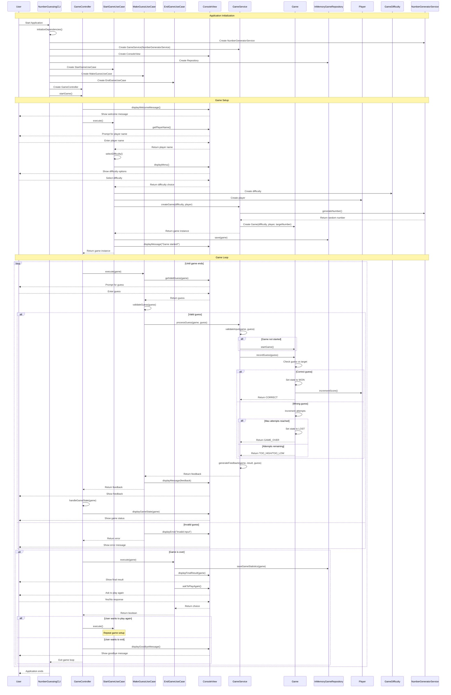
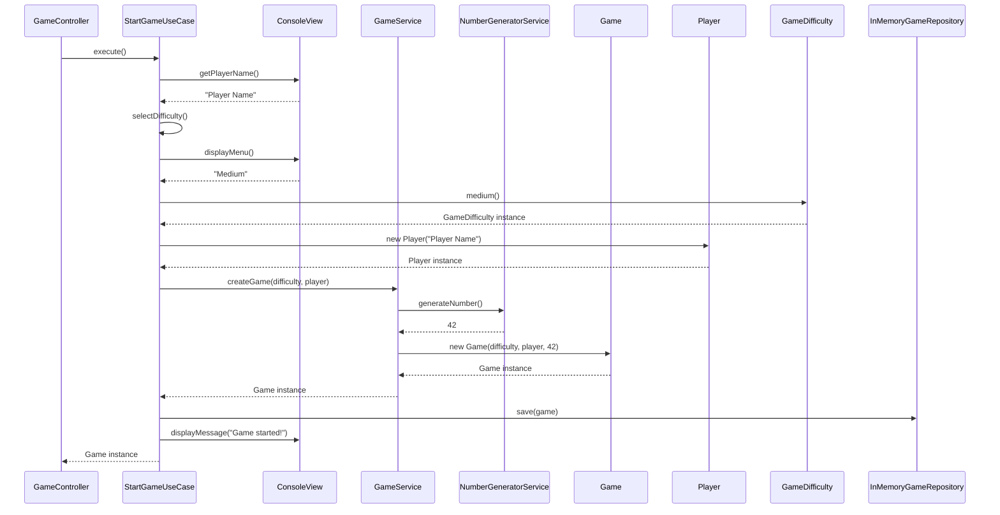
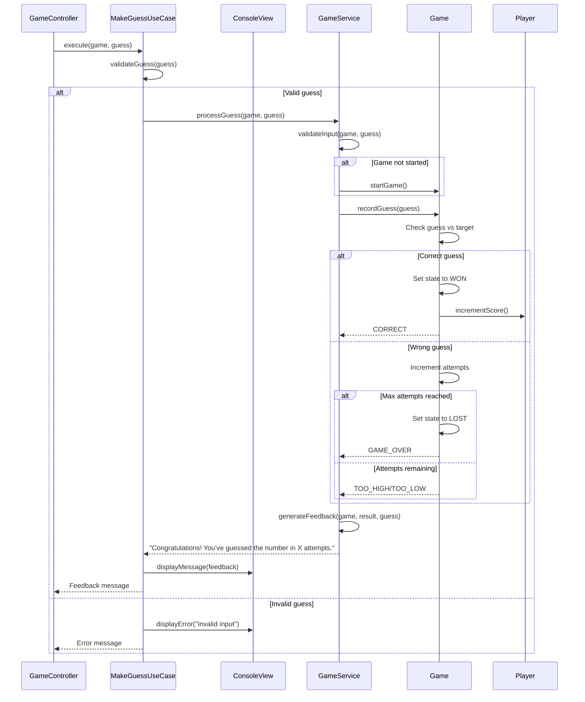
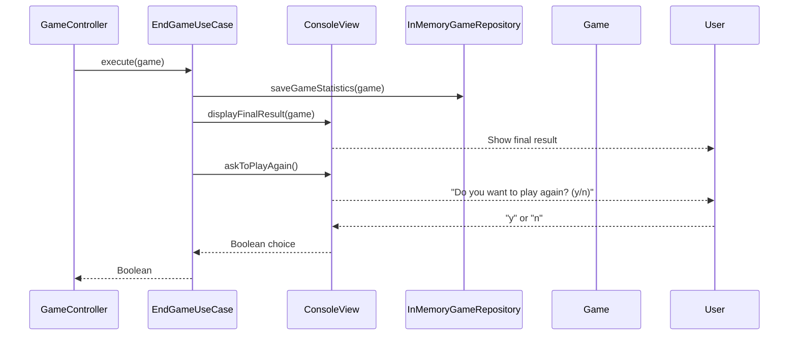
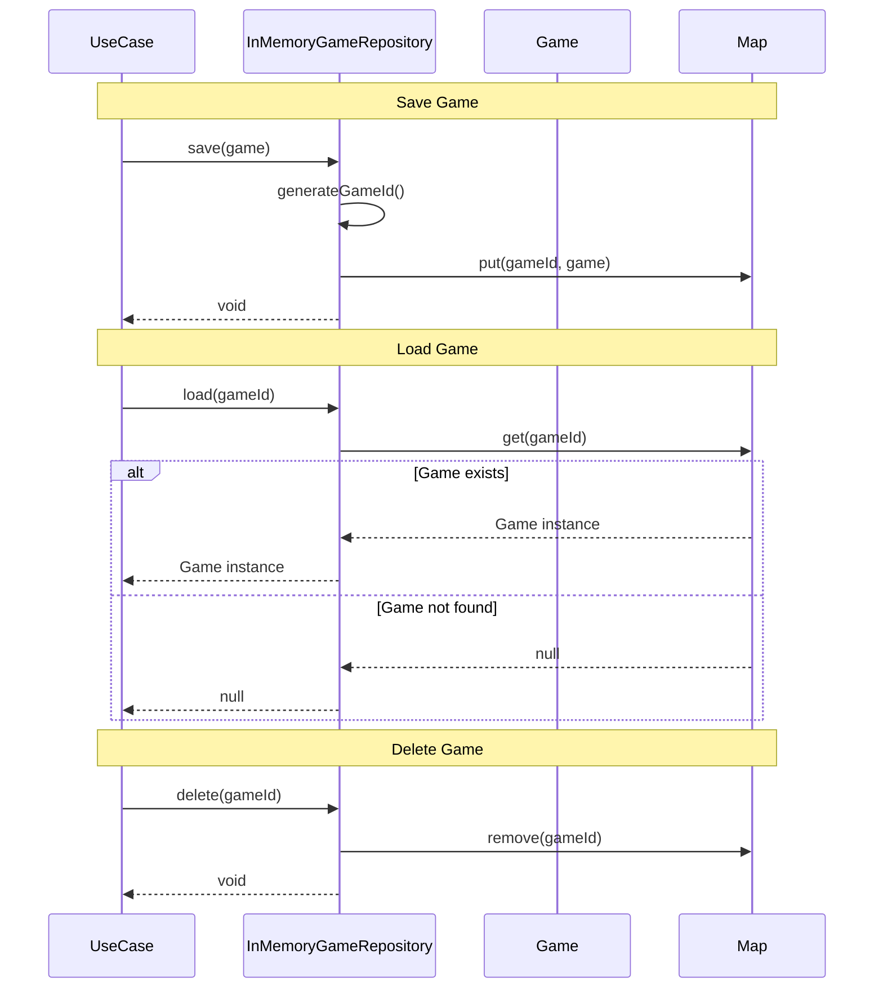

# Number Guessing Game - Sequence Diagram

## Main Game Flow Sequence Diagram

## Use Case Sequence Diagrams

### Start Game Use Case

### Make Guess Use Case

### End Game Use Case

## Repository Operations Sequence Diagram

## Key Interactions Explained

### 1. **Application Initialization**
- NumberGuessingCLI creates all dependencies with proper dependency injection
- GameService is created with NumberGeneratorService dependency
- GameController starts the main game loop

### 2. **Game Setup Flow**
- Player name input and validation
- Difficulty selection from menu
- Game creation through GameService with dependency injection
- Game persistence in repository

### 3. **Game Loop with Complete Architecture**
- Continuous guess processing until game ends
- Input validation through GameService
- Game state management with GuessResult enum
- User feedback and hints through rich domain service
- Real-time game status display

### 4. **Game Completion**
- Final result display
- Statistics saving
- Play again option
- Clean exit handling

### 5. **Error Handling**
- Invalid input validation through GameService
- Game state validation
- Exception handling throughout the flow
- Graceful error recovery

### 6. **Complete Implementation Features**
- **Dependency Injection**: GameService properly injects NumberGeneratorService
- **Separation of Concerns**: Game entity is pure, GameService handles business logic
- **Clean State Management**: GuessResult enum for clear state transitions
- **Rich Domain Service**: Centralized business logic and validation
- **Professional UI**: Comprehensive user feedback and status updates
- **Error Recovery**: Graceful handling of edge cases and invalid input

This sequence diagram shows the complete flow of the number guessing game, demonstrating how all components interact following the hexagonal architecture principles with complete implementation and enhanced user experience. 