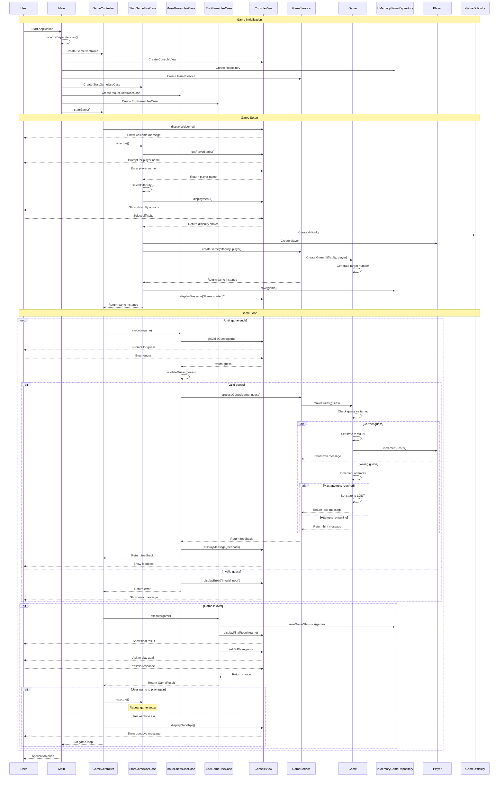
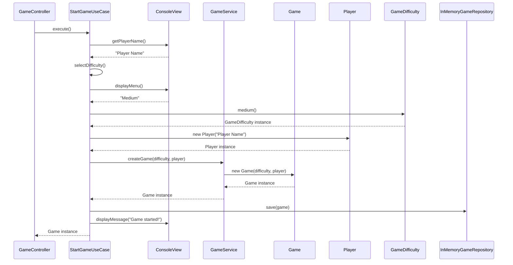
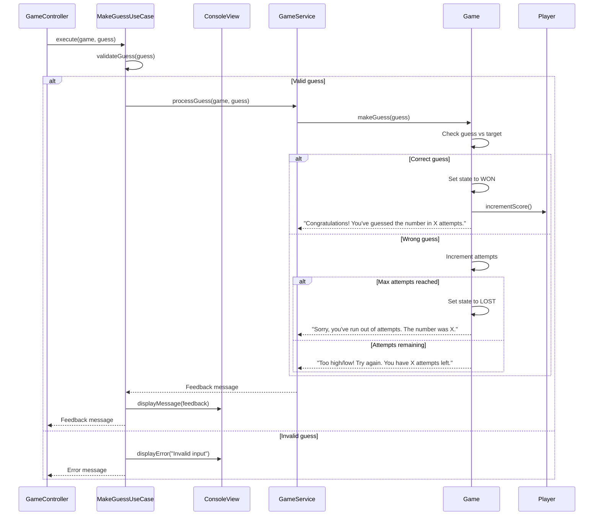
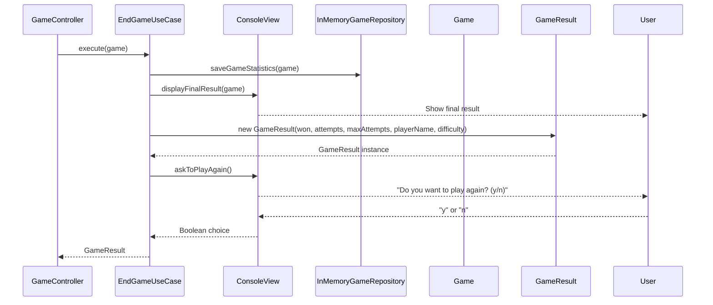
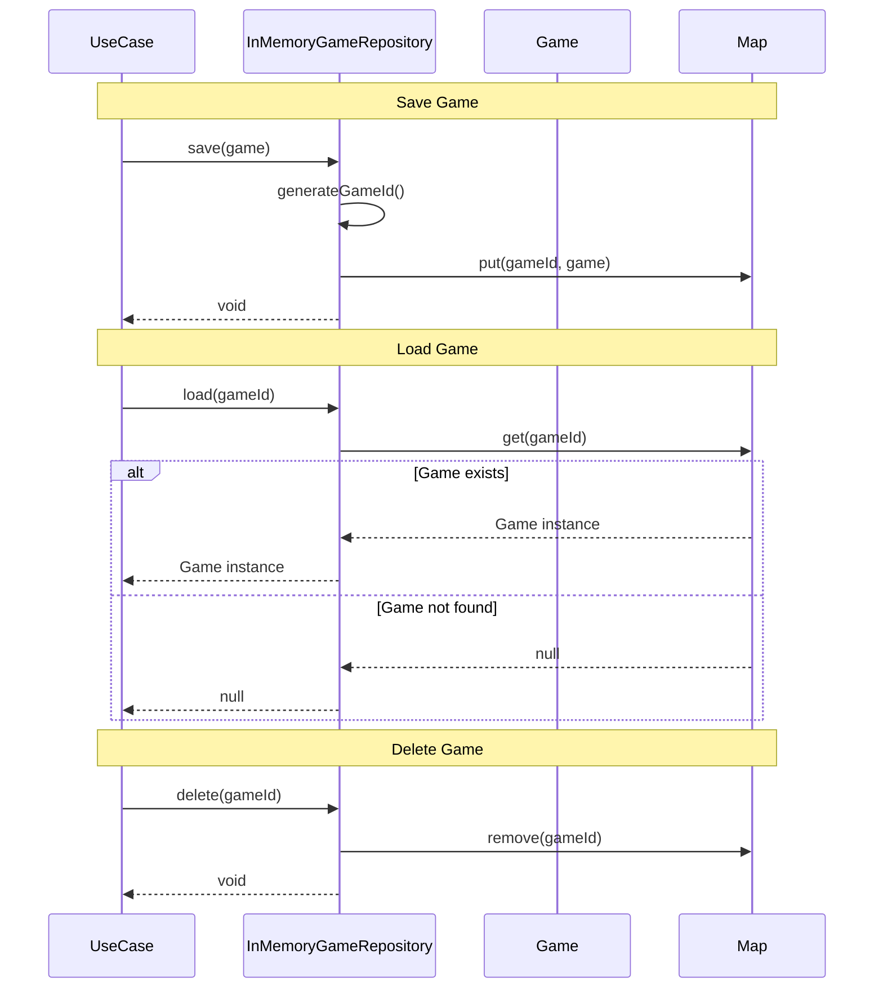

# Number Guessing Game - Sequence Diagram

## Main Game Flow Sequence Diagram

## Use Case Sequence Diagrams

### Start Game Use Case

### Make Guess Use Case

### End Game Use Case

## Repository Operations Sequence Diagram

## Key Interactions Explained

### 1. **Application Initialization**
- Main class creates all dependencies
- Dependency injection setup
- GameController starts the main game loop

### 2. **Game Setup Flow**
- Player name input and validation
- Difficulty selection from menu
- Game creation with domain services
- Game persistence in repository

### 3. **Game Loop**
- Continuous guess processing until game ends
- Input validation and error handling
- Game state management
- User feedback and hints

### 4. **Game Completion**
- Final result display
- Statistics saving
- Play again option
- Clean exit handling

### 5. **Error Handling**
- Invalid input validation
- Game state validation
- Exception handling throughout the flow

This sequence diagram shows the complete flow of the number guessing game, demonstrating how all components interact following the hexagonal architecture principles. 