# Number Guessing Game - Use Case Diagram

## Main Use Case Diagram

```mermaid
graph TB
    subgraph "Actors"
        Player[👤 Player]
        System[🖥️ System]
    end

    subgraph "Number Guessing Game System"
        subgraph "Game Management"
            StartGame[🎮 Start Game]
            SelectDifficulty[⚙️ Select Difficulty]
            EndGame[🏁 End Game]
            PlayAgain[🔄 Play Again]
        end

        subgraph "Gameplay"
            MakeGuess[🎯 Make Guess]
            ValidateGuess[✅ Validate Guess]
            ViewGameState[👁️ View Game State]
            ViewMenu[📋 View Menu]
            ViewRules[📖 View Rules]
        end

        subgraph "Data Management"
            SaveGame[💾 Save Game]
            LoadGame[📂 Load Game]
            DeleteGame[🗑️ Delete Game]
        end

        subgraph "User Interface"
            DisplayMessage[💬 Display Message]
            GetUserInput[⌨️ Get User Input]
            DisplayError[⚠️ Display Error]
            DisplaySuccess[🎉 Display Success]
            ClearScreen[🧹 Clear Screen]
        end

        subgraph "Business Logic"
            ProcessGuess[🔄 Process Guess]
            GenerateFeedback[💭 Generate Feedback]
            ManageGameState[🎛️ Manage Game State]
        end
    end

    %% Actor relationships
    Player --> StartGame
    Player --> SelectDifficulty
    Player --> MakeGuess
    Player --> ViewGameState
    Player --> ViewMenu
    Player --> ViewRules
    Player --> PlayAgain
    Player --> GetUserInput

    System --> EndGame
    System --> SaveGame
    System --> LoadGame
    System --> DeleteGame
    System --> DisplayMessage
    System --> DisplayError
    System --> DisplaySuccess
    System --> ClearScreen
    System --> ProcessGuess
    System --> GenerateFeedback
    System --> ManageGameState

    %% Use case relationships
    StartGame --> SelectDifficulty
    StartGame --> SaveGame
    StartGame --> DisplayMessage
    StartGame --> GetUserInput

    SelectDifficulty --> ViewMenu
    SelectDifficulty --> GetUserInput
    SelectDifficulty --> DisplayMessage

    MakeGuess --> ValidateGuess
    MakeGuess --> ProcessGuess
    MakeGuess --> GetUserInput
    MakeGuess --> DisplayMessage
    MakeGuess --> DisplayError
    MakeGuess --> ViewGameState
    MakeGuess --> SaveGame

    ValidateGuess --> DisplayError
    ProcessGuess --> GenerateFeedback
    ProcessGuess --> ManageGameState
    GenerateFeedback --> DisplayMessage
    GenerateFeedback --> DisplaySuccess

    EndGame --> SaveGame
    EndGame --> DisplayMessage
    EndGame --> DisplaySuccess
    EndGame --> PlayAgain

    PlayAgain --> StartGame

    ViewGameState --> DisplayMessage
    ViewMenu --> DisplayMessage
    ViewRules --> DisplayMessage

    %% Styling
    classDef actor fill:#ffebee
    classDef primaryUseCase fill:#e8f5e8
    classDef secondaryUseCase fill:#e3f2fd
    classDef systemUseCase fill:#fff3e0
    classDef businessUseCase fill:#f3e5f5

    class Player,System actor
    class StartGame,MakeGuess,EndGame,PlayAgain primaryUseCase
    class SelectDifficulty,ViewGameState,ViewMenu,ViewRules secondaryUseCase
    class SaveGame,LoadGame,DeleteGame,DisplayMessage,GetUserInput,DisplayError,DisplaySuccess,ClearScreen systemUseCase
    class ValidateGuess,ProcessGuess,GenerateFeedback,ManageGameState businessUseCase
```

## Detailed Use Case Descriptions

### **Primary Use Cases**

#### **🎮 Start Game**
- **Actor**: Player
- **Description**: Initialize a new number guessing game with complete validation
- **Preconditions**: Player is ready to play
- **Main Flow**:
  1. Player requests to start a new game
  2. System prompts for player name with validation
  3. System displays difficulty options with clear descriptions
  4. Player selects difficulty level (numeric or text input supported)
  5. System validates difficulty selection
  6. System creates game with random target number through GameService
  7. System saves game state to repository
  8. System displays welcome message with game information
- **Alternative Flows**:
  - Invalid player name: System displays error and prompts again
  - Invalid difficulty: System displays error and shows options again
- **Postconditions**: Game is initialized and ready for play

#### **🎯 Make Guess**
- **Actor**: Player
- **Description**: Player makes a validated guess at the target number
- **Preconditions**: Game is in progress
- **Main Flow**:
  1. Player enters a guess (1-100)
  2. System validates input format and range
  3. System processes guess through GameService
  4. System compares guess to target number
  5. System provides appropriate feedback (too high/low/correct)
  6. System updates game state and manages transitions
  7. System displays current game status
  8. System saves game progress
- **Alternative Flows**:
  - Invalid input: System displays error and prompts again
  - Correct guess: Game ends with win and score increment
  - Max attempts reached: Game ends with loss
- **Postconditions**: Game state is updated with proper feedback

#### **🏁 End Game**
- **Actor**: System
- **Description**: Complete the current game session with comprehensive result handling
- **Preconditions**: Game is in progress or completed
- **Main Flow**:
  1. System detects game completion (win/loss)
  2. System displays final result with detailed statistics
  3. System saves final game statistics to repository
  4. System asks if player wants to play again
  5. System handles player choice appropriately
- **Postconditions**: Game session is complete with proper cleanup

#### **🔄 Play Again**
- **Actor**: Player
- **Description**: Start a new game after completing one
- **Preconditions**: Previous game is completed
- **Main Flow**:
  1. Player chooses to play again
  2. System starts new game (see Start Game use case)
- **Postconditions**: New game is initialized

### **Secondary Use Cases**

#### **⚙️ Select Difficulty**
- **Actor**: Player
- **Description**: Choose game difficulty level with complete validation
- **Preconditions**: Game is being initialized
- **Main Flow**:
  1. System displays difficulty options with attempt counts
  2. Player selects difficulty (supports both numeric and text input)
  3. System validates selection
  4. System configures game with selected difficulty
- **Alternative Flows**:
  - Invalid selection: System displays error and shows options again
- **Postconditions**: Game difficulty is set

#### **👁️ View Game State**
- **Actor**: Player
- **Description**: View current game information with comprehensive details
- **Preconditions**: Game is in progress
- **Main Flow**:
  1. Player requests game state information
  2. System displays current attempts, remaining attempts, difficulty, and game state
- **Postconditions**: Player sees comprehensive current game status

#### **📋 View Menu**
- **Actor**: Player
- **Description**: Display available game options with complete presentation
- **Preconditions**: Player is in game interface
- **Main Flow**:
  1. Player requests menu display
  2. System shows available options and commands with clear descriptions
- **Postconditions**: Player sees available options

#### **📖 View Rules**
- **Actor**: Player
- **Description**: Display game rules and instructions
- **Preconditions**: None
- **Main Flow**:
  1. Player requests game rules
  2. System displays complete game instructions
- **Postconditions**: Player understands game rules

### **System Use Cases**

#### **💾 Save Game**
- **Actor**: System
- **Description**: Persist game state to storage with complete error handling
- **Preconditions**: Game state has changed
- **Main Flow**:
  1. System detects state change
  2. System serializes game data
  3. System stores data in repository with error handling
- **Alternative Flows**:
  - Storage error: System logs error and continues
- **Postconditions**: Game state is persisted

#### **📂 Load Game**
- **Actor**: System
- **Description**: Retrieve game state from storage with validation
- **Preconditions**: Game data exists in storage
- **Main Flow**:
  1. System requests game data
  2. System retrieves data from repository
  3. System validates data integrity
  4. System reconstructs game state
- **Alternative Flows**:
  - Corrupted data: System handles gracefully
- **Postconditions**: Game state is restored

#### **🗑️ Delete Game**
- **Actor**: System
- **Description**: Remove game data from storage
- **Preconditions**: Game data exists in storage
- **Main Flow**:
  1. System identifies game to delete
  2. System removes data from repository
- **Postconditions**: Game data is removed

#### **💬 Display Message**
- **Actor**: System
- **Description**: Show information to player with complete formatting
- **Preconditions**: Message is available
- **Main Flow**:
  1. System formats message appropriately
  2. System displays message to player
- **Postconditions**: Player sees formatted message

#### **⌨️ Get User Input**
- **Actor**: System
- **Description**: Capture and validate player input
- **Preconditions**: Input is requested
- **Main Flow**:
  1. System prompts for input
  2. System captures player response
  3. System validates input format and content
- **Alternative Flows**:
  - Invalid input: System provides helpful error message
- **Postconditions**: Valid input is captured

#### **⚠️ Display Error**
- **Actor**: System
- **Description**: Show error message to player with helpful guidance
- **Preconditions**: Error condition exists
- **Main Flow**:
  1. System identifies error
  2. System formats error message with helpful guidance
  3. System displays error to player
- **Postconditions**: Player sees helpful error message

#### **🎉 Display Success**
- **Actor**: System
- **Description**: Show success message to player with celebration
- **Preconditions**: Success condition exists
- **Main Flow**:
  1. System identifies success
  2. System formats success message with celebration
  3. System displays success to player
- **Postconditions**: Player sees celebratory success message

#### **🧹 Clear Screen**
- **Actor**: System
- **Description**: Clear display for better readability
- **Preconditions**: Screen needs clearing
- **Main Flow**:
  1. System detects need to clear screen
  2. System clears display area
- **Postconditions**: Screen is cleared

### **Business Logic Use Cases**

#### **✅ Validate Guess**
- **Actor**: System
- **Description**: Validate player guess input with comprehensive checks
- **Preconditions**: Guess input is provided
- **Main Flow**:
  1. System checks input format (numeric)
  2. System validates range (1-100)
  3. System ensures game is in valid state for guessing
- **Alternative Flows**:
  - Invalid format: Return validation error
  - Out of range: Return range error
  - Invalid game state: Return state error
- **Postconditions**: Guess is validated or error is returned

#### **🔄 Process Guess**
- **Actor**: System
- **Description**: Process validated guess through business logic
- **Preconditions**: Valid guess is provided
- **Main Flow**:
  1. System records guess attempt
  2. System compares guess to target number
  3. System updates game state based on result
  4. System manages score if applicable
- **Postconditions**: Game state is updated with guess result

#### **💭 Generate Feedback**
- **Actor**: System
- **Description**: Generate appropriate feedback message based on guess result
- **Preconditions**: Guess result is available
- **Main Flow**:
  1. System determines feedback type based on result
  2. System formats message with relevant information
  3. System includes remaining attempts if applicable
- **Postconditions**: Appropriate feedback message is generated

#### **🎛️ Manage Game State**
- **Actor**: System
- **Description**: Manage game state transitions and lifecycle
- **Preconditions**: Game state change is needed
- **Main Flow**:
  1. System determines required state transition
  2. System validates transition is allowed
  3. System updates game state
  4. System triggers appropriate actions (score increment, etc.)
- **Postconditions**: Game state is properly updated

## Use Case Relationships

### **Include Relationships**
- **Start Game** includes **Select Difficulty**
- **Start Game** includes **Save Game**
- **Make Guess** includes **Validate Guess**
- **Make Guess** includes **Process Guess**
- **Make Guess** includes **Save Game**
- **End Game** includes **Save Game**

### **Extend Relationships**
- **Make Guess** extends **Display Error** (when invalid input)
- **Make Guess** extends **Display Success** (when correct)
- **End Game** extends **Play Again**
- **Process Guess** extends **Generate Feedback**
- **Process Guess** extends **Manage Game State**

### **Generalization Relationships**
- **Display Message** is generalized by **Display Error** and **Display Success**
- **Get User Input** is specialized for different input types
- **Validate Guess** is specialized for different validation scenarios

## Implementation Status

### ✅ **Fully Implemented Use Cases**
- **Start Game**: Complete game initialization with validation
- **Make Guess**: Complete guess processing with feedback
- **End Game**: Complete game completion with statistics
- **Play Again**: Complete play again functionality
- **Select Difficulty**: Complete difficulty selection with validation
- **View Game State**: Complete game status display
- **View Menu**: Complete menu display
- **View Rules**: Complete rules display
- **All System Use Cases**: Complete system functionality
- **All Business Logic Use Cases**: Complete business logic implementation

### 🎯 **Key Features**
- **Complete Game Flow**: From startup to game completion
- **Error Handling**: Graceful handling of invalid input and edge cases
- **User Experience**: Professional UI with clear messages and status updates
- **Architecture Compliance**: Full hexagonal architecture implementation
- **Documentation**: Comprehensive JavaDoc throughout the codebase

This use case diagram provides a comprehensive view of all the interactions between the player and the complete number guessing game system, showing both primary gameplay use cases and supporting system functionality with complete implementation and enhanced user experience. 