# Number Guessing Game - Use Case Diagram

## Main Use Case Diagram

```mermaid
graph TB
    subgraph "Actors"
        Player[👤 Player]
        System[🖥️ System]
    end

    subgraph "Number Guessing Game System"
        subgraph "Game Management"
            StartGame[🎮 Start Game]
            SelectDifficulty[⚙️ Select Difficulty]
            EndGame[🏁 End Game]
            PlayAgain[🔄 Play Again]
        end

        subgraph "Gameplay"
            MakeGuess[🎯 Make Guess]
            ViewGameState[👁️ View Game State]
            ViewMenu[📋 View Menu]
            ViewRules[📖 View Rules]
        end

        subgraph "Data Management"
            SaveGame[💾 Save Game]
            LoadGame[📂 Load Game]
            DeleteGame[🗑️ Delete Game]
            ViewStatistics[📊 View Statistics]
        end

        subgraph "User Interface"
            DisplayMessage[💬 Display Message]
            GetUserInput[⌨️ Get User Input]
            DisplayError[⚠️ Display Error]
            ClearScreen[🧹 Clear Screen]
        end
    end

    %% Actor relationships
    Player --> StartGame
    Player --> SelectDifficulty
    Player --> MakeGuess
    Player --> ViewGameState
    Player --> ViewMenu
    Player --> ViewRules
    Player --> PlayAgain
    Player --> ViewStatistics
    Player --> GetUserInput

    System --> EndGame
    System --> SaveGame
    System --> LoadGame
    System --> DeleteGame
    System --> DisplayMessage
    System --> DisplayError
    System --> ClearScreen

    %% Use case relationships
    StartGame --> SelectDifficulty
    StartGame --> SaveGame
    StartGame --> DisplayMessage
    StartGame --> GetUserInput

    SelectDifficulty --> ViewMenu
    SelectDifficulty --> GetUserInput
    SelectDifficulty --> DisplayMessage

    MakeGuess --> GetUserInput
    MakeGuess --> DisplayMessage
    MakeGuess --> DisplayError
    MakeGuess --> ViewGameState
    MakeGuess --> SaveGame

    EndGame --> SaveGame
    EndGame --> DisplayMessage
    EndGame --> ViewStatistics
    EndGame --> PlayAgain

    PlayAgain --> StartGame

    ViewGameState --> DisplayMessage
    ViewMenu --> DisplayMessage
    ViewRules --> DisplayMessage
    ViewStatistics --> DisplayMessage

    %% Styling
    classDef actor fill:#ffebee
    classDef primaryUseCase fill:#e8f5e8
    classDef secondaryUseCase fill:#e3f2fd
    classDef systemUseCase fill:#fff3e0

    class Player,System actor
    class StartGame,MakeGuess,EndGame,PlayAgain primaryUseCase
    class SelectDifficulty,ViewGameState,ViewMenu,ViewRules,ViewStatistics secondaryUseCase
    class SaveGame,LoadGame,DeleteGame,DisplayMessage,GetUserInput,DisplayError,ClearScreen systemUseCase
```

## Detailed Use Case Descriptions

### **Primary Use Cases**

#### **🎮 Start Game**
- **Actor**: Player
- **Description**: Initialize a new number guessing game
- **Preconditions**: Player is ready to play
- **Main Flow**:
  1. Player requests to start a new game
  2. System prompts for player name
  3. System displays difficulty options
  4. Player selects difficulty level
  5. System creates game with random target number
  6. System saves game state
  7. System displays welcome message
- **Postconditions**: Game is initialized and ready for play

#### **🎯 Make Guess**
- **Actor**: Player
- **Description**: Player makes a guess at the target number
- **Preconditions**: Game is in progress
- **Main Flow**:
  1. Player enters a guess (1-100)
  2. System validates input
  3. System compares guess to target number
  4. System provides feedback (too high/low/correct)
  5. System updates game state
  6. System saves game progress
- **Alternative Flows**:
  - Invalid input: System displays error and prompts again
  - Correct guess: Game ends with win
  - Max attempts reached: Game ends with loss
- **Postconditions**: Game state is updated

#### **🏁 End Game**
- **Actor**: System
- **Description**: Complete the current game session
- **Preconditions**: Game is in progress or completed
- **Main Flow**:
  1. System detects game completion (win/loss)
  2. System displays final result
  3. System saves final game statistics
  4. System asks if player wants to play again
- **Postconditions**: Game session is complete

#### **🔄 Play Again**
- **Actor**: Player
- **Description**: Start a new game after completing one
- **Preconditions**: Previous game is completed
- **Main Flow**:
  1. Player chooses to play again
  2. System starts new game (see Start Game use case)
- **Postconditions**: New game is initialized

### **Secondary Use Cases**

#### **⚙️ Select Difficulty**
- **Actor**: Player
- **Description**: Choose game difficulty level
- **Preconditions**: Game is being initialized
- **Main Flow**:
  1. System displays difficulty options (Easy/Medium/Hard)
  2. Player selects difficulty
  3. System validates selection
  4. System configures game with selected difficulty
- **Postconditions**: Game difficulty is set

#### **👁️ View Game State**
- **Actor**: Player
- **Description**: View current game information
- **Preconditions**: Game is in progress
- **Main Flow**:
  1. Player requests game state information
  2. System displays current attempts, remaining attempts, difficulty
- **Postconditions**: Player sees current game status

#### **📋 View Menu**
- **Actor**: Player
- **Description**: Display available game options
- **Preconditions**: Player is in game interface
- **Main Flow**:
  1. Player requests menu display
  2. System shows available options and commands
- **Postconditions**: Player sees available options

#### **📖 View Rules**
- **Actor**: Player
- **Description**: Display game rules and instructions
- **Preconditions**: None
- **Main Flow**:
  1. Player requests game rules
  2. System displays complete game instructions
- **Postconditions**: Player understands game rules

#### **📊 View Statistics**
- **Actor**: Player
- **Description**: View game performance statistics
- **Preconditions**: Game is completed
- **Main Flow**:
  1. Player requests statistics
  2. System displays player score, games played, win rate
- **Postconditions**: Player sees performance data

### **System Use Cases**

#### **💾 Save Game**
- **Actor**: System
- **Description**: Persist game state to storage
- **Preconditions**: Game state has changed
- **Main Flow**:
  1. System detects state change
  2. System serializes game data
  3. System stores data in repository
- **Postconditions**: Game state is persisted

#### **📂 Load Game**
- **Actor**: System
- **Description**: Retrieve game state from storage
- **Preconditions**: Game data exists in storage
- **Main Flow**:
  1. System requests game data
  2. System retrieves data from repository
  3. System reconstructs game state
- **Postconditions**: Game state is restored

#### **🗑️ Delete Game**
- **Actor**: System
- **Description**: Remove game data from storage
- **Preconditions**: Game data exists in storage
- **Main Flow**:
  1. System identifies game to delete
  2. System removes data from repository
- **Postconditions**: Game data is removed

#### **💬 Display Message**
- **Actor**: System
- **Description**: Show information to player
- **Preconditions**: Message is available
- **Main Flow**:
  1. System formats message
  2. System displays message to player
- **Postconditions**: Player sees message

#### **⌨️ Get User Input**
- **Actor**: System
- **Description**: Capture player input
- **Preconditions**: Input is requested
- **Main Flow**:
  1. System prompts for input
  2. System captures player response
  3. System validates input format
- **Postconditions**: Valid input is captured

#### **⚠️ Display Error**
- **Actor**: System
- **Description**: Show error message to player
- **Preconditions**: Error condition exists
- **Main Flow**:
  1. System identifies error
  2. System formats error message
  3. System displays error to player
- **Postconditions**: Player sees error message

#### **🧹 Clear Screen**
- **Actor**: System
- **Description**: Clear display for better readability
- **Preconditions**: Screen needs clearing
- **Main Flow**:
  1. System detects need to clear screen
  2. System clears display area
- **Postconditions**: Screen is cleared

## Use Case Relationships

### **Include Relationships**
- **Start Game** includes **Select Difficulty**
- **Start Game** includes **Save Game**
- **Make Guess** includes **Save Game**
- **End Game** includes **Save Game**

### **Extend Relationships**
- **Make Guess** extends **Display Error** (when invalid input)
- **End Game** extends **View Statistics**
- **End Game** extends **Play Again**

### **Generalization Relationships**
- **Display Message** is generalized by **Display Error**
- **Get User Input** is specialized for different input types

This use case diagram provides a comprehensive view of all the interactions between the player and the number guessing game system, showing both primary gameplay use cases and supporting system functionality. 