# Number Guessing Game - Class Diagram

```mermaid
classDiagram
    %% Domain Model Layer
    class Game {
        -GameDifficulty difficulty
        -Player player
        -GameState state
        -int targetNumber
        -int currentAttempts
        +Game(GameDifficulty, Player)
        +startGame() void
        +makeGuess(int guess) String
        +getDifficulty() GameDifficulty
        +getPlayer() Player
        +getState() GameState
        +getTargetNumber() int
        +getCurrentAttempts() int
        +getRemainingAttempts() int
        +isGameOver() boolean
    }

    class Player {
        -String name
        -int score
        +Player(String name)
        +getName() String
        +getScore() int
        +incrementScore() void
    }

    class GameState {
        <<enumeration>>
        NOT_STARTED
        IN_PROGRESS
        WON
        LOST
    }

    class GameDifficulty {
        -DifficultyStrategy strategy
        +GameDifficulty(DifficultyStrategy)
        +easy() GameDifficulty
        +medium() GameDifficulty
        +hard() GameDifficulty
        +getMaxAttempts() int
        +getDifficultyName() String
        +setStrategy(DifficultyStrategy) void
        +getStrategy() DifficultyStrategy
        +equals(Object) boolean
        +hashCode() int
        +toString() String
    }

    class DifficultyStrategy {
        <<interface>>
        +getMaxAttempts() int
        +getDifficultyName() String
    }

    class DifficultyEasy {
        -int MAX_ATTEMPTS = 10
        -String DIFFICULTY_NAME = "Easy"
        +getMaxAttempts() int
        +getDifficultyName() String
    }

    class DifficultyMedium {
        -int MAX_ATTEMPTS = 5
        -String DIFFICULTY_NAME = "Medium"
        +getMaxAttempts() int
        +getDifficultyName() String
    }

    class DifficultyHard {
        -int MAX_ATTEMPTS = 3
        -String DIFFICULTY_NAME = "Hard"
        +getMaxAttempts() int
        +getDifficultyName() String
    }

    %% Domain Services Layer
    class GameService {
        +createGame(GameDifficulty, Player) Game
        +processGuess(Game, int) String
    }

    class NumberGeneratorService {
        -Random random
        +NumberGeneratorService()
        +generateNumber() int
    }

    %% Application Layer - Ports
    class GameRepository {
        <<interface>>
        +save(Game) void
        +load(String gameId) Game
        +delete(String gameId) void
    }

    class UserInterface {
        <<interface>>
        +displayMessage(String) void
        +getUserInput() String
        +displayMenu() void
    }

    %% Application Layer - Use Cases
    class StartGameUseCase {
        -GameService gameService
        -GameRepository gameRepository
        -UserInterface userInterface
        +StartGameUseCase(GameService, GameRepository, UserInterface)
        +execute(String playerName, GameDifficulty difficulty) Game
        +selectDifficulty() GameDifficulty
        +getPlayerName() String
    }

    class MakeGuessUseCase {
        -GameService gameService
        -UserInterface userInterface
        +MakeGuessUseCase(GameService, UserInterface)
        +execute(Game game, int guess) String
        +getValidGuess(Game game) int
        +validateGuess(int guess) boolean
    }

    class EndGameUseCase {
        -GameRepository gameRepository
        -UserInterface userInterface
        +EndGameUseCase(GameRepository, UserInterface)
        +execute(Game game) GameResult
        +saveGameStatistics(Game game) void
        +displayFinalResult(Game game) void
        +askToPlayAgain() boolean
    }

    %% Infrastructure Layer
    class InMemoryGameRepository {
        -Map~String, Game~ games
        -AtomicLong gameIdCounter
        +InMemoryGameRepository()
        +save(Game game) void
        +load(String gameId) Game
        +delete(String gameId) void
        +getAllGames() List~Game~
        +generateGameId() String
        +clearAllGames() void
    }

    class ConsoleView {
        -Scanner scanner
        -PrintStream output
        +ConsoleView()
        +ConsoleView(InputStream, PrintStream)
        +displayMessage(String) void
        +getUserInput() String
        +displayMenu() void
        +clearScreen() void
        +displayGameState(Game) void
        +displayError(String) void
        +displaySuccess(String) void
    }

    class GameController {
        -StartGameUseCase startGameUseCase
        -MakeGuessUseCase makeGuessUseCase
        -EndGameUseCase endGameUseCase
        -UserInterface userInterface
        +GameController(StartGameUseCase, MakeGuessUseCase, EndGameUseCase, UserInterface)
        +startGame() void
        +runGameLoop() void
        +processUserInput(String) void
        +handleGameState(Game) void
        +displayWelcome() void
        +displayGoodbye() void
    }

    class GameFactory {
        +GameFactory()
        +createGame(GameDifficulty, Player) Game
        +createPlayer(String name) Player
        +createDifficulty(String difficultyName) GameDifficulty
        +createGameWithDefaults() Game
    }

    %% Main Application
    class Main {
        +main(String[] args) void
        +initializeDependencies() GameController
        +setupGameServices() GameService
        +setupRepositories() GameRepository
        +setupUserInterface() UserInterface
    }

    %% Additional Utility Classes
    class GameResult {
        -boolean won
        -int attempts
        -int maxAttempts
        -String playerName
        -GameDifficulty difficulty
        +GameResult(boolean, int, int, String, GameDifficulty)
        +isWon() boolean
        +getAttempts() int
        +getMaxAttempts() int
        +getPlayerName() String
        +getDifficulty() GameDifficulty
        +toString() String
    }

    class GameException {
        +GameException(String)
        +GameException(String, Throwable)
    }

    class InputValidator {
        +validateNumericInput(String, int, int) boolean
        +validatePlayerName(String) boolean
        +validateDifficultyChoice(String) boolean
    }

    %% Relationships
    Game --> GameDifficulty : has
    Game --> Player : has
    Game --> GameState : has
    Game --> NumberGeneratorService : uses

    GameDifficulty --> DifficultyStrategy : uses
    DifficultyEasy ..|> DifficultyStrategy : implements
    DifficultyMedium ..|> DifficultyStrategy : implements
    DifficultyHard ..|> DifficultyStrategy : implements

    StartGameUseCase --> GameService : uses
    StartGameUseCase --> GameRepository : uses
    StartGameUseCase --> UserInterface : uses
    StartGameUseCase --> Game : creates
    StartGameUseCase --> GameDifficulty : uses

    MakeGuessUseCase --> GameService : uses
    MakeGuessUseCase --> UserInterface : uses
    MakeGuessUseCase --> Game : processes

    EndGameUseCase --> GameRepository : uses
    EndGameUseCase --> UserInterface : uses
    EndGameUseCase --> Game : processes
    EndGameUseCase --> GameResult : creates

    InMemoryGameRepository ..|> GameRepository : implements
    InMemoryGameRepository --> Game : stores

    ConsoleView ..|> UserInterface : implements
    ConsoleView --> Game : displays

    GameController --> StartGameUseCase : orchestrates
    GameController --> MakeGuessUseCase : orchestrates
    GameController --> EndGameUseCase : orchestrates
    GameController --> UserInterface : uses
    GameController --> Game : manages

    GameFactory --> Game : creates
    GameFactory --> Player : creates
    GameFactory --> GameDifficulty : creates

    Main --> GameController : creates
    Main --> GameService : creates
    Main --> GameRepository : creates
    Main --> UserInterface : creates

    GameException --> Exception : extends

    InputValidator --> StartGameUseCase : validates
    InputValidator --> MakeGuessUseCase : validates
    InputValidator --> ConsoleView : validates
```

## Architecture Layers

### Domain Layer (Core Business Logic)
- **Game**: Main game entity with business rules
- **Player**: Player entity with score management
- **GameState**: Enumeration of game states
- **GameDifficulty**: Strategy pattern for difficulty levels
- **DifficultyStrategy**: Interface for difficulty implementations

### Domain Services Layer
- **GameService**: High-level game operations
- **NumberGeneratorService**: Random number generation

### Application Layer
- **Ports**: Interfaces for external dependencies
  - **GameRepository**: Data persistence contract
  - **UserInterface**: User interaction contract
- **Use Cases**: Application business logic
  - **StartGameUseCase**: Game initialization logic
  - **MakeGuessUseCase**: Guess processing logic
  - **EndGameUseCase**: Game completion logic

### Infrastructure Layer
- **InMemoryGameRepository**: In-memory data storage
- **ConsoleView**: Command-line interface implementation
- **GameController**: Application flow orchestration
- **GameFactory**: Object creation factory

### Main Application
- **Main**: Application entry point and dependency setup

### Utility Classes
- **GameResult**: Result data transfer object
- **GameException**: Custom exception handling
- **InputValidator**: Input validation utilities

## Design Patterns Used

1. **Hexagonal Architecture**: Clear separation between domain, application, and infrastructure
2. **Strategy Pattern**: Difficulty levels implementation
3. **Factory Pattern**: Object creation in GameFactory
4. **Dependency Injection**: Constructor-based dependency management
5. **Repository Pattern**: Data access abstraction
6. **Use Case Pattern**: Application business logic organization 