# Class Diagram - Personal Blog Application

This diagram shows the static structure of the Personal Blog application, including entities, DTOs, services, controllers, and their relationships.

## Domain Model & Architecture

```mermaid
classDiagram
    %% Base Entity
    class BaseEntity {
        <<abstract>>
        - Long id
        - LocalDateTime createdAt
        - LocalDateTime updatedAt
        - String createdBy
        - String updatedBy
        + getId() Long
        + getCreatedAt() LocalDateTime
        + getUpdatedAt() LocalDateTime
    }

    %% Core Entities
    class User {
        - String username
        - String email
        - String password
        - String firstName
        - String lastName
        - UserRole role
        - boolean enabled
        - LocalDateTime lastLoginAt
        + getFullName() String
        + isAdmin() boolean
        + updateLastLogin() void
    }

    class BlogPost {
        - String title
        - String slug
        - String content
        - String excerpt
        - String featuredImage
        - PostStatus status
        - LocalDateTime publishedAt
        - Integer viewCount
        - User author
        - Category category
        - Set_of_Tag tags
        - List_of_Comment comments
        + isPublished() boolean
        + incrementViewCount() void
        + addTag(Tag) void
        + removeTag(Tag) void
    }

    class Category {
        - String name
        - String slug
        - String description
        - String color
        - List_of_BlogPost posts
        + getPostCount() int
    }

    class Tag {
        - String name
        - String slug
        - String color
        - Set_of_BlogPost posts
        + getPostCount() int
    }

    class Comment {
        - String content
        - String authorName
        - String authorEmail
        - String authorWebsite
        - CommentStatus status
        - BlogPost post
        - Comment parentComment
        - List_of_Comment replies
        + isApproved() boolean
        + addReply(Comment) void
    }

    class RefreshToken {
        - String token
        - LocalDateTime expiryDate
        - User user
        + isExpired() boolean
    }

    %% Enums
    class UserRole {
        <<enumeration>>
    }

    class PostStatus {
        <<enumeration>>
    }

    class CommentStatus {
        <<enumeration>>
    }

    %% DTOs - Request
    class LoginRequest {
        - String email
        - String password
        + validate() void
    }

    class BlogPostRequest {
        - String title
        - String content
        - String excerpt
        - String featuredImage
        - PostStatus status
        - Long categoryId
        - Set_of_Long tagIds
        + validate() void
        + toEntity() BlogPost
    }

    class CategoryRequest {
        - String name
        - String description
        - String color
        + validate() void
        + toEntity() Category
    }

    class CommentRequest {
        - String content
        - String authorName
        - String authorEmail
        - String authorWebsite
        - Long postId
        - Long parentCommentId
        + validate() void
        + toEntity() Comment
    }

    %% DTOs - Response
    class AuthResponse {
        - String accessToken
        - String refreshToken
        - String tokenType
        - Long expiresIn
        - UserResponse user
    }

    class BlogPostResponse {
        - Long id
        - String title
        - String slug
        - String content
        - String excerpt
        - String featuredImage
        - PostStatus status
        - LocalDateTime publishedAt
        - Integer viewCount
        - UserResponse author
        - CategoryResponse category
        - Set_of_TagResponse tags
        - List_of_CommentResponse comments
        + fromEntity(BlogPost) BlogPostResponse
    }

    class CategoryResponse {
        - Long id
        - String name
        - String slug
        - String description
        - String color
        - Integer postCount
        + fromEntity(Category) CategoryResponse
    }

    class UserResponse {
        - Long id
        - String username
        - String email
        - String firstName
        - String lastName
        - UserRole role
        + fromEntity(User) UserResponse
    }

    class ApiResponse_Generic {
        - boolean success
        - String message
        - Object data
        - LocalDateTime timestamp
        + success(data: Object) ApiResponse_Generic
        + error(message: String) ApiResponse_Generic
    }

    %% Services
    class AuthService {
        + login(LoginRequest) AuthResponse
        + refreshToken(String) AuthResponse
        + logout(String) void
        + validateToken(String) boolean
    }

    class BlogPostService {
        + findAll(Pageable) Page_of_BlogPostResponse
        + findBySlug(String) BlogPostResponse
        + create(BlogPostRequest) BlogPostResponse
        + update(Long, BlogPostRequest) BlogPostResponse
        + delete(Long) void
        + incrementViewCount(Long) void
    }

    class CategoryService {
        + findAll() List_of_CategoryResponse
        + findBySlug(String) CategoryResponse
        + create(CategoryRequest) CategoryResponse
        + update(Long, CategoryRequest) CategoryResponse
        + delete(Long) void
    }

    class SearchService {
        + searchPosts(String, Pageable) Page_of_BlogPostResponse
        + searchByCategory(String, Pageable) Page_of_BlogPostResponse
        + searchByTag(String, Pageable) Page_of_BlogPostResponse
    }

    %% Controllers
    class AuthController {
        + login(LoginRequest) ResponseEntity_of_AuthResponse
        + refreshToken(RefreshTokenRequest) ResponseEntity_of_AuthResponse
        + logout(HttpServletRequest) ResponseEntity_of_Void
    }

    class BlogPostController {
        + getAllPosts(Pageable) ResponseEntity_of_Page_of_BlogPostResponse
        + getPostBySlug(String) ResponseEntity_of_BlogPostResponse
        + createPost(BlogPostRequest) ResponseEntity_of_BlogPostResponse
        + updatePost(Long, BlogPostRequest) ResponseEntity_of_BlogPostResponse
        + deletePost(Long) ResponseEntity_of_Void
    }

    class HomeController {
        + home(Model) String
        + post(String, Model) String
        + category(String, Model) String
        + search(String, Model) String
    }

    %% Security
    class JwtTokenProvider {
        - String jwtSecret
        - int jwtExpirationMs
        + generateToken(UserDetails) String
        + getUsernameFromToken(String) String
        + validateToken(String) boolean
        + getExpirationDateFromToken(String) Date
    }

    class CustomUserDetailsService {
        + loadUserByUsername(String) UserDetails
    }

    %% Repositories
    class UserRepository {
        <<interface>>
    }

    class BlogPostRepository {
        <<interface>>
    }

    class CategoryRepository {
        <<interface>>
    }

    %% Inheritance
    BaseEntity <|-- User
    BaseEntity <|-- BlogPost
    BaseEntity <|-- Category
    BaseEntity <|-- Tag
    BaseEntity <|-- Comment
    BaseEntity <|-- RefreshToken
```

## Key Design Patterns

### 1. **Repository Pattern**
- Clean separation between data access and business logic
- Spring Data JPA repositories with custom query methods
- Type-safe query methods with proper naming conventions

### 2. **DTO Pattern**
- Request DTOs for input validation and data transfer
- Response DTOs for controlled data exposure
- Separation of internal entities from API contracts

### 3. **Service Layer Pattern**
- Business logic encapsulation in service classes
- Transaction management at service level
- Clear separation of concerns

### 4. **Builder Pattern**
- Used in DTOs and entities for object construction
- Immutable response objects where appropriate
- Fluent API for complex object creation

## Architectural Layers

### **Controller Layer**
- REST API endpoints and web controllers
- Request validation and response formatting
- HTTP-specific concerns (status codes, headers)

### **Service Layer**
- Business logic implementation
- Transaction boundaries
- Cross-cutting concerns (caching, security)

### **Repository Layer**
- Data access abstraction
- Query optimization
- Database-specific operations

### **Entity Layer**
- Domain model representation
- JPA mappings and relationships
- Business rules and constraints

## Security Integration

### **Authentication Flow**
1. `AuthController` receives login request
2. `AuthService` validates credentials
3. `JwtTokenProvider` generates tokens
4. `RefreshToken` entity manages token lifecycle

### **Authorization**
- Role-based access control with `UserRole` enum
- Method-level security annotations
- JWT token validation in security filters

## Data Relationships

### **Core Relationships**
- **User → BlogPost**: One-to-Many (author relationship)
- **Category → BlogPost**: One-to-Many (categorization)
- **BlogPost ↔ Tag**: Many-to-Many (tagging system)
- **BlogPost → Comment**: One-to-Many (commenting)
- **Comment → Comment**: Self-referencing (reply system)

### **Audit Trail**
- `BaseEntity` provides audit fields for all entities
- Automatic timestamp management
- User tracking for create/update operations

---
*This class diagram represents the complete domain model and architecture for the Personal Blog application, following Spring Boot 3.5.4 and Java 21 best practices.*
