# Component Diagram - Personal Blog Application

This diagram illustrates the high-level architecture and component interactions of the Personal Blog application, showing the system's modular structure and external dependencies.

## 🏗️ System Architecture Overview

```mermaid
graph TB
    %% External Actors
    subgraph "External Actors"
        USER[👤 Blog Visitors]
        ADMIN[👨‍💼 Admin Users]
        SEARCH[🔍 Search Engines]
    end

    %% Load Balancer / Reverse Proxy
    subgraph "Infrastructure Layer"
        LB[🔄 Load Balancer/Nginx]
        SSL[🔒 SSL Termination]
    end

    %% Application Layer
    subgraph "Personal Blog Application"
        
        %% Web Layer
        subgraph "Web Layer"
            WEB[🌐 Thymeleaf Templates]
            STATIC[📁 Static Resources]
        end

        %% API Layer
        subgraph "API Layer"
            REST[🔌 REST Controllers]
            AUTH[🔐 Auth Controller]
            ADMIN_API[⚙️ Admin API]
        end

        %% Security Layer
        subgraph "Security Layer"
            JWT[🎫 JWT Filter]
            SECURITY[🛡️ Spring Security]
            RATE[⏱️ Rate Limiting]
        end

        %% Business Layer
        subgraph "Business Layer"
            BLOG_SVC[📝 Blog Service]
            AUTH_SVC[🔑 Auth Service]
            SEARCH_SVC[🔍 Search Service]
            CATEGORY_SVC[📂 Category Service]
            COMMENT_SVC[💬 Comment Service]
            EMAIL_SVC[📧 Email Service]
        end

        %% Data Access Layer
        subgraph "Data Access Layer"
            REPO[🗃️ JPA Repositories]
            CACHE_SVC[⚡ Cache Service]
            FILE_SVC[📎 File Service]
        end

        %% Configuration
        subgraph "Configuration Layer"
            CONFIG[⚙️ Spring Configuration]
            PROPS[📋 Application Properties]
            PROFILES[🎯 Environment Profiles]
        end

    end

    %% External Systems
    subgraph "External Systems"
        
        %% Database
        subgraph "Database Layer"
            POSTGRES[(🐘 PostgreSQL)]
            FLYWAY[🔄 Flyway Migrations]
        end

        %% Caching
        subgraph "Caching Layer"
            REDIS[(⚡ Redis Cache)]
        end

        %% File Storage
        subgraph "Storage Layer"
            S3[☁️ AWS S3/MinIO]
            LOCAL[💾 Local Storage]
        end

        %% Email Service
        subgraph "Communication"
            SMTP[📧 SMTP Server]
            MAILGUN[📮 Mailgun API]
        end

        %% Monitoring
        subgraph "Observability"
            ACTUATOR[📊 Spring Actuator]
            PROMETHEUS[📈 Prometheus]
            GRAFANA[📊 Grafana]
            LOGS[📝 Centralized Logging]
        end

    end

    %% Container Platform
    subgraph "Container Platform"
        DOCKER[🐳 Docker Container]
        K8S[☸️ Kubernetes/Railway]
    end

    %% Connections - External to Infrastructure
    USER --> LB
    ADMIN --> LB
    SEARCH --> LB
    
    LB --> SSL
    SSL --> WEB
    SSL --> REST
    SSL --> AUTH
    SSL --> ADMIN_API

    %% Web Layer Connections
    WEB --> BLOG_SVC
    WEB --> CATEGORY_SVC
    WEB --> SEARCH_SVC
    STATIC --> WEB

    %% API Layer Connections
    REST --> SECURITY
    AUTH --> SECURITY
    ADMIN_API --> SECURITY
    
    %% Security Layer Connections
    SECURITY --> JWT
    SECURITY --> RATE
    JWT --> AUTH_SVC
    RATE --> REST

    %% Business Layer Connections
    REST --> BLOG_SVC
    REST --> SEARCH_SVC
    REST --> CATEGORY_SVC
    REST --> COMMENT_SVC
    
    AUTH --> AUTH_SVC
    ADMIN_API --> BLOG_SVC
    ADMIN_API --> CATEGORY_SVC
    
    BLOG_SVC --> REPO
    BLOG_SVC --> CACHE_SVC
    BLOG_SVC --> FILE_SVC
    
    AUTH_SVC --> REPO
    AUTH_SVC --> CACHE_SVC
    
    SEARCH_SVC --> REPO
    SEARCH_SVC --> CACHE_SVC
    
    CATEGORY_SVC --> REPO
    CATEGORY_SVC --> CACHE_SVC
    
    COMMENT_SVC --> REPO
    COMMENT_SVC --> EMAIL_SVC
    
    EMAIL_SVC --> SMTP
    EMAIL_SVC --> MAILGUN

    %% Data Layer Connections
    REPO --> POSTGRES
    CACHE_SVC --> REDIS
    FILE_SVC --> S3
    FILE_SVC --> LOCAL
    
    FLYWAY --> POSTGRES

    %% Configuration Connections
    CONFIG --> PROPS
    CONFIG --> PROFILES
    
    %% Monitoring Connections
    ACTUATOR --> PROMETHEUS
    PROMETHEUS --> GRAFANA
    BLOG_SVC --> LOGS
    AUTH_SVC --> LOGS
    SEARCH_SVC --> LOGS

    %% Container Connections
    DOCKER --> K8S

    %% Styling
    classDef external fill:#e1f5fe
    classDef web fill:#f3e5f5
    classDef api fill:#e8f5e8
    classDef security fill:#fff3e0
    classDef business fill:#e3f2fd
    classDef data fill:#fce4ec
    classDef config fill:#f1f8e9
    classDef database fill:#e0f2f1
    classDef cache fill:#fff8e1
    classDef storage fill:#fafafa
    classDef monitoring fill:#e8eaf6
    classDef container fill:#f3e5f5

    class USER,ADMIN,SEARCH external
    class WEB,STATIC web
    class REST,AUTH,ADMIN_API api
    class JWT,SECURITY,RATE security
    class BLOG_SVC,AUTH_SVC,SEARCH_SVC,CATEGORY_SVC,COMMENT_SVC,EMAIL_SVC business
    class REPO,CACHE_SVC,FILE_SVC data
    class CONFIG,PROPS,PROFILES config
    class POSTGRES,FLYWAY database
    class REDIS cache
    class S3,LOCAL storage
    class ACTUATOR,PROMETHEUS,GRAFANA,LOGS monitoring
    class DOCKER,K8S container
```

## 🔧 Component Descriptions

### **Web Layer Components**

#### 🌐 Thymeleaf Templates
- **Purpose**: Server-side rendering of HTML pages
- **Technology**: Thymeleaf 3.1+
- **Responsibilities**: 
  - Blog post display
  - Admin dashboard
  - User authentication forms
  - SEO-optimized pages

#### 📁 Static Resources
- **Purpose**: CSS, JavaScript, images, and fonts
- **Technology**: Spring Boot static resource handling
- **Responsibilities**:
  - Responsive design assets
  - Interactive JavaScript components
  - Image optimization and caching

### **API Layer Components**

#### 🔌 REST Controllers
- **Purpose**: RESTful API endpoints for blog operations
- **Technology**: Spring Web MVC
- **Endpoints**:
  - `/api/posts` - Blog post management
  - `/api/categories` - Category operations
  - `/api/search` - Search functionality
  - `/api/comments` - Comment management

#### 🔐 Auth Controller
- **Purpose**: Authentication and authorization endpoints
- **Technology**: Spring Security + JWT
- **Endpoints**:
  - `/api/auth/login` - User authentication
  - `/api/auth/refresh` - Token refresh
  - `/api/auth/logout` - Session termination

#### ⚙️ Admin API
- **Purpose**: Administrative operations
- **Technology**: Spring Web MVC with role-based access
- **Endpoints**:
  - `/api/admin/posts` - Post management
  - `/api/admin/users` - User management
  - `/api/admin/analytics` - System analytics

### **Security Layer Components**

#### 🎫 JWT Filter
- **Purpose**: Token validation and user context setup
- **Technology**: Spring Security Filter Chain
- **Responsibilities**:
  - JWT token extraction and validation
  - User authentication context setup
  - Request/response token handling

#### 🛡️ Spring Security
- **Purpose**: Comprehensive security framework
- **Technology**: Spring Security 6.5.2
- **Features**:
  - Method-level security
  - CSRF protection
  - CORS configuration
  - Password encoding (Argon2)

#### ⏱️ Rate Limiting
- **Purpose**: API rate limiting and DDoS protection
- **Technology**: Custom filter with Redis
- **Features**:
  - Per-IP rate limiting
  - API endpoint throttling
  - Burst protection

### **Business Layer Components**

#### 📝 Blog Service
- **Purpose**: Core blog functionality
- **Responsibilities**:
  - Post CRUD operations
  - Content validation and sanitization
  - SEO optimization (slug generation)
  - View count tracking

#### 🔑 Auth Service
- **Purpose**: User authentication and session management
- **Responsibilities**:
  - User login/logout
  - JWT token generation and validation
  - Refresh token management
  - Password reset functionality

#### 🔍 Search Service
- **Purpose**: Full-text search capabilities
- **Responsibilities**:
  - Content indexing
  - Search query processing
  - Result ranking and pagination
  - Search analytics

### **Data Access Layer Components**

#### 🗃️ JPA Repositories
- **Purpose**: Database abstraction layer
- **Technology**: Spring Data JPA
- **Features**:
  - Custom query methods
  - Pagination and sorting
  - Transaction management
  - Audit trail support

#### ⚡ Cache Service
- **Purpose**: Performance optimization through caching
- **Technology**: Spring Cache + Redis
- **Cached Data**:
  - Blog posts
  - Category lists
  - Search results
  - User sessions

#### 📎 File Service
- **Purpose**: File upload and management
- **Technology**: Spring Boot + AWS S3/MinIO
- **Features**:
  - Image upload and processing
  - File validation and security
  - CDN integration
  - Storage optimization

## 🔄 Data Flow Patterns

### **Read Operations (Blog Post Retrieval)**
1. User requests blog post via web interface
2. Thymeleaf controller processes request
3. Blog Service checks cache first
4. If cache miss, queries database via Repository
5. Result cached and returned to user

### **Write Operations (Post Creation)**
1. Admin submits post via API
2. JWT Filter validates authentication
3. Security layer checks authorization
4. Blog Service validates and processes content
5. Repository persists to database
6. Cache invalidation for affected data

### **Search Operations**
1. User submits search query
2. Search Service processes query
3. Database full-text search executed
4. Results cached for performance
5. Paginated response returned

## 🚀 Deployment Architecture

### **Container Strategy**
- **Docker**: Application containerization
- **Multi-stage builds**: Optimized image size
- **Health checks**: Container monitoring
- **Resource limits**: Memory and CPU constraints

### **Platform Integration**
- **Railway/Render**: Cloud platform deployment
- **Environment variables**: Configuration management
- **Auto-scaling**: Traffic-based scaling
- **Load balancing**: High availability

## 📊 Monitoring and Observability

### **Application Metrics**
- **Spring Actuator**: Health checks and metrics
- **Custom metrics**: Business-specific monitoring
- **Performance tracking**: Response times and throughput

### **External Monitoring**
- **Prometheus**: Metrics collection
- **Grafana**: Visualization and alerting
- **Centralized logging**: ELK stack or similar

## 🔐 Security Integration

### **Defense in Depth**
1. **Infrastructure**: SSL/TLS termination
2. **Application**: Spring Security configuration
3. **API**: JWT token validation
4. **Data**: Input validation and sanitization
5. **Monitoring**: Security event logging

### **Compliance**
- **OWASP Top 10**: Security vulnerability prevention
- **GDPR**: Data protection and privacy
- **Security headers**: XSS, CSRF, and clickjacking protection

---
*This component diagram represents the complete system architecture for the Personal Blog application, designed for scalability, security, and maintainability using Spring Boot 3.5.4 and modern cloud-native practices.*