# Package Diagram - Personal Blog Application

This diagram illustrates the high-level organization of the Spring Boot application modules and their dependencies, following clean architecture principles.

## 🏗️ Application Package Structure

```mermaid
graph TB
    %% Main Application Package
    subgraph "com.personalblog"
        APP["📱 PersonalBlogApplication<br/>(Main Class)"]
    end

    %% Web Layer
    subgraph "com.personalblog.web"
        subgraph "controllers"
            WC1["🎮 AuthController"]
            WC2["🎮 BlogPostController"]
            WC3["🎮 CommentController"]
            WC4["🎮 CategoryController"]
            WC5["🎮 TagController"]
            WC6["🎮 UserController"]
            WC7["🎮 SearchController"]
            WC8["🎮 HomeController"]
        end
        
        subgraph "dto"
            DTO1["📄 AuthRequest/Response"]
            DTO2["📄 BlogPostRequest/Response"]
            DTO3["📄 CommentRequest/Response"]
            DTO4["📄 CategoryRequest/Response"]
            DTO5["📄 TagRequest/Response"]
            DTO6["📄 UserRequest/Response"]
            DTO7["📄 SearchRequest/Response"]
            DTO8["📄 ErrorResponse"]
        end
        
        subgraph "exception"
            EX1["⚠️ GlobalExceptionHandler"]
            EX2["⚠️ CustomExceptions"]
        end
        
        subgraph "validation"
            VAL1["✅ CustomValidators"]
            VAL2["✅ ValidationGroups"]
        end
    end

    %% Security Layer
    subgraph "com.personalblog.security"
        subgraph "config"
            SEC1["🔐 SecurityConfig"]
            SEC2["🔐 JwtConfig"]
            SEC3["🔐 CorsConfig"]
        end
        
        subgraph "jwt"
            JWT1["🎫 JwtTokenProvider"]
            JWT2["🎫 JwtAuthenticationFilter"]
            JWT3["🎫 JwtAuthenticationEntryPoint"]
        end
        
        subgraph "service"
            SECS1["🛡️ UserDetailsServiceImpl"]
            SECS2["🛡️ AuthenticationService"]
        end
    end

    %% Service Layer
    subgraph "com.personalblog.service"
        subgraph "interfaces"
            SI1["📋 BlogPostService"]
            SI2["📋 CommentService"]
            SI3["📋 CategoryService"]
            SI4["📋 TagService"]
            SI5["📋 UserService"]
            SI6["📋 SearchService"]
            SI7["📋 EmailService"]
            SI8["📋 CacheService"]
        end
        
        subgraph "impl"
            IMPL1["⚙️ BlogPostServiceImpl"]
            IMPL2["⚙️ CommentServiceImpl"]
            IMPL3["⚙️ CategoryServiceImpl"]
            IMPL4["⚙️ TagServiceImpl"]
            IMPL5["⚙️ UserServiceImpl"]
            IMPL6["⚙️ SearchServiceImpl"]
            IMPL7["⚙️ EmailServiceImpl"]
            IMPL8["⚙️ CacheServiceImpl"]
        end
    end

    %% Repository Layer
    subgraph "com.personalblog.repository"
        REPO1["🗄️ BlogPostRepository"]
        REPO2["🗄️ CommentRepository"]
        REPO3["🗄️ CategoryRepository"]
        REPO4["🗄️ TagRepository"]
        REPO5["🗄️ UserRepository"]
        REPO6["🗄️ RefreshTokenRepository"]
        
        subgraph "custom"
            CUSTOM1["🔍 BlogPostCustomRepository"]
            CUSTOM2["🔍 SearchRepository"]
        end
    end

    %% Domain/Entity Layer
    subgraph "com.personalblog.entity"
        ENT1["🏛️ BlogPost"]
        ENT2["🏛️ Comment"]
        ENT3["🏛️ Category"]
        ENT4["🏛️ Tag"]
        ENT5["🏛️ User"]
        ENT6["🏛️ RefreshToken"]
        
        subgraph "enums"
            ENUM1["📝 PostStatus"]
            ENUM2["📝 CommentStatus"]
            ENUM3["📝 UserRole"]
        end
        
        subgraph "audit"
            AUD1["📅 BaseEntity"]
            AUD2["📅 AuditableEntity"]
        end
    end

    %% Configuration Layer
    subgraph "com.personalblog.config"
        CONF1["⚙️ DatabaseConfig"]
        CONF2["⚙️ RedisConfig"]
        CONF3["⚙️ EmailConfig"]
        CONF4["⚙️ CacheConfig"]
        CONF5["⚙️ AsyncConfig"]
        CONF6["⚙️ WebMvcConfig"]
        CONF7["⚙️ OpenApiConfig"]
    end

    %% Utility Layer
    subgraph "com.personalblog.util"
        UTIL1["🔧 SlugGenerator"]
        UTIL2["🔧 PasswordGenerator"]
        UTIL3["🔧 DateTimeUtil"]
        UTIL4["🔧 FileUtil"]
        UTIL5["🔧 ValidationUtil"]
        UTIL6["🔧 SecurityUtil"]
        UTIL7["🔧 CacheKeyGenerator"]
    end

    %% Constants
    subgraph "com.personalblog.constant"
        CONST1["📌 ApiConstants"]
        CONST2["📌 SecurityConstants"]
        CONST3["📌 CacheConstants"]
        CONST4["📌 ValidationConstants"]
        CONST5["📌 EmailConstants"]
    end

    %% External Dependencies
    subgraph "External Libraries"
        EXT1["🌐 Spring Boot Starter Web"]
        EXT2["🔒 Spring Security"]
        EXT3["🗃️ Spring Data JPA"]
        EXT4["🐘 PostgreSQL Driver"]
        EXT5["🔴 Redis"]
        EXT6["📧 Spring Mail"]
        EXT7["📊 Micrometer"]
        EXT8["📝 Validation API"]
        EXT9["🎯 MapStruct"]
        EXT10["📋 Lombok"]
    end

    %% Package Dependencies
    
    %% Application Dependencies
    APP --> WC1
    APP --> CONF1
    APP --> SEC1
    
    %% Web Layer Dependencies
    WC1 --> DTO1
    WC1 --> SECS2
    WC2 --> DTO2
    WC2 --> SI1
    WC3 --> DTO3
    WC3 --> SI2
    WC4 --> DTO4
    WC4 --> SI3
    WC5 --> DTO5
    WC5 --> SI4
    WC6 --> DTO6
    WC6 --> SI5
    WC7 --> DTO7
    WC7 --> SI6
    WC8 --> SI1
    
    EX1 --> EX2
    EX1 --> DTO8
    
    %% Security Dependencies
    SEC1 --> JWT1
    SEC1 --> JWT2
    SEC1 --> SECS1
    JWT2 --> JWT1
    SECS1 --> SI5
    SECS2 --> SI5
    SECS2 --> JWT1
    
    %% Service Dependencies
    IMPL1 --> SI1
    IMPL1 --> REPO1
    IMPL1 --> SI8
    IMPL2 --> SI2
    IMPL2 --> REPO2
    IMPL3 --> SI3
    IMPL3 --> REPO3
    IMPL4 --> SI4
    IMPL4 --> REPO4
    IMPL5 --> SI5
    IMPL5 --> REPO5
    IMPL6 --> SI6
    IMPL6 --> CUSTOM2
    IMPL7 --> SI7
    IMPL8 --> SI8
    
    %% Repository Dependencies
    REPO1 --> ENT1
    REPO2 --> ENT2
    REPO3 --> ENT3
    REPO4 --> ENT4
    REPO5 --> ENT5
    REPO6 --> ENT6
    CUSTOM1 --> ENT1
    CUSTOM2 --> ENT1
    
    %% Entity Dependencies
    ENT1 --> AUD2
    ENT1 --> ENUM1
    ENT2 --> AUD2
    ENT2 --> ENUM2
    ENT5 --> AUD1
    ENT5 --> ENUM3
    ENT6 --> AUD1
    
    %% Utility Dependencies
    IMPL1 --> UTIL1
    IMPL5 --> UTIL2
    SECS2 --> UTIL6
    IMPL8 --> UTIL7
    
    %% External Dependencies
    WC1 --> EXT1
    SEC1 --> EXT2
    REPO1 --> EXT3
    CONF1 --> EXT4
    CONF2 --> EXT5
    IMPL7 --> EXT6
    CONF5 --> EXT7
    DTO1 --> EXT8
    DTO2 --> EXT9
    ENT1 --> EXT10

    %% Styling
    classDef webLayer fill:#e3f2fd,stroke:#1976d2,stroke-width:2px
    classDef securityLayer fill:#fff3e0,stroke:#f57c00,stroke-width:2px
    classDef serviceLayer fill:#e8f5e8,stroke:#388e3c,stroke-width:2px
    classDef repositoryLayer fill:#fce4ec,stroke:#c2185b,stroke-width:2px
    classDef entityLayer fill:#f3e5f5,stroke:#7b1fa2,stroke-width:2px
    classDef configLayer fill:#fff8e1,stroke:#fbc02d,stroke-width:2px
    classDef utilLayer fill:#e0f2f1,stroke:#00695c,stroke-width:2px
    classDef constantLayer fill:#efebe9,stroke:#5d4037,stroke-width:2px
    classDef externalLayer fill:#fafafa,stroke:#616161,stroke-width:2px
    classDef mainApp fill:#ffebee,stroke:#d32f2f,stroke-width:3px

    class WC1,WC2,WC3,WC4,WC5,WC6,WC7,WC8,DTO1,DTO2,DTO3,DTO4,DTO5,DTO6,DTO7,DTO8,EX1,EX2,VAL1,VAL2 webLayer
    class SEC1,SEC2,SEC3,JWT1,JWT2,JWT3,SECS1,SECS2 securityLayer
    class SI1,SI2,SI3,SI4,SI5,SI6,SI7,SI8,IMPL1,IMPL2,IMPL3,IMPL4,IMPL5,IMPL6,IMPL7,IMPL8 serviceLayer
    class REPO1,REPO2,REPO3,REPO4,REPO5,REPO6,CUSTOM1,CUSTOM2 repositoryLayer
    class ENT1,ENT2,ENT3,ENT4,ENT5,ENT6,ENUM1,ENUM2,ENUM3,AUD1,AUD2 entityLayer
    class CONF1,CONF2,CONF3,CONF4,CONF5,CONF6,CONF7 configLayer
    class UTIL1,UTIL2,UTIL3,UTIL4,UTIL5,UTIL6,UTIL7 utilLayer
    class CONST1,CONST2,CONST3,CONST4,CONST5 constantLayer
    class EXT1,EXT2,EXT3,EXT4,EXT5,EXT6,EXT7,EXT8,EXT9,EXT10 externalLayer
    class APP mainApp
```



## 📦 Package Responsibilities

### **🎮 Web Layer (`com.personalblog.web`)**
**Purpose**: Handle HTTP requests and responses, input validation, and API documentation

- **Controllers**: REST endpoints for different domain areas
- **DTOs**: Data transfer objects for request/response mapping
- **Exception**: Global exception handling and custom exceptions
- **Validation**: Custom validators and validation groups

**Key Principles**:
- Thin controllers with business logic delegated to services
- Comprehensive input validation
- Consistent API response format
- Proper HTTP status codes

### **🔐 Security Layer (`com.personalblog.security`)**
**Purpose**: Authentication, authorization, and security configuration

- **Config**: Security configuration classes
- **JWT**: Token-based authentication implementation
- **Service**: Security-related services

**Key Features**:
- JWT-based stateless authentication
- Role-based access control (RBAC)
- CORS configuration
- Security headers and CSRF protection

### **⚙️ Service Layer (`com.personalblog.service`)**
**Purpose**: Business logic implementation and transaction management

- **Interfaces**: Service contracts defining business operations
- **Impl**: Concrete implementations of business logic

**Key Principles**:
- Interface segregation for testability
- Transaction boundary management
- Business rule enforcement
- Integration with external services

### **🗄️ Repository Layer (`com.personalblog.repository`)**
**Purpose**: Data access abstraction and database operations

- **Standard Repositories**: Spring Data JPA repositories
- **Custom**: Custom query implementations

**Key Features**:
- Spring Data JPA integration
- Custom query methods
- Database transaction support
- Query optimization

### **🏛️ Entity Layer (`com.personalblog.entity`)**
**Purpose**: Domain model and data structure definition

- **Entities**: JPA entity classes
- **Enums**: Domain-specific enumerations
- **Audit**: Base classes for auditing

**Key Features**:
- JPA annotations for ORM mapping
- Entity relationships and constraints
- Audit trail support
- Domain-driven design principles

### **⚙️ Configuration Layer (`com.personalblog.config`)**
**Purpose**: Application configuration and bean definitions

**Configurations**:
- Database connection and JPA settings
- Redis cache configuration
- Email service setup
- Async processing configuration
- Web MVC customization
- API documentation setup

### **🔧 Utility Layer (`com.personalblog.util`)**
**Purpose**: Common utility functions and helper methods

**Utilities**:
- Slug generation for SEO-friendly URLs
- Password generation and validation
- Date/time manipulation
- File handling operations
- Security utilities
- Cache key generation

### **📌 Constants Layer (`com.personalblog.constant`)**
**Purpose**: Application-wide constants and configuration values

**Constants**:
- API endpoint paths and versions
- Security-related constants
- Cache keys and TTL values
- Validation messages and patterns
- Email templates and subjects

## 🔄 Dependency Flow

### **Layered Architecture Dependencies**
```
Web Layer → Security Layer → Service Layer → Repository Layer → Entity Layer
     ↓           ↓              ↓              ↓              ↓
 Configuration ← Utility ← Constants ← External Libraries
```

### **Key Dependency Rules**
1. **Downward Dependencies Only**: Higher layers depend on lower layers, never the reverse
2. **Interface Segregation**: Services depend on interfaces, not implementations
3. **Dependency Injection**: All dependencies injected via Spring's IoC container
4. **External Library Isolation**: External dependencies isolated in specific layers

## 🏗️ Architectural Patterns

### **Clean Architecture Principles**
- **Separation of Concerns**: Each layer has distinct responsibilities
- **Dependency Inversion**: High-level modules don't depend on low-level modules
- **Interface Segregation**: Clients depend only on interfaces they use
- **Single Responsibility**: Each class has one reason to change

### **Spring Boot Patterns**
- **Dependency Injection**: Constructor-based injection preferred
- **Configuration Properties**: Type-safe configuration binding
- **Auto-Configuration**: Leverage Spring Boot's auto-configuration
- **Profiles**: Environment-specific configurations

### **Security Patterns**
- **JWT Stateless Authentication**: No server-side session storage
- **Role-Based Access Control**: Fine-grained permission system
- **Security by Default**: Secure defaults with explicit overrides
- **Defense in Depth**: Multiple security layers

## 📊 Package Metrics

### **Complexity Distribution**
- **Web Layer**: 25% - Request/response handling
- **Service Layer**: 40% - Business logic implementation
- **Repository Layer**: 15% - Data access operations
- **Security Layer**: 10% - Authentication/authorization
- **Configuration/Utility**: 10% - Supporting infrastructure

### **Testing Strategy by Layer**
- **Web Layer**: Integration tests with MockMvc
- **Service Layer**: Unit tests with mocked dependencies
- **Repository Layer**: Data JPA tests with TestContainers
- **Security Layer**: Security tests with test configurations
- **Utility Layer**: Pure unit tests

---
*This package diagram represents a well-structured Spring Boot application following clean architecture principles, ensuring maintainability, testability, and scalability for the Personal Blog system.*