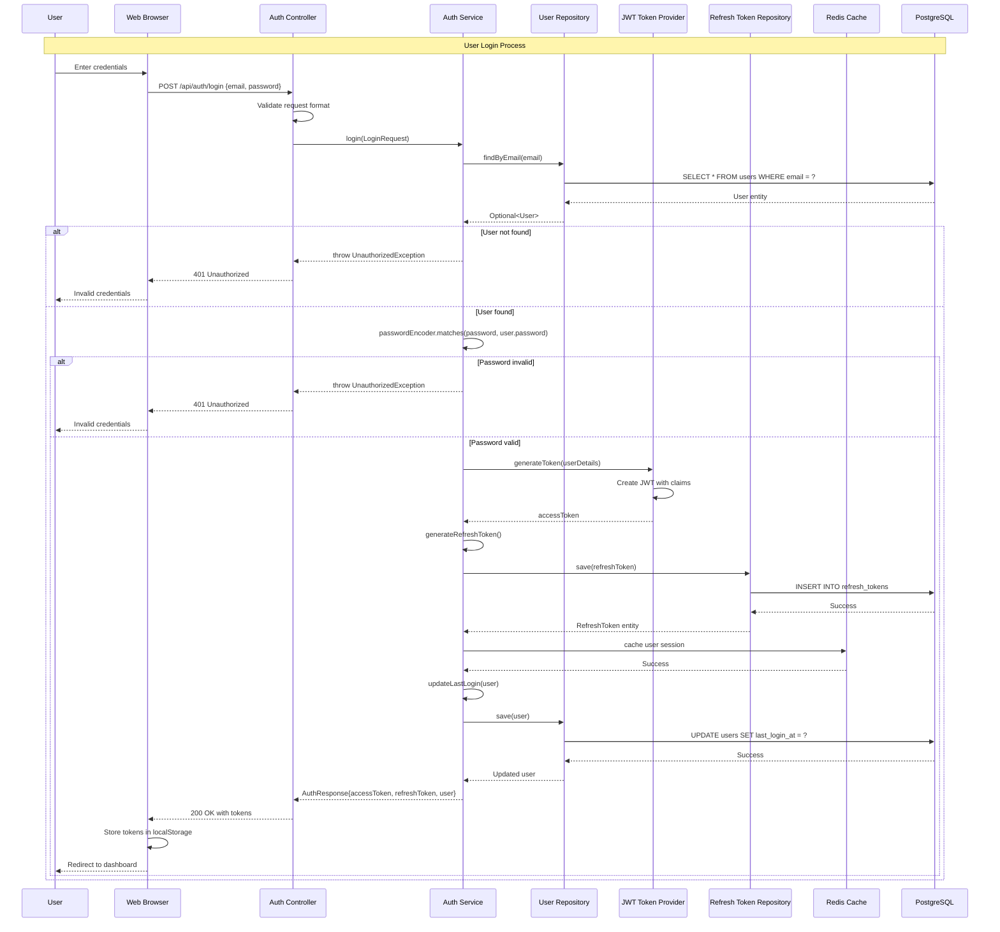
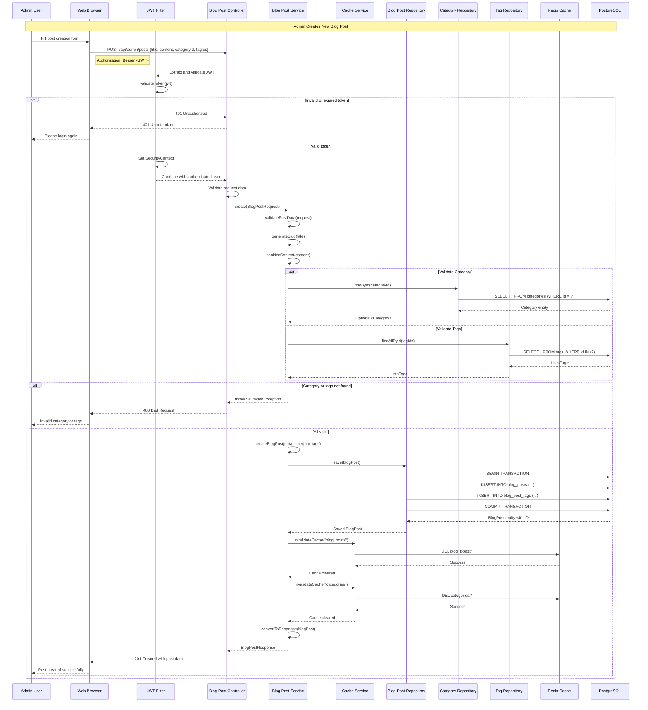
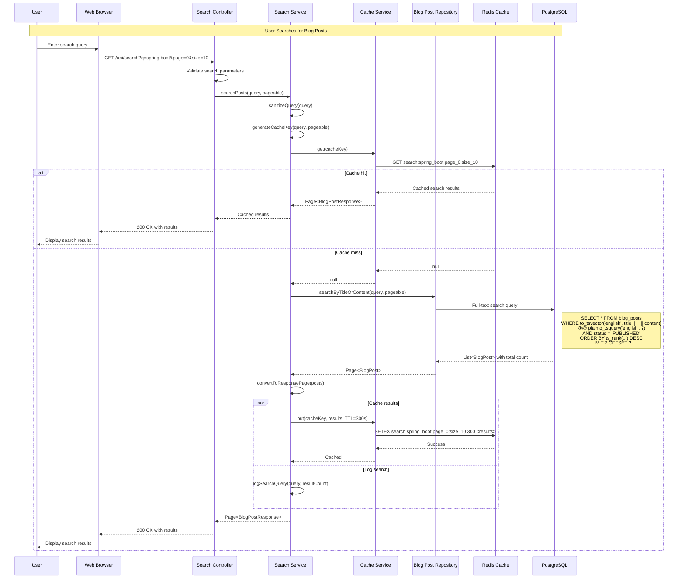
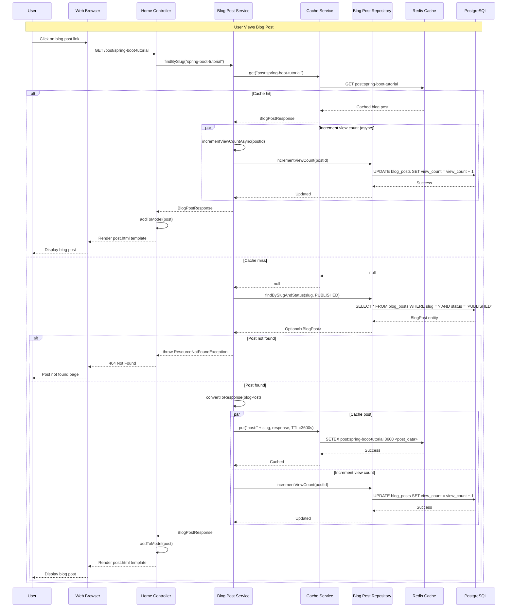
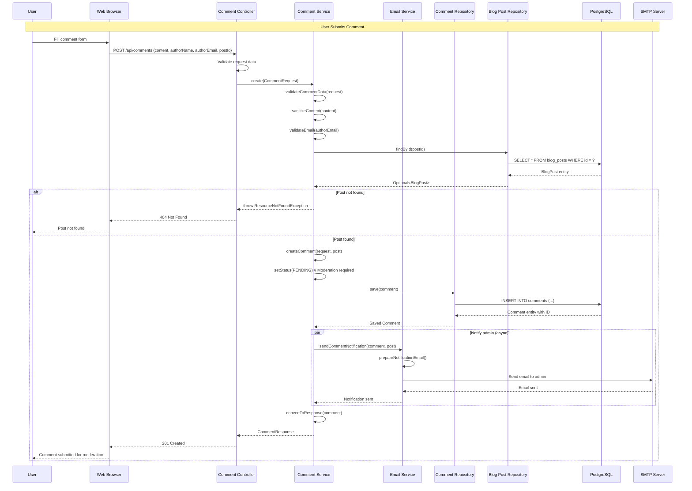
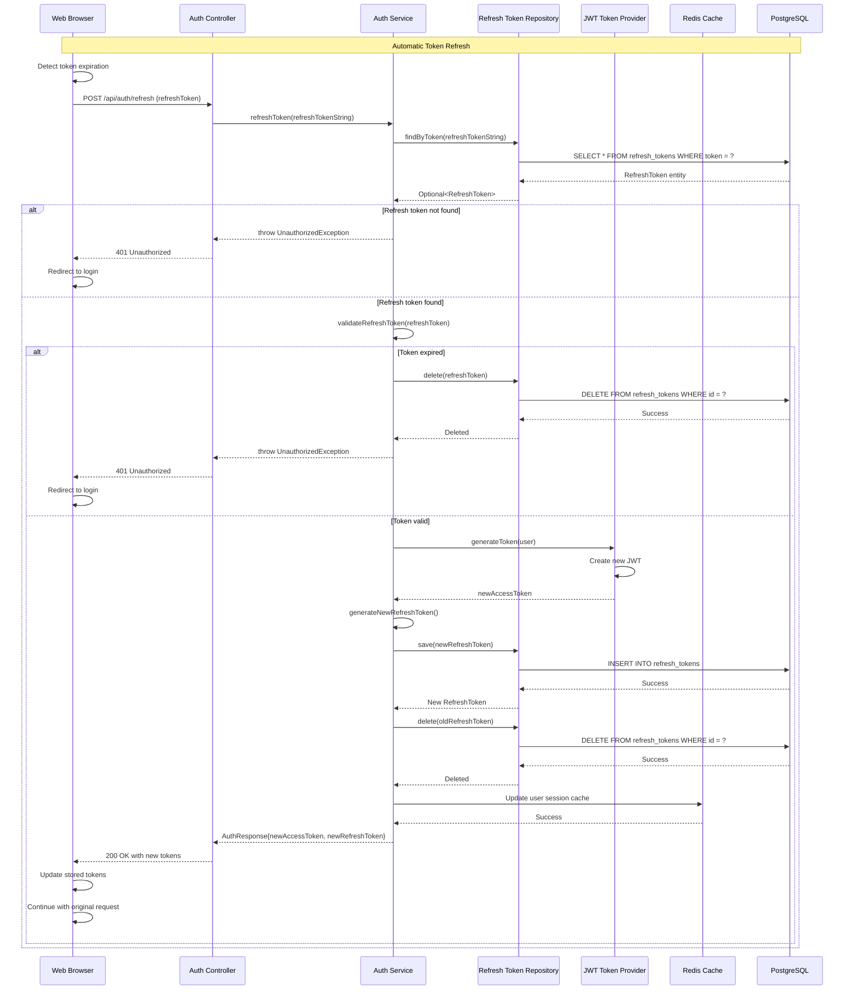

# Sequence Diagram - Personal Blog Application

This diagram shows the interaction flows for key use cases in the Personal Blog application, illustrating time-ordered interactions between system components.

## User Authentication Flow

## Blog Post Creation Flow

## Search Functionality Flow

## Blog Post Viewing Flow

## Comment Submission Flow

## Token Refresh Flow

## Key Interaction Patterns

### **Security-First Approach**
- Every API request goes through JWT validation
- Token refresh mechanism prevents session hijacking
- Input validation and sanitization at multiple layers

### **Performance Optimization**
- Multi-level caching strategy (Redis + application cache)
- Async operations for non-critical tasks
- Database query optimization with proper indexing

### **Error Handling**
- Graceful degradation for cache misses
- Comprehensive exception handling
- User-friendly error messages

### **Audit and Monitoring**
- Search query logging for analytics
- User activity tracking
- Performance metrics collection

### **Scalability Considerations**
- Stateless authentication with JWT
- Cache invalidation strategies
- Async processing for heavy operations

---
*These sequence diagrams represent the critical user flows in the Personal Blog application, designed for security, performance, and maintainability using Spring Boot 3.5.4 and modern Java practices.*