# Use Case Diagram - Personal Blog Application

This diagram illustrates the functional requirements and user interactions within the Personal Blog application, showing different user roles and their capabilities.

## System Actors and Use Cases

```mermaid
graph TB
    %% External Actors
    V[Visitor]
    RU[Registered User]
    A[Admin]
    SA[Super Admin]
    ES[Email System]
    SS[Search Engine]

    %% Public Features
    UC1[View Blog Posts]
    UC2[Search Posts]
    UC3[View Post Details]
    UC4[Browse by Category]
    UC5[Browse by Tags]
    UC6[View Archives]
    UC7[Subscribe to Newsletter]
    UC8[Contact Admin]

    %% Authentication
    UC9[Register Account]
    UC10[Login]
    UC11[Logout]
    UC12[Reset Password]
    UC13[Verify Email]
    UC14[Refresh Token]

    %% User Features
    UC15[Update Profile]
    UC16[Change Password]
    UC17[Manage Preferences]
    UC18[View Reading History]
    UC19[Bookmark Posts]
    UC20[Submit Comments]

    %% Content Management
    UC21[Create Blog Post]
    UC22[Edit Blog Post]
    UC23[Delete Blog Post]
    UC24[Publish/Unpublish Post]
    UC25[Schedule Post]
    UC26[Manage Categories]
    UC27[Manage Tags]
    UC28[Upload Media]
    UC29[Manage Comments]

    %% Administration
    UC30[Manage Users]
    UC31[View Analytics]
    UC32[Moderate Comments]
    UC33[Manage Site Settings]
    UC34[Backup Data]
    UC35[Monitor System]
    UC36[Manage Roles]
    UC37[Security Audit]

    %% System Features
    UC38[Send Notifications]
    UC39[Generate Sitemap]
    UC40[Cache Management]
    UC41[SEO Optimization]
    UC42[Rate Limiting]

    %% Visitor Relationships
    V --> UC1
    V --> UC2
    V --> UC3
    V --> UC4
    V --> UC5
    V --> UC6
    V --> UC7
    V --> UC8
    V --> UC9
    V --> UC10
    V --> UC12

    %% Registered User Relationships
    RU --> UC1
    RU --> UC2
    RU --> UC3
    RU --> UC4
    RU --> UC5
    RU --> UC6
    RU --> UC10
    RU --> UC11
    RU --> UC12
    RU --> UC13
    RU --> UC14
    RU --> UC15
    RU --> UC16
    RU --> UC17
    RU --> UC18
    RU --> UC19
    RU --> UC20

    %% Admin Relationships
    A --> UC1
    A --> UC2
    A --> UC3
    A --> UC10
    A --> UC11
    A --> UC15
    A --> UC16
    A --> UC21
    A --> UC22
    A --> UC23
    A --> UC24
    A --> UC25
    A --> UC26
    A --> UC27
    A --> UC28
    A --> UC29
    A --> UC31
    A --> UC32
    A --> UC33

    %% Super Admin Relationships
    SA --> UC21
    SA --> UC22
    SA --> UC23
    SA --> UC24
    SA --> UC26
    SA --> UC27
    SA --> UC29
    SA --> UC30
    SA --> UC31
    SA --> UC32
    SA --> UC33
    SA --> UC34
    SA --> UC35
    SA --> UC36
    SA --> UC37

    %% External Systems
    ES --> UC38
    SS --> UC39
    SS --> UC41

    %% Simplified Use Case Notes (instead of .-.->
    UC20 --> UC13
    UC21 --> UC28
    UC22 --> UC28
    UC24 --> UC39
    UC31 --> UC35
    UC32 --> UC38

    %% Styling (has no effect on GitHub but kept for completeness)
    classDef actor fill:#e1f5fe,stroke:#01579b,stroke-width:2px
    classDef usecase fill:#f3e5f5,stroke:#4a148c,stroke-width:1px
    classDef extends stroke:#ff5722,stroke-width:2px,stroke-dasharray: 5 5

    class V,RU,A,SA,ES,SS actor
    class UC1,UC2,UC3,UC4,UC5,UC6,UC7,UC8,UC9,UC10,UC11,UC12,UC13,UC14,UC15,UC16,UC17,UC18,UC19,UC20,UC21,UC22,UC23,UC24,UC25,UC26,UC27,UC28,UC29,UC30,UC31,UC32,UC33,UC34,UC35,UC36,UC37,UC38,UC39,UC40,UC41,UC42 usecase
```

## Detailed Use Case Descriptions

### **Visitor (Anonymous User)**

| Use Case | Description | Preconditions | Postconditions |
|----------|-------------|---------------|----------------|
| **View Blog Posts** | Browse published blog posts on homepage | None | Posts displayed with pagination |
| **Search Posts** | Search for posts by keywords | None | Relevant posts displayed |
| **View Post Details** | Read full blog post content | Post exists and is published | Post content displayed, view count incremented |
| **Browse by Category** | Filter posts by category | Categories exist | Posts filtered by selected category |
| **Browse by Tags** | Filter posts by tags | Tags exist | Posts filtered by selected tags |
| **View Archives** | Browse posts by date | Posts exist | Posts grouped by publication date |
| **Subscribe to Newsletter** | Subscribe to email notifications | Valid email provided | Subscription confirmation sent |
| **Contact Admin** | Send message to site administrator | Valid contact form data | Message sent to admin |
| **Register Account** | Create new user account | Valid registration data | Account created, verification email sent |
| **Login** | Authenticate with credentials | Valid credentials | User authenticated, session created |
| **Reset Password** | Request password reset | Valid email address | Reset link sent to email |

### **Registered User (Authenticated)**
*Inherits all Visitor capabilities plus:*

| Use Case | Description | Preconditions | Postconditions |
|----------|-------------|---------------|----------------|
| **Logout** | End user session | User is logged in | Session terminated, tokens invalidated |
| **Verify Email** | Confirm email address | Verification token valid | Email verified, account activated |
| **Refresh Token** | Renew authentication token | Valid refresh token | New access token issued |
| **Update Profile** | Modify user profile information | User is authenticated | Profile updated successfully |
| **Change Password** | Update account password | Current password valid | Password updated, re-authentication required |
| **Manage Preferences** | Configure user preferences | User is authenticated | Preferences saved |
| **View Reading History** | See previously read posts | User is authenticated | Reading history displayed |
| **Bookmark Posts** | Save posts for later reading | User is authenticated, post exists | Post bookmarked |
| **Submit Comments** | Add comments to blog posts | User is authenticated, email verified | Comment submitted for moderation |

### **Admin (Content Manager)**
*Inherits Registered User capabilities plus:*

| Use Case | Description | Preconditions | Postconditions |
|----------|-------------|---------------|----------------|
| **Create Blog Post** | Write and publish new posts | Admin is authenticated | Post created and saved |
| **Edit Blog Post** | Modify existing posts | Admin is authenticated, post exists | Post updated |
| **Delete Blog Post** | Remove posts from system | Admin is authenticated, post exists | Post deleted, cache invalidated |
| **Publish/Unpublish Post** | Control post visibility | Admin is authenticated, post exists | Post status changed |
| **Schedule Post** | Set future publication date | Admin is authenticated | Post scheduled for publication |
| **Manage Categories** | Create, edit, delete categories | Admin is authenticated | Categories updated |
| **Manage Tags** | Create, edit, delete tags | Admin is authenticated | Tags updated |
| **Upload Media** | Add images and files | Admin is authenticated, valid file | Media uploaded and stored |
| **Manage Comments** | Moderate user comments | Admin is authenticated | Comments approved/rejected |
| **View Analytics** | Access site statistics | Admin is authenticated | Analytics dashboard displayed |
| **Moderate Comments** | Review and approve comments | Admin is authenticated | Comments moderated |
| **Manage Site Settings** | Configure site parameters | Admin is authenticated | Settings updated |

### **Super Admin (System Administrator)**
*Inherits Admin capabilities plus:*

| Use Case | Description | Preconditions | Postconditions |
|----------|-------------|---------------|----------------|
| **Manage Users** | Create, edit, delete user accounts | Super Admin authenticated | User accounts managed |
| **Backup Data** | Create system backups | Super Admin authenticated | Backup created successfully |
| **Monitor System** | View system health and performance | Super Admin authenticated | System status displayed |
| **Manage Roles** | Assign and modify user roles | Super Admin authenticated | User roles updated |
| **Security Audit** | Review security logs and events | Super Admin authenticated | Security report generated |

### **External Systems**

| Actor | Use Cases | Description |
|-------|-----------|-------------|
| **Email System** | Send Notifications | Handles all email communications (registration, password reset, comment notifications) |
| **Search Engine** | Generate Sitemap, SEO Optimization | Crawls and indexes site content for search visibility |

## Use Case Relationships

### **Inheritance Relationships**
- **Registered User** inherits all **Visitor** capabilities
- **Admin** inherits all **Registered User** capabilities  
- **Super Admin** inherits all **Admin** capabilities

### **Extension Relationships**
- **Submit Comments** extends **Verify Email** (email verification required)
- **View Analytics** extends **Monitor System** (system monitoring included)
- **Moderate Comments** extends **Send Notifications** (notifications sent on moderation)

### **Inclusion Relationships**
- **Create/Edit Blog Post** includes **Upload Media**
- **Publish Post** includes **Generate Sitemap**
- **All authenticated actions** include **Refresh Token**

## Business Rules and Constraints

### **Authentication Rules**
1. Users must verify email before commenting
2. Sessions expire after 24 hours of inactivity
3. Password must meet complexity requirements
4. Maximum 5 login attempts before account lockout

### **Content Rules**
1. Only published posts are visible to visitors
2. Comments require moderation before display
3. Posts can be scheduled for future publication
4. Media uploads have size and type restrictions

### **Authorization Rules**
1. Only admins can create/edit/delete posts
2. Only super admins can manage users and system settings
3. Users can only edit their own profiles and comments
4. Anonymous users have read-only access

### **System Rules**
1. All user inputs are validated and sanitized
2. Rate limiting applies to all API endpoints
3. Cache invalidation occurs on content changes
4. Audit logs are maintained for all admin actions

## Use Case Priorities

### **High Priority (MVP)**
- View Blog Posts, Search Posts, View Post Details
- Register Account, Login, Logout
- Create/Edit/Delete Blog Post (Admin)
- Manage Categories and Tags (Admin)

### **Medium Priority**
- Submit Comments, Moderate Comments
- User Profile Management
- Analytics Dashboard
- Email Notifications

### **Low Priority (Future Enhancements)**
- Advanced Search Filters
- Social Media Integration
- Multi-language Support
- Advanced Analytics

---
*This use case diagram defines the complete functional scope of the Personal Blog application, ensuring comprehensive coverage of user needs and system capabilities while maintaining clear role-based access control.*
