# Class Diagram - Unit Converter System

```mermaid
classDiagram
    %% Exception Hierarchy
    class Error {
        <<native>>
    }
    
    class BaseError {
        +message: String
        +statusCode: Number
        +timestamp: Date
        +BaseError(message: String, statusCode: Number)
        +toJSON(): Object
    }
    
    class ApplicationError {
        +ApplicationError(message: String)
    }
    
    class ConversionError {
        +ConversionError(message: String)
    }
    
    class UnitError {
        +UnitError(message: String)
    }
    
    class ValidationError {
        +ValidationError(message: String)
    }

    %% Controllers
    class LengthController {
        -conversionService: ConversionService
        +convert(req: Request, res: Response): Promise~Response~
        +getSupportedUnits(req: Request, res: Response): Promise~Response~
    }
    
    class TemperatureController {
        -conversionService: ConversionService
        +convert(req: Request, res: Response): Promise~Response~
        +getSupportedUnits(req: Request, res: Response): Promise~Response~
    }
    
    class WeightController {
        -conversionService: ConversionService
        +convert(req: Request, res: Response): Promise~Response~
        +getSupportedUnits(req: Request, res: Response): Promise~Response~
    }

    %% Services
    class ConversionService {
        -validationService: ValidationService
        -lengthConverter: LengthConverter
        -temperatureConverter: TemperatureConverter
        -weightConverter: WeightConverter
        +convertLength(value: Number, fromUnit: String, toUnit: String): Promise~Number~
        +convertTemperature(value: Number, fromUnit: String, toUnit: String): Promise~Number~
        +convertWeight(value: Number, fromUnit: String, toUnit: String): Promise~Number~
        +getSupportedUnits(unitType: String): Array~String~
    }
    
    class ValidationService {
        -inputValidator: InputValidator
        -lengthValidator: LengthValidator
        -temperatureValidator: TemperatureValidator
        -weightValidator: WeightValidator
        +validateConversionInput(value: Number, fromUnit: String, toUnit: String, unitType: String): Promise~Boolean~
        +validateUnitType(unitType: String): Boolean
    }

    %% Converter Modules
    class LengthConverter {
        -conversionFactors: ConversionFactors
        -units: Units
        +convert(value: Number, fromUnit: String, toUnit: String): Number
        +getSupportedUnits(): Array~String~
        -getConversionFactor(fromUnit: String, toUnit: String): Number
    }
    
    class TemperatureConverter {
        -units: Units
        +convert(value: Number, fromUnit: String, toUnit: String): Number
        +getSupportedUnits(): Array~String~
        -celsiusToFahrenheit(celsius: Number): Number
        -fahrenheitToCelsius(fahrenheit: Number): Number
        -celsiusToKelvin(celsius: Number): Number
        -kelvinToCelsius(kelvin: Number): Number
    }
    
    class WeightConverter {
        -conversionFactors: ConversionFactors
        -units: Units
        +convert(value: Number, fromUnit: String, toUnit: String): Number
        +getSupportedUnits(): Array~String~
        -getConversionFactor(fromUnit: String, toUnit: String): Number
    }

    %% Validators
    class InputValidator {
        +validateNumericInput(value: Any): Boolean
        +validateStringInput(value: Any): Boolean
        +validateRange(value: Number, min: Number, max: Number): Boolean
        +sanitizeInput(value: Any): Any
    }
    
    class LengthValidator {
        -units: Units
        +validateUnit(unit: String): Boolean
        +validateValue(value: Number): Boolean
        +validateConversion(value: Number, fromUnit: String, toUnit: String): Boolean
    }
    
    class TemperatureValidator {
        -units: Units
        +validateUnit(unit: String): Boolean
        +validateValue(value: Number, unit: String): Boolean
        +validateConversion(value: Number, fromUnit: String, toUnit: String): Boolean
    }
    
    class WeightValidator {
        -units: Units
        +validateUnit(unit: String): Boolean
        +validateValue(value: Number): Boolean
        +validateConversion(value: Number, fromUnit: String, toUnit: String): Boolean
    }

    %% Repositories
    class ConversionFactors {
        -lengthFactors: Object
        -weightFactors: Object
        +getLengthFactor(fromUnit: String, toUnit: String): Number
        +getWeightFactor(fromUnit: String, toUnit: String): Number
        +getAllLengthFactors(): Object
        +getAllWeightFactors(): Object
    }
    
    class Units {
        -lengthUnits: Array~String~
        -temperatureUnits: Array~String~
        -weightUnits: Array~String~
        +getLengthUnits(): Array~String~
        +getTemperatureUnits(): Array~String~
        +getWeightUnits(): Array~String~
        +isValidUnit(unit: String, unitType: String): Boolean
        +getAllUnits(): Object
    }

    %% Relationships - Inheritance
    Error <|-- BaseError
    BaseError <|-- ApplicationError
    BaseError <|-- ConversionError
    BaseError <|-- UnitError
    BaseError <|-- ValidationError

    %% Relationships - Composition/Aggregation
    LengthController o-- ConversionService : uses
    TemperatureController o-- ConversionService : uses
    WeightController o-- ConversionService : uses
    
    ConversionService o-- ValidationService : uses
    ConversionService o-- LengthConverter : uses
    ConversionService o-- TemperatureConverter : uses
    ConversionService o-- WeightConverter : uses
    
    ValidationService o-- InputValidator : uses
    ValidationService o-- LengthValidator : uses
    ValidationService o-- TemperatureValidator : uses
    ValidationService o-- WeightValidator : uses
    
    LengthConverter o-- ConversionFactors : uses
    LengthConverter o-- Units : uses
    TemperatureConverter o-- Units : uses
    WeightConverter o-- ConversionFactors : uses
    WeightConverter o-- Units : uses
    
    LengthValidator o-- Units : uses
    TemperatureValidator o-- Units : uses
    WeightValidator o-- Units : uses

    %% Exception Dependencies (can throw)
    ConversionService ..> ConversionError : throws
    ConversionService ..> ApplicationError : throws
    ValidationService ..> ValidationError : throws
    LengthConverter ..> UnitError : throws
    TemperatureConverter ..> UnitError : throws
    WeightConverter ..> UnitError : throws
    InputValidator ..> ValidationError : throws
    LengthValidator ..> ValidationError : throws
    TemperatureValidator ..> ValidationError : throws
    WeightValidator ..> ValidationError : throws
```

## Class Descriptions

### Exception Classes
- **BaseError**: Abstract base class for all application errors with common properties
- **ApplicationError**: General application-level errors
- **ConversionError**: Errors specific to conversion operations
- **UnitError**: Errors related to unit validation and support
- **ValidationError**: Input validation and data integrity errors

### Controller Classes
- **LengthController**: Handles HTTP requests for length conversions
- **TemperatureController**: Handles HTTP requests for temperature conversions
- **WeightController**: Handles HTTP requests for weight conversions

### Service Classes
- **ConversionService**: Orchestrates conversion operations and coordinates business logic
- **ValidationService**: Centralizes validation logic across all unit types

### Converter Classes
- **LengthConverter**: Core length conversion algorithms and logic
- **TemperatureConverter**: Core temperature conversion algorithms with formula implementations
- **WeightConverter**: Core weight conversion algorithms and logic

### Validator Classes
- **InputValidator**: Generic input validation utilities
- **LengthValidator**: Length-specific validation rules
- **TemperatureValidator**: Temperature-specific validation rules (including range checks)
- **WeightValidator**: Weight-specific validation rules

### Repository Classes
- **ConversionFactors**: Data store for conversion factors and mathematical constants
- **Units**: Repository for unit definitions, metadata, and supported unit lists

## Key Design Patterns
1. **Repository Pattern**: Data access abstraction through ConversionFactors and Units
2. **Service Layer Pattern**: Business logic encapsulation in ConversionService and ValidationService
3. **Strategy Pattern**: Different converter implementations for each unit type
4. **Exception Hierarchy**: Structured error handling with specific exception types