# Component Diagram - Unit Converter System

```mermaid
graph TB
    %% External Systems
    subgraph "External"
        USER[🧑 User/Browser]
        DEPLOY[☁️ Vercel Platform]
    end

    %% Presentation Layer
    subgraph "Presentation Layer"
        subgraph "Frontend Components"
            VIEWS[📄 HTML Views<br/>- index.html<br/>- length.html<br/>- temperature.html<br/>- weight.html]
            STATIC[🎨 Static Assets<br/>- CSS Styles<br/>- Client-side JS]
        end
        
        subgraph "Controller Components"
            LC[🎛️ Length Controller<br/>- HTTP request handling<br/>- Response formatting]
            TC[🎛️ Temperature Controller<br/>- HTTP request handling<br/>- Response formatting]
            WC[🎛️ Weight Controller<br/>- HTTP request handling<br/>- Response formatting]
        end
        
        APP[⚙️ Express App<br/>- Route configuration<br/>- Middleware setup<br/>- Error handling]
    end

    %% Business Layer
    subgraph "Business Layer"
        subgraph "Service Components"
            CS[🔧 Conversion Service<br/>- Business orchestration<br/>- Workflow coordination<br/>- Unit type routing<br/><<pending>>]
            VS[✅ Validation Service<br/>- Input validation<br/>- Business rules<br/>- Data integrity<br/><<pending>>]
        end
        
        subgraph "Core Logic Components (✅ IMPLEMENTED)"
            LM[📏 Length Module<br/>- Metric conversions<br/>- Imperial conversions<br/>- Factor calculations<br/><<implemented>>]
            TM[🌡️ Temperature Module<br/>- Celsius/Fahrenheit<br/>- Kelvin conversions<br/>- Formula implementations<br/><<implemented>>]
            WM[⚖️ Weight Module<br/>- Mass conversions<br/>- Unit calculations<br/>- Factor applications<br/><<implemented>>]
        end
        
        subgraph "Validation Components (✅ IMPLEMENTED)"
            IV[🔍 Input Validator<br/>- Type checking<br/>- Range validation<br/>- Sanitization<br/><<implemented>>]
            LV[📐 Length Validator<br/>- Unit validation<br/>- Value constraints<br/><<implemented>>]
            TV[🌡️ Temperature Validator<br/>- Unit validation<br/>- Range limits<br/>- Physical constraints<br/><<implemented>>]
            WV[⚖️ Weight Validator<br/>- Unit validation<br/>- Positive value checks<br/><<implemented>>]
        end
    end

    %% Data Layer
    subgraph "Data Layer"
        subgraph "Repository Components (✅ IMPLEMENTED)"
            CF[📊 Conversion Factors<br/>- Mathematical constants<br/>- Conversion ratios<br/>- Factor lookup<br/><<implemented>>]
            UR[📋 Units Repository<br/>- Supported units<br/>- Unit metadata<br/>- Unit categories<br/><<implemented>>]
        end
    end

    %% Cross-cutting Concerns
    subgraph "Infrastructure"
        subgraph "Error Handling (✅ IMPLEMENTED)"
            EH[⚠️ Exception System<br/>- BaseError<br/>- ConversionError<br/>- ValidationError<br/>- UnitError<br/>- ApplicationError<br/><<implemented>>]
        end
        
        subgraph "Configuration"
            CONFIG[⚙️ Configuration<br/>- Environment settings<br/>- Deployment config<br/>- Static file serving<br/><<pending>>]
        end
        
        subgraph "Testing Components (✅ COMPREHENSIVE)"
            IVT[🧪 Input Validator Tests<br/>- 38 test cases<br/>- Edge case coverage<br/><<test>>]
            LVT[🧪 Length Validator Tests<br/>- 38 test cases<br/>- Validation scenarios<br/><<test>>]
            TVT[🧪 Temperature Validator Tests<br/>- 38 test cases<br/>- Range validation<br/><<test>>]
            WVT[🧪 Weight Validator Tests<br/>- 38 test cases<br/>- Constraint testing<br/><<test>>]
            LCT[🧪 Length Converter Tests<br/>- 30 test cases<br/>- Precision testing<br/><<test>>]
            TCT[🧪 Temperature Converter Tests<br/>- 34 test cases<br/>- Formula verification<br/><<test>>]
            WCT[🧪 Weight Converter Tests<br/>- 35 test cases<br/>- Real-world scenarios<br/><<test>>]
        end
    end

    %% External Connections
    USER -.->|HTTP Requests| APP
    APP -.->|HTTP Responses| USER
    DEPLOY -.->|Hosts| APP

    %% Presentation Layer Connections
    APP --> LC
    APP --> TC
    APP --> WC
    APP --> VIEWS
    APP --> STATIC
    APP --> CONFIG

    %% Controller to Service Connections
    LC --> CS
    TC --> CS
    WC --> CS

    %% Service Layer Connections
    CS --> VS
    CS --> LM
    CS --> TM
    CS --> WM

    %% Validation Connections
    VS --> IV
    VS --> LV
    VS --> TV
    VS --> WV
    
    %% Testing Connections
    IVT -.->|tests| IV
    LVT -.->|tests| LV
    TVT -.->|tests| TV
    WVT -.->|tests| WV
    LCT -.->|tests| LM
    TCT -.->|tests| TM
    WCT -.->|tests| WM

    %% Module to Repository Connections
    LM --> CF
    LM --> UR
    TM --> UR
    WM --> CF
    WM --> UR

    %% Validator to Repository Connections
    LV --> UR
    TV --> UR
    WV --> UR

    %% Exception Handling (cross-cutting)
    CS -.->|throws| EH
    VS -.->|throws| EH
    LM -.->|throws| EH
    TM -.->|throws| EH
    WM -.->|throws| EH
    IV -.->|throws| EH
    LV -.->|throws| EH
    TV -.->|throws| EH
    WV -.->|throws| EH

    %% Styling
    classDef userStyle fill:#e1f5fe,stroke:#01579b,stroke-width:2px
    classDef presentationStyle fill:#f3e5f5,stroke:#4a148c,stroke-width:2px
    classDef businessStyle fill:#e8f5e8,stroke:#1b5e20,stroke-width:2px
    classDef dataStyle fill:#fff3e0,stroke:#e65100,stroke-width:2px
    classDef infrastructureStyle fill:#fce4ec,stroke:#880e4f,stroke-width:2px
    classDef testStyle fill:#e3f2fd,stroke:#0d47a1,stroke-width:2px

    class USER,DEPLOY userStyle
    class VIEWS,STATIC,LC,TC,WC,APP presentationStyle
    class CS,VS,LM,TM,WM,IV,LV,TV,WV businessStyle
    class CF,UR dataStyle
    class EH,CONFIG infrastructureStyle
    class IVT,LVT,TVT,WVT,LCT,TCT,WCT testStyle
```

## Component Overview

### External Components
- **User/Browser**: End users accessing the web application
- **Vercel Platform**: Cloud deployment and hosting platform

### Presentation Layer
- **HTML Views**: Server-side rendered templates for each converter type
- **Static Assets**: CSS stylesheets and client-side JavaScript
- **Controllers**: HTTP request handlers for each unit conversion type
- **Express App**: Main application server with routing and middleware

### Business Layer
- **Conversion Service**: Central orchestrator for all conversion operations (pending implementation)
- **Validation Service**: Centralized validation logic coordinator (pending implementation)
- **Converter Modules**: Core conversion algorithms for each unit type (✅ fully implemented and tested)
- **Validator Components**: Specific validation logic for each unit type (✅ fully implemented and tested)

### Data Layer
- **Conversion Factors**: Repository of mathematical conversion constants (✅ fully implemented)
- **Units Repository**: Storage of supported units and their metadata (✅ fully implemented)

### Infrastructure Components
- **Exception System**: Hierarchical error handling across all layers (✅ fully implemented)
- **Configuration**: Application settings and deployment configuration (pending implementation)
- **Testing Components**: Comprehensive test suites covering all implemented modules (✅ 251 test cases)

## Component Responsibilities

### Data Flow
1. **User Request**: Browser sends HTTP request to Express App
2. **Routing**: App routes request to appropriate Controller
3. **Service Orchestration**: Controller calls Conversion Service
4. **Validation**: Service validates input through Validation Service
5. **Conversion**: Service executes conversion through appropriate Module
6. **Data Access**: Modules access Conversion Factors and Units Repository
7. **Response**: Results flow back through the layers to the user

### Error Handling
- All components can throw specific exceptions
- Exception System provides consistent error handling
- Errors are propagated up through the service layers
- Controllers format errors for HTTP responses

### Configuration Management
- Configuration component manages environment settings
- Deployment configuration for Vercel platform
- Static file serving configuration for Express

## Implementation Status

### ✅ Completed Components (Production Ready)
- **Core Logic Layer**: All converter modules with comprehensive JSDoc and testing
- **Validation Layer**: Complete input validation system with edge case coverage
- **Data Layer**: All conversion factors and unit definitions implemented
- **Exception System**: Full error hierarchy with proper inheritance
- **Testing Infrastructure**: 251 test cases across 7 test suites

### ❌ Pending Components (Web Interface)
- **Service Layer**: Orchestration and coordination logic
- **Controller Layer**: HTTP request/response handling
- **Application Layer**: Express server setup and configuration
- **Frontend Components**: HTML views and static assets

## Key Architectural Patterns
1. **Layered Architecture**: Clear separation between presentation, business, and data layers
2. **Service Orchestration**: Central services coordinate multiple components (pending)
3. **Repository Pattern**: Data access abstraction through repository components (✅ implemented)
4. **Exception Propagation**: Consistent error handling across all layers (✅ implemented)
5. **Test-Driven Design**: Comprehensive testing with edge case coverage (✅ implemented)
6. **Separation of Concerns**: Each component has a single, well-defined responsibility