# Component Diagram - Unit Converter System

```mermaid
graph TB
    %% External Systems
    subgraph "External"
        USER[🧑 User/Browser]
        DEPLOY[☁️ Vercel Platform]
    end

    %% Presentation Layer
    subgraph "Presentation Layer"
        subgraph "Frontend Components"
            VIEWS[📄 HTML Views<br/>- index.html<br/>- length.html<br/>- temperature.html<br/>- weight.html]
            STATIC[🎨 Static Assets<br/>- CSS Styles<br/>- Client-side JS]
        end
        
        subgraph "Controller Components"
            LC[🎛️ Length Controller<br/>- HTTP request handling<br/>- Response formatting]
            TC[🎛️ Temperature Controller<br/>- HTTP request handling<br/>- Response formatting]
            WC[🎛️ Weight Controller<br/>- HTTP request handling<br/>- Response formatting]
        end
        
        APP[⚙️ Express App<br/>- Route configuration<br/>- Middleware setup<br/>- Error handling]
    end

    %% Business Layer
    subgraph "Business Layer"
        subgraph "Service Components"
            CS[🔧 Conversion Service<br/>- Business orchestration<br/>- Workflow coordination<br/>- Unit type routing]
            VS[✅ Validation Service<br/>- Input validation<br/>- Business rules<br/>- Data integrity]
        end
        
        subgraph "Core Logic Components"
            LM[📏 Length Module<br/>- Metric conversions<br/>- Imperial conversions<br/>- Factor calculations]
            TM[🌡️ Temperature Module<br/>- Celsius/Fahrenheit<br/>- Kelvin conversions<br/>- Formula implementations]
            WM[⚖️ Weight Module<br/>- Mass conversions<br/>- Unit calculations<br/>- Factor applications]
        end
        
        subgraph "Validation Components"
            IV[🔍 Input Validator<br/>- Type checking<br/>- Range validation<br/>- Sanitization]
            LV[📐 Length Validator<br/>- Unit validation<br/>- Value constraints]
            TV[🌡️ Temperature Validator<br/>- Unit validation<br/>- Range limits<br/>- Physical constraints]
            WV[⚖️ Weight Validator<br/>- Unit validation<br/>- Positive value checks]
        end
    end

    %% Data Layer
    subgraph "Data Layer"
        subgraph "Repository Components"
            CF[📊 Conversion Factors<br/>- Mathematical constants<br/>- Conversion ratios<br/>- Factor lookup]
            UR[📋 Units Repository<br/>- Supported units<br/>- Unit metadata<br/>- Unit categories]
        end
    end

    %% Cross-cutting Concerns
    subgraph "Infrastructure"
        subgraph "Error Handling"
            EH[⚠️ Exception System<br/>- BaseError<br/>- ConversionError<br/>- ValidationError<br/>- UnitError<br/>- ApplicationError]
        end
        
        subgraph "Configuration"
            CONFIG[⚙️ Configuration<br/>- Environment settings<br/>- Deployment config<br/>- Static file serving]
        end
    end

    %% External Connections
    USER -.->|HTTP Requests| APP
    APP -.->|HTTP Responses| USER
    DEPLOY -.->|Hosts| APP

    %% Presentation Layer Connections
    APP --> LC
    APP --> TC
    APP --> WC
    APP --> VIEWS
    APP --> STATIC
    APP --> CONFIG

    %% Controller to Service Connections
    LC --> CS
    TC --> CS
    WC --> CS

    %% Service Layer Connections
    CS --> VS
    CS --> LM
    CS --> TM
    CS --> WM

    %% Validation Connections
    VS --> IV
    VS --> LV
    VS --> TV
    VS --> WV

    %% Module to Repository Connections
    LM --> CF
    LM --> UR
    TM --> UR
    WM --> CF
    WM --> UR

    %% Validator to Repository Connections
    LV --> UR
    TV --> UR
    WV --> UR

    %% Exception Handling (cross-cutting)
    CS -.->|throws| EH
    VS -.->|throws| EH
    LM -.->|throws| EH
    TM -.->|throws| EH
    WM -.->|throws| EH
    IV -.->|throws| EH
    LV -.->|throws| EH
    TV -.->|throws| EH
    WV -.->|throws| EH

    %% Styling
    classDef userStyle fill:#e1f5fe,stroke:#01579b,stroke-width:2px
    classDef presentationStyle fill:#f3e5f5,stroke:#4a148c,stroke-width:2px
    classDef businessStyle fill:#e8f5e8,stroke:#1b5e20,stroke-width:2px
    classDef dataStyle fill:#fff3e0,stroke:#e65100,stroke-width:2px
    classDef infrastructureStyle fill:#fce4ec,stroke:#880e4f,stroke-width:2px

    class USER,DEPLOY userStyle
    class VIEWS,STATIC,LC,TC,WC,APP presentationStyle
    class CS,VS,LM,TM,WM,IV,LV,TV,WV businessStyle
    class CF,UR dataStyle
    class EH,CONFIG infrastructureStyle
```

## Component Overview

### External Components
- **User/Browser**: End users accessing the web application
- **Vercel Platform**: Cloud deployment and hosting platform

### Presentation Layer
- **HTML Views**: Server-side rendered templates for each converter type
- **Static Assets**: CSS stylesheets and client-side JavaScript
- **Controllers**: HTTP request handlers for each unit conversion type
- **Express App**: Main application server with routing and middleware

### Business Layer
- **Conversion Service**: Central orchestrator for all conversion operations
- **Validation Service**: Centralized validation logic coordinator
- **Converter Modules**: Core conversion algorithms for each unit type
- **Validator Components**: Specific validation logic for each unit type

### Data Layer
- **Conversion Factors**: Repository of mathematical conversion constants
- **Units Repository**: Storage of supported units and their metadata

### Infrastructure Components
- **Exception System**: Hierarchical error handling across all layers
- **Configuration**: Application settings and deployment configuration

## Component Responsibilities

### Data Flow
1. **User Request**: Browser sends HTTP request to Express App
2. **Routing**: App routes request to appropriate Controller
3. **Service Orchestration**: Controller calls Conversion Service
4. **Validation**: Service validates input through Validation Service
5. **Conversion**: Service executes conversion through appropriate Module
6. **Data Access**: Modules access Conversion Factors and Units Repository
7. **Response**: Results flow back through the layers to the user

### Error Handling
- All components can throw specific exceptions
- Exception System provides consistent error handling
- Errors are propagated up through the service layers
- Controllers format errors for HTTP responses

### Configuration Management
- Configuration component manages environment settings
- Deployment configuration for Vercel platform
- Static file serving configuration for Express

## Key Architectural Patterns
1. **Layered Architecture**: Clear separation between presentation, business, and data layers
2. **Service Orchestration**: Central services coordinate multiple components
3. **Repository Pattern**: Data access abstraction through repository components
4. **Exception Propagation**: Consistent error handling across all layers
5. **Separation of Concerns**: Each component has a single, well-defined responsibility