# Package Diagram - Unit Converter System

```mermaid
graph TB
    %% Root Package
    subgraph "unit-converter"
        
        %% Source Code Packages
        subgraph "src"
            
            %% Application Entry Point
            APP_ENTRY[📄 app.js<br/>- Express server setup<br/>- Middleware configuration<br/>- Route registration<br/>- Error handling middleware]
            
            %% Controller Package
            subgraph "controllers 🎛️"
                LC[📏 lengthController.js<br/>- HTTP request handling<br/>- Response formatting<br/>- Route-specific logic]
                TC[🌡️ temperatureController.js<br/>- HTTP request handling<br/>- Response formatting<br/>- Route-specific logic]
                WC[⚖️ weightController.js<br/>- HTTP request handling<br/>- Response formatting<br/>- Route-specific logic]
            end
            
            %% Service Package
            subgraph "services 🔧"
                CS[🔧 conversionService.js<br/>- Business orchestration<br/>- Conversion coordination<br/>- Unit type routing]
                VS[✅ validationService.js<br/>- Input validation coordination<br/>- Business rule enforcement<br/>- Validation workflow]
            end
            
            %% Module Package (Core Logic)
            subgraph "modules 📊"
                LM[📏 lengthConverter.js<br/>- Length conversion algorithms<br/>- Metric/Imperial conversions<br/>- Factor-based calculations]
                TM[🌡️ temperatureConverter.js<br/>- Temperature conversion formulas<br/>- Celsius/Fahrenheit/Kelvin<br/>- Formula implementations]
                WM[⚖️ weightConverter.js<br/>- Weight/Mass conversions<br/>- Unit calculations<br/>- Factor applications]
            end
            
            %% Validator Package
            subgraph "validators ✅"
                IV[🔍 inputValidator.js<br/>- Generic input validation<br/>- Type checking<br/>- Range validation<br/>- Input sanitization]
                LV[📐 lengthValidator.js<br/>- Length-specific validation<br/>- Unit validation<br/>- Value constraints]
                TV[🌡️ temperatureValidator.js<br/>- Temperature validation<br/>- Range limits<br/>- Physical constraints]
                WV[⚖️ weightValidator.js<br/>- Weight validation<br/>- Positive value checks<br/>- Unit validation]
            end
            
            %% Repository Package
            subgraph "repositories 📋"
                CF[📊 conversionFactors.js<br/>- Conversion constants<br/>- Mathematical ratios<br/>- Factor lookup tables]
                UR[📋 units.js<br/>- Supported unit definitions<br/>- Unit metadata<br/>- Unit categorization]
            end
            
            %% Exception Package
            subgraph "exceptions ⚠️"
                BE[🔗 BaseError.js<br/>- Base exception class<br/>- Common error properties<br/>- Error serialization]
                AE[🔧 ApplicationError.js<br/>- General application errors<br/>- System-level issues]
                CE[📊 ConversionError.js<br/>- Conversion-specific errors<br/>- Calculation failures]
                UE[📋 UnitError.js<br/>- Unit validation errors<br/>- Unsupported units]
                VE[✅ ValidationError.js<br/>- Input validation errors<br/>- Data integrity issues]
            end
            
            %% View Package
            subgraph "views 📄"
                VIEWS[🌐 HTML Templates<br/>- index.html<br/>- length.html<br/>- temperature.html<br/>- weight.html]
            end
            
            %% Public Assets Package
            subgraph "public 🎨"
                subgraph "css"
                    STYLES[🎨 styles.css<br/>- Application styling<br/>- Responsive design<br/>- UI components]
                end
                subgraph "js"
                    CLIENT_JS[⚡ main.js<br/>- Client-side logic<br/>- Form handling<br/>- AJAX requests]
                end
            end
            
        end
        
        %% Configuration Files
        CONFIG_FILES[⚙️ Configuration<br/>- package.json<br/>- vercel.json<br/>- package-lock.json]
        
        %% Documentation
        DOCS[📚 Documentation<br/>- README.md<br/>- uml-diagrams/]
        
        %% Node Modules
        NODE_MODULES[📦 node_modules<br/>- Express.js<br/>- Dependencies<br/>- Third-party libraries]
        
    end
    
    %% Package Dependencies
    APP_ENTRY --> controllers
    APP_ENTRY --> views
    APP_ENTRY --> public
    
    controllers --> services
    services --> modules
    services --> validators
    
    modules --> repositories
    validators --> repositories
    
    %% Cross-cutting dependencies
    controllers -.-> exceptions
    services -.-> exceptions
    modules -.-> exceptions
    validators -.-> exceptions
    
    %% External dependencies
    APP_ENTRY -.-> NODE_MODULES
    controllers -.-> NODE_MODULES
    
    %% Static content
    views --> public
    
    %% Exception hierarchy
    exceptions --> BE
    AE --> BE
    CE --> BE
    UE --> BE
    VE --> BE
    
    %% Styling
    classDef entryPoint fill:#e8f5e8,stroke:#2e7d32,stroke-width:3px
    classDef controller fill:#e3f2fd,stroke:#1976d2,stroke-width:2px
    classDef service fill:#f3e5f5,stroke:#7b1fa2,stroke-width:2px
    classDef module fill:#fff3e0,stroke:#f57c00,stroke-width:2px
    classDef validator fill:#e0f2f1,stroke:#388e3c,stroke-width:2px
    classDef repository fill:#fce4ec,stroke:#c2185b,stroke-width:2px
    classDef exception fill:#ffebee,stroke:#d32f2f,stroke-width:2px
    classDef view fill:#f1f8e9,stroke:#689f38,stroke-width:2px
    classDef config fill:#f5f5f5,stroke:#616161,stroke-width:2px
    classDef external fill:#fff8e1,stroke:#ffa000,stroke-width:2px
    
    class APP_ENTRY entryPoint
    class LC,TC,WC controller
    class CS,VS service
    class LM,TM,WM module
    class IV,LV,TV,WV validator
    class CF,UR repository
    class BE,AE,CE,UE,VE exception
    class VIEWS,STYLES,CLIENT_JS view
    class CONFIG_FILES,DOCS config
    class NODE_MODULES external
```



## Package Structure Overview

### Core Application Packages

#### **controllers** 🎛️
**Purpose**: HTTP request handling and response management
- **Dependencies**: services, exceptions
- **Exports**: Route handlers for each conversion type
- **Responsibilities**:
  - Parse HTTP requests
  - Delegate to service layer
  - Format responses
  - Handle HTTP-specific errors

#### **services** 🔧
**Purpose**: Business logic orchestration and workflow coordination
- **Dependencies**: modules, validators, exceptions
- **Exports**: High-level business operations
- **Responsibilities**:
  - Coordinate conversion workflows
  - Orchestrate validation processes
  - Manage business rules
  - Handle business exceptions

#### **modules** 📊
**Purpose**: Core conversion algorithms and mathematical operations
- **Dependencies**: repositories, exceptions
- **Exports**: Pure conversion functions
- **Responsibilities**:
  - Implement conversion algorithms
  - Perform mathematical calculations
  - Access conversion factors
  - Maintain calculation accuracy

#### **validators** ✅
**Purpose**: Input validation and data integrity enforcement
- **Dependencies**: repositories, exceptions
- **Exports**: Validation functions and rules
- **Responsibilities**:
  - Validate input data types
  - Enforce business constraints
  - Check unit validity
  - Ensure data integrity

#### **repositories** 📋
**Purpose**: Data access and configuration management
- **Dependencies**: None (data layer)
- **Exports**: Data access functions
- **Responsibilities**:
  - Store conversion factors
  - Manage unit definitions
  - Provide data lookup
  - Maintain data consistency

#### **exceptions** ⚠️
**Purpose**: Error handling and exception management
- **Dependencies**: None (utility layer)
- **Exports**: Exception classes
- **Responsibilities**:
  - Define error hierarchy
  - Provide error context
  - Enable error propagation
  - Support error serialization

### Presentation Packages

#### **views** 📄
**Purpose**: User interface templates and markup
- **Dependencies**: public (assets)
- **Exports**: HTML templates
- **Responsibilities**:
  - Define page structure
  - Provide form interfaces
  - Display conversion results
  - Handle user interactions

#### **public** 🎨
**Purpose**: Static assets and client-side resources
- **Dependencies**: None (static assets)
- **Exports**: CSS, JavaScript, images
- **Responsibilities**:
  - Style application interface
  - Provide client-side functionality
  - Handle form submissions
  - Manage user experience

### Configuration Packages

#### **Configuration Files** ⚙️
**Purpose**: Application configuration and metadata
- **Dependencies**: None
- **Content**:
  - `package.json`: Node.js project configuration
  - `vercel.json`: Deployment configuration
  - `package-lock.json`: Dependency lock file

#### **Documentation** 📚
**Purpose**: Project documentation and diagrams
- **Dependencies**: None
- **Content**:
  - `README.md`: Project overview and setup
  - `uml-diagrams/`: System design documentation

### External Dependencies

#### **node_modules** 📦
**Purpose**: Third-party libraries and frameworks
- **Key Dependencies**:
  - Express.js: Web framework
  - Additional utilities and middleware

## Package Relationships

### Dependency Flow
```
Controllers → Services → Modules/Validators → Repositories
     ↓            ↓            ↓               ↓
  Exceptions ← Exceptions ← Exceptions ← Exceptions
```

### Layer Architecture
1. **Presentation Layer**: controllers, views, public
2. **Business Layer**: services, modules, validators
3. **Data Layer**: repositories
4. **Infrastructure Layer**: exceptions, configuration

### Key Design Principles

#### **Separation of Concerns**
- Each package has a single, well-defined responsibility
- Clear boundaries between layers
- Minimal coupling between packages

#### **Dependency Direction**
- Dependencies flow inward toward core business logic
- No circular dependencies
- External dependencies isolated

#### **Cohesion**
- Related functionality grouped in same package
- High cohesion within packages
- Loose coupling between packages

#### **Extensibility**
- Easy to add new conversion types
- Pluggable validator architecture
- Modular exception handling

#### **Testability**
- Clear package boundaries enable unit testing
- Pure functions in modules
- Isolated dependencies