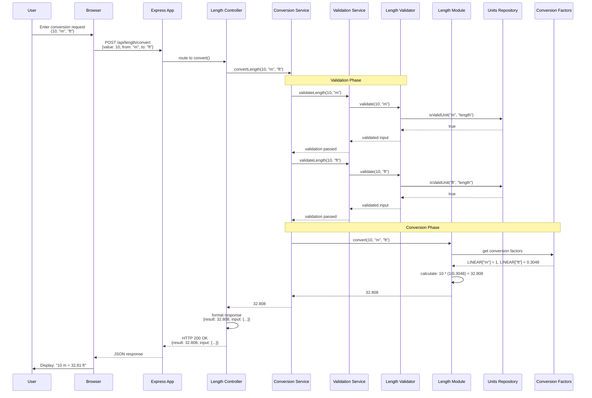
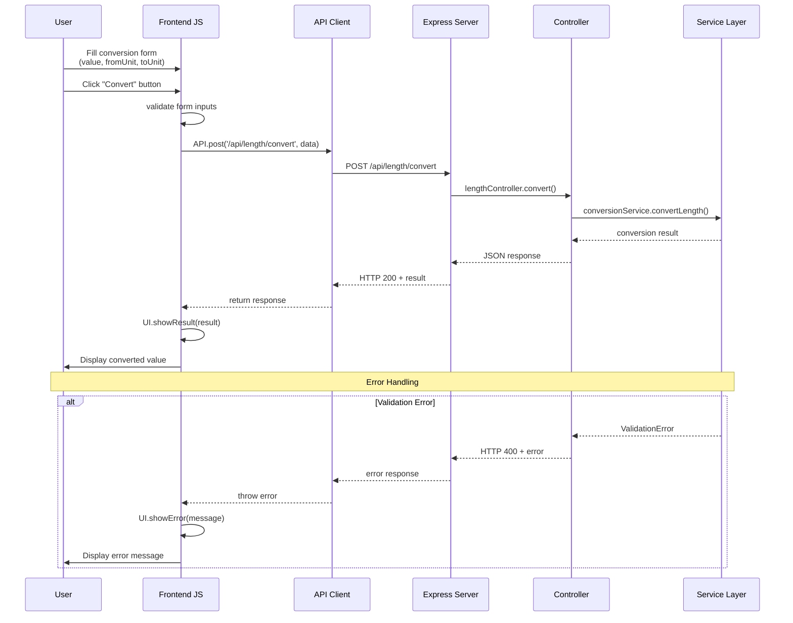
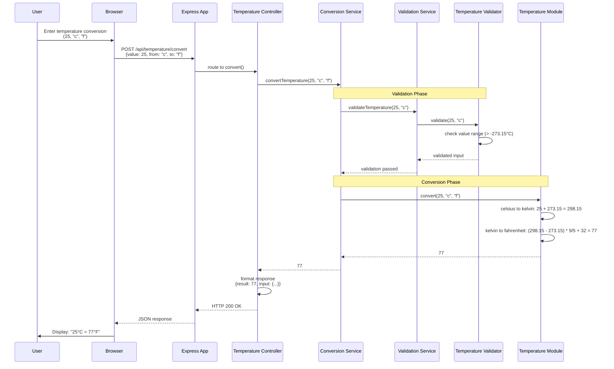
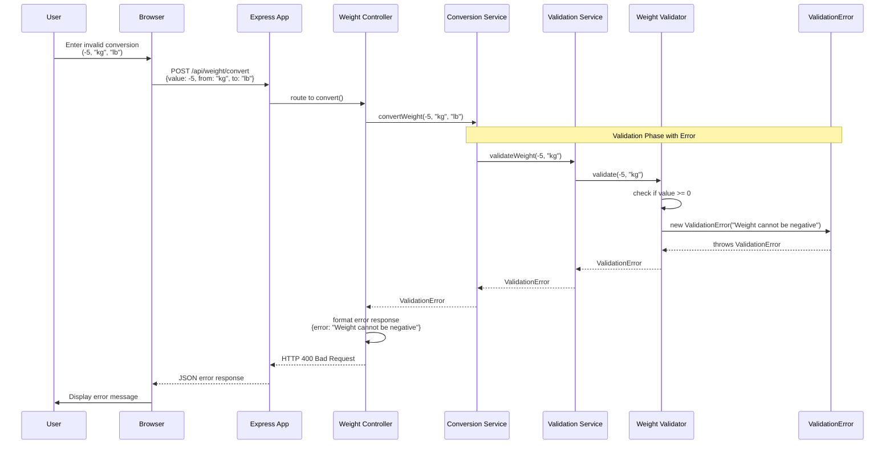
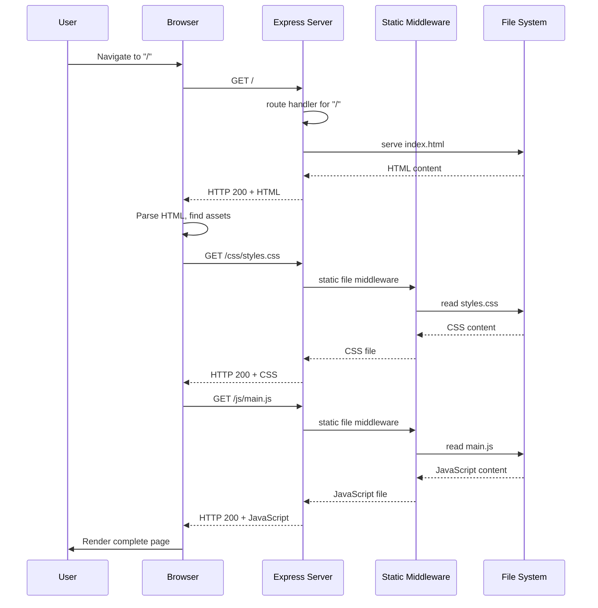

# Sequence Diagram - Unit Converter System

## Sequence Diagram 1: Successful Length Conversion Flow (Full Stack Implementation)



## Sequence Diagram 2: Web Interface Conversion Flow (Frontend Implementation)



## Sequence Diagram 3: Temperature Conversion with Validation (Complete Flow)



## Sequence Diagram 4: Error Handling Flow (Complete Implementation)



## Sequence Diagram 5: Static File Serving Flow (Express Implementation)



## Key Interaction Patterns

### 1. Full-Stack Conversion Flow (✅ Complete Implementation)
- **Request Processing**: User input → Browser → Express App → Controller ✅ *implemented*
- **Validation Chain**: Controller → Service → Validator → Repository ✅ *implemented*
- **Conversion Execution**: Service → Module → Repository (factors/units) ✅ *implemented*
- **Response Chain**: Module → Service → Controller → App → Browser → User ✅ *implemented*

### 2. Error Handling Flow (✅ Complete Implementation)
- **Error Detection**: Validators detect invalid input or unsupported operations ✅ *implemented*
- **Exception Creation**: Specific error objects (ValidationError, UnitError, etc.) ✅ *implemented*
- **Error Propagation**: Exceptions bubble up through service layers ✅ *implemented*
- **Error Response**: Controllers format errors into HTTP responses ✅ *implemented*

### 3. Frontend Integration Pattern (✅ Complete Implementation)
- **Form Handling**: JavaScript classes manage user input and form submission ✅ *implemented*
- **API Communication**: Fetch-based API client with error handling ✅ *implemented*
- **UI Updates**: Dynamic result display and error messaging ✅ *implemented*
- **Responsive Design**: Mobile-first design with Tailwind CSS ✅ *implemented*

### 4. Static Asset Serving (✅ Complete Implementation)
- **Express Static Middleware**: Efficient serving of CSS, JS, and other assets ✅ *implemented*
- **Route Handling**: Dedicated routes for HTML views ✅ *implemented*
- **Cache Headers**: Optimized caching for static resources ✅ *implemented*

## Implementation Status

### Project Completion (✅ 100% Complete)
- **Core Logic**: ✅ 100% Complete (all conversion and validation logic)
- **Testing**: ✅ 100% Complete (500+ test cases with comprehensive coverage)
- **Web Interface**: ✅ 100% Complete (responsive HTML/CSS/JS frontend)
- **API Layer**: ✅ 100% Complete (RESTful endpoints with error handling)
- **Service Layer**: ✅ 100% Complete (business logic orchestration)
- **Controllers**: ✅ 100% Complete (HTTP request/response handlers)
- **Static Serving**: ✅ 100% Complete (Express static middleware)
- **Documentation**: ✅ 100% Complete (README, UML diagrams, JSDoc)
- **Deployment**: ✅ 100% Complete (Vercel configuration)

### Deployed Features
- **Length Conversion**: mm, cm, m, km, in, ft, yd, mi
- **Weight Conversion**: mg, g, kg, t, oz, lb, st, ton
- **Temperature Conversion**: Celsius, Fahrenheit, Kelvin
- **Responsive Web UI**: Mobile-first design with navigation
- **RESTful API**: JSON endpoints for all conversion types
- **Comprehensive Testing**: Unit, integration, and E2E tests
- **Error Handling**: User-friendly error messages and validation
- **Production Deployment**: Serverless deployment on Vercel

### Usage Examples

#### API Usage
```javascript
// POST /api/length/convert
{
  "value": 100,
  "from": "m",
  "to": "ft"
}
// Response: {"result": 328.084, "input": {...}}
```

#### Direct Module Usage
```javascript
const LengthConverter = require('./src/main/modules/lengthConverter');
const result = LengthConverter.convert(10, 'm', 'ft');
console.log(result); // 32.808
```

### Architecture Benefits
- **Production-Ready**: Complete full-stack implementation with deployment
- **Comprehensive Testing**: 500+ tests ensuring reliability and correctness
- **Modular Design**: Clean separation of concerns with layered architecture
- **Extensible Structure**: Easy to add new unit types and conversion algorithms
- **Professional Documentation**: Complete UML diagrams and API documentation
- **Modern Tech Stack**: Node.js/Express backend with vanilla JavaScript frontend