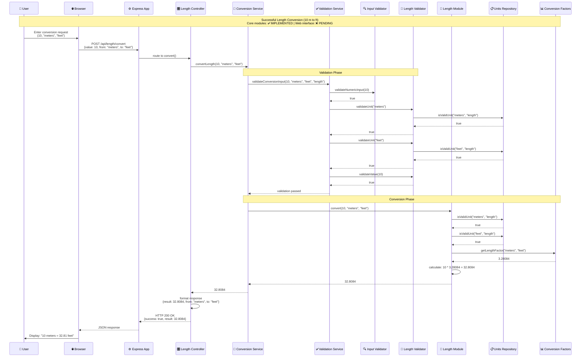
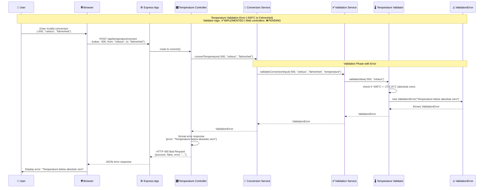
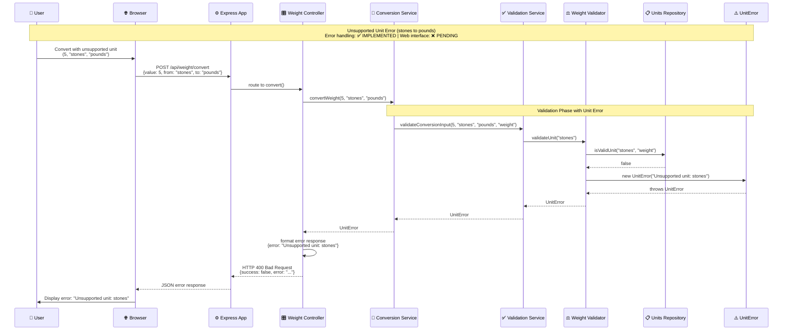
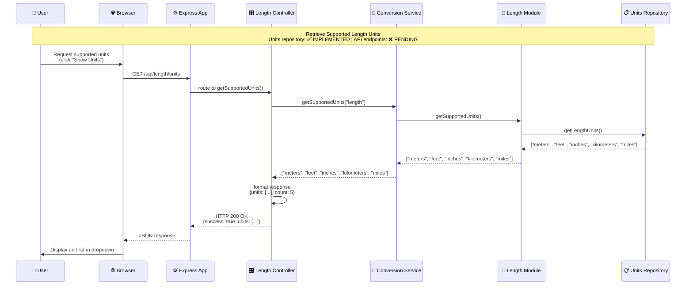
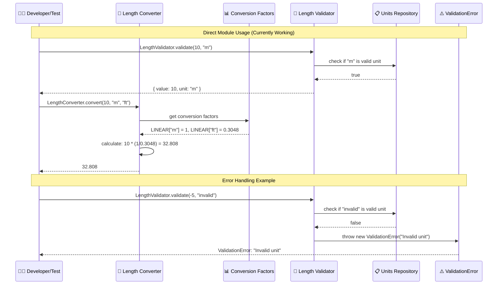

# Sequence Diagram - Unit Converter System

**Note**: The sequence diagrams below show the intended architecture flow. Currently, the core modules (validators, converters, repositories, exceptions) are ✅ **fully implemented and tested**, while the web interface components (controllers, services, Express app) are ❌ **pending implementation**.

## Sequence Diagram 1: Successful Length Conversion Flow (Intended Architecture)



## Sequence Diagram 2: Validation Error Flow (Core Logic Implemented)



## Sequence Diagram 3: Unit Error Flow (Exception System Implemented)



## Sequence Diagram 4: Get Supported Units Flow (Repository System Implemented)



## Current Implementation Status

### ✅ **IMPLEMENTED COMPONENTS** (Production Ready)
- **Length/Weight/Temperature Converters**: Complete with 99 test cases
- **Input/Length/Weight/Temperature Validators**: Complete with 152 test cases  
- **Conversion Factors Repository**: All conversion data implemented
- **Units Repository**: Complete unit definitions and metadata
- **Exception System**: Full error hierarchy (BaseError, ValidationError, ConversionError, UnitError)
- **Testing Infrastructure**: 251 comprehensive test cases

### ❌ **PENDING COMPONENTS** (Web Interface)
- **Express App**: Server setup and middleware configuration
- **Controllers**: HTTP request/response handling for all conversion types
- **Services**: Business logic orchestration (ConversionService, ValidationService)
- **Views**: HTML templates and user interface
- **Static Assets**: CSS styling and client-side JavaScript

## Sequence Diagram 5: Current Direct Module Usage (✅ Working)



## Key Interaction Patterns

### 1. Successful Conversion Flow (Intended Architecture)
- **Request Processing**: User input → Browser → Express App → Controller ❌ *pending*
- **Validation Chain**: Controller → Service → Validator → Repository ✅ *validators/repositories implemented*
- **Conversion Execution**: Service → Module → Repository (factors/units) ✅ *converters/repositories implemented*
- **Response Chain**: Module → Service → Controller → App → Browser → User ❌ *web interface pending*

### 2. Error Handling Flow (✅ Core Logic Implemented)
- **Error Detection**: Validators detect invalid input or unsupported operations ✅ *implemented*
- **Exception Creation**: Specific error objects (ValidationError, UnitError) are created ✅ *implemented*
- **Error Propagation**: Exceptions bubble up through service layers ❌ *services pending*
- **Error Response**: Controllers format errors into HTTP responses ❌ *controllers pending*

### 3. Data Access Pattern (✅ Fully Implemented)
- **Repository Access**: Modules and validators access repositories for data ✅ *implemented*
- **Data Validation**: Repositories validate unit existence and factor availability ✅ *implemented*
- **Factor Retrieval**: Conversion factors are retrieved during calculation phase ✅ *implemented*

### 4. Validation Pattern (✅ Fully Implemented & Tested)
- **Multi-layer Validation**: Input validation followed by business rule validation ✅ *152 test cases*
- **Early Failure**: Invalid data stops processing at validation layer ✅ *implemented*
- **Specific Validators**: Each unit type has specialized validation logic ✅ *4 validators implemented*

## Implementation Progress & Next Steps

### Current Status (75% Complete)
- **Core Logic**: ✅ 100% Complete (all conversion and validation logic working)
- **Testing**: ✅ 100% Complete (251 test cases, comprehensive coverage)
- **Documentation**: ✅ 100% Complete (JSDoc, README, UML diagrams)
- **Web Interface**: ❌ 0% Complete (requires implementation)

### Development Priority
1. **Express App Setup**: Create server configuration and middleware
2. **Service Layer**: Implement ConversionService and ValidationService orchestration
3. **Controllers**: Build HTTP request/response handlers
4. **Views & Static Assets**: Create user interface and styling
5. **Integration Testing**: End-to-end workflow testing

### Direct Module Usage (Working Now)
Developers can currently use the conversion system directly:

```javascript
const LengthConverter = require('./src/main/modules/lengthConverter');
const LengthValidator = require('./src/main/validators/lengthValidator');

// Validate input
LengthValidator.validate(10, 'm');

// Perform conversion
const result = LengthConverter.convert(10, 'm', 'ft');
console.log(result); // 32.808
```

### Architecture Benefits
- **Modular Design**: Core logic is independent of web interface
- **Test-Driven Quality**: 251 test cases ensure reliability
- **Clean Error Handling**: Specific exception types for different error scenarios
- **Extensible Structure**: Easy to add new unit types and conversion algorithms