# Sequence Diagram - Unit Converter System

## Sequence Diagram 1: Successful Length Conversion Flow

```mermaid
sequenceDiagram
    participant User as 👤 User
    participant Browser as 🌐 Browser
    participant App as ⚙️ Express App
    participant LC as 🎛️ Length Controller
    participant CS as 🔧 Conversion Service
    participant VS as ✅ Validation Service
    participant IV as 🔍 Input Validator
    participant LV as 📐 Length Validator
    participant LM as 📏 Length Module
    participant UR as 📋 Units Repository
    participant CF as 📊 Conversion Factors

    Note over User, CF: Successful Length Conversion (10 meters to feet)

    User->>Browser: Enter conversion request<br/>(10, "meters", "feet")
    Browser->>App: POST /api/length/convert<br/>{value: 10, from: "meters", to: "feet"}
    App->>LC: route to convert()
    
    LC->>CS: convertLength(10, "meters", "feet")
    
    Note over CS, LV: Validation Phase
    CS->>VS: validateConversionInput(10, "meters", "feet", "length")
    VS->>IV: validateNumericInput(10)
    IV-->>VS: true
    VS->>LV: validateUnit("meters")
    LV->>UR: isValidUnit("meters", "length")
    UR-->>LV: true
    LV-->>VS: true
    VS->>LV: validateUnit("feet")
    LV->>UR: isValidUnit("feet", "length")
    UR-->>LV: true
    LV-->>VS: true
    VS->>LV: validateValue(10)
    LV-->>VS: true
    VS-->>CS: validation passed
    
    Note over CS, CF: Conversion Phase
    CS->>LM: convert(10, "meters", "feet")
    LM->>UR: isValidUnit("meters", "length")
    UR-->>LM: true
    LM->>UR: isValidUnit("feet", "length")
    UR-->>LM: true
    LM->>CF: getLengthFactor("meters", "feet")
    CF-->>LM: 3.28084
    LM->>LM: calculate: 10 * 3.28084 = 32.8084
    LM-->>CS: 32.8084
    
    CS-->>LC: 32.8084
    LC->>LC: format response<br/>{result: 32.8084, from: "meters", to: "feet"}
    LC-->>App: HTTP 200 OK<br/>{success: true, result: 32.8084}
    App-->>Browser: JSON response
    Browser->>User: Display: "10 meters = 32.81 feet"
```

## Sequence Diagram 2: Validation Error Flow

```mermaid
sequenceDiagram
    participant User as 👤 User
    participant Browser as 🌐 Browser
    participant App as ⚙️ Express App
    participant TC as 🎛️ Temperature Controller
    participant CS as 🔧 Conversion Service
    participant VS as ✅ Validation Service
    participant TV as 🌡️ Temperature Validator
    participant VE as ⚠️ ValidationError

    Note over User, VE: Temperature Validation Error (-500°C to Fahrenheit)

    User->>Browser: Enter invalid conversion<br/>(-500, "celsius", "fahrenheit")
    Browser->>App: POST /api/temperature/convert<br/>{value: -500, from: "celsius", to: "fahrenheit"}
    App->>TC: route to convert()
    
    TC->>CS: convertTemperature(-500, "celsius", "fahrenheit")
    
    Note over CS, VE: Validation Phase with Error
    CS->>VS: validateConversionInput(-500, "celsius", "fahrenheit", "temperature")
    VS->>TV: validateValue(-500, "celsius")
    TV->>TV: check if -500°C < -273.15°C (absolute zero)
    TV->>VE: new ValidationError("Temperature below absolute zero")
    VE-->>TV: throws ValidationError
    TV-->>VS: ValidationError
    VS-->>CS: ValidationError
    CS-->>TC: ValidationError
    
    TC->>TC: format error response<br/>{error: "Temperature below absolute zero"}
    TC-->>App: HTTP 400 Bad Request<br/>{success: false, error: "..."}
    App-->>Browser: JSON error response
    Browser->>User: Display error: "Temperature below absolute zero"
```

## Sequence Diagram 3: Unit Error Flow

## Sequence Diagram 4: Get Supported Units Flow

```mermaid
sequenceDiagram
    participant User as 👤 User
    participant Browser as 🌐 Browser
    participant App as ⚙️ Express App
    participant LC as 🎛️ Length Controller
    participant CS as 🔧 Conversion Service
    participant LM as 📏 Length Module
    participant UR as 📋 Units Repository

    Note over User, UR: Retrieve Supported Length Units

    User->>Browser: Request supported units<br/>(click "Show Units")
    Browser->>App: GET /api/length/units
    App->>LC: route to getSupportedUnits()
    
    LC->>CS: getSupportedUnits("length")
    CS->>LM: getSupportedUnits()
    LM->>UR: getLengthUnits()
    UR-->>LM: ["meters", "feet", "inches", "kilometers", "miles"]
    LM-->>CS: ["meters", "feet", "inches", "kilometers", "miles"]
    CS-->>LC: ["meters", "feet", "inches", "kilometers", "miles"]
    
    LC->>LC: format response<br/>{units: [...], count: 5}
    LC-->>App: HTTP 200 OK<br/>{success: true, units: [...]}
    App-->>Browser: JSON response
    Browser->>User: Display unit list in dropdown
```

## Key Interaction Patterns

### 1. Successful Conversion Flow
- **Request Processing**: User input → Browser → Express App → Controller
- **Validation Chain**: Controller → Service → Validator → Repository
- **Conversion Execution**: Service → Module → Repository (factors/units)
- **Response Chain**: Module → Service → Controller → App → Browser → User

### 2. Error Handling Flow
- **Error Detection**: Validators detect invalid input or unsupported operations
- **Exception Creation**: Specific error objects (ValidationError, UnitError) are created
- **Error Propagation**: Exceptions bubble up through service layers
- **Error Response**: Controllers format errors into HTTP responses

### 3. Data Access Pattern
- **Repository Access**: Modules and validators access repositories for data
- **Data Validation**: Repositories validate unit existence and factor availability
- **Factor Retrieval**: Conversion factors are retrieved during calculation phase

### 4. Validation Pattern
- **Multi-layer Validation**: Input validation followed by business rule validation
- **Early Failure**: Invalid data stops processing at validation layer
- **Specific Validators**: Each unit type has specialized validation logic

## Timing and Flow Characteristics

### Normal Operation
1. **Request Phase** (~10ms): HTTP request processing and routing
2. **Validation Phase** (~20ms): Multi-level input and business validation
3. **Conversion Phase** (~5ms): Mathematical calculation and factor lookup
4. **Response Phase** (~10ms): Result formatting and HTTP response

### Error Scenarios
1. **Validation Errors**: Fast failure at validation layer (~15ms)
2. **Unit Errors**: Repository lookup failure (~25ms)
3. **System Errors**: Propagated through all layers (~30ms)

### Data Flow
- **Synchronous Processing**: All operations are synchronous for simplicity
- **Layered Validation**: Multiple validation checkpoints ensure data integrity
- **Clean Error Propagation**: Specific exceptions provide clear error context
- **Consistent Response Format**: Uniform JSON responses for success and error cases