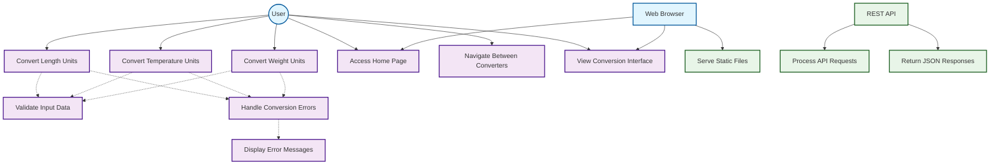

# Use Case Diagram - Unit Converter System

## Use Case Descriptions

### Primary Use Cases (User)

#### UC1: Convert Length Units
- **Actor**: User
- **Goal**: Convert a value from one length unit to another
- **Preconditions**: User has access to the length conversion page
- **Main Flow**:
  1. User navigates to /length endpoint
  2. User enters numeric value in the form
  3. User selects source unit (mm, cm, m, km, in, ft, yd, mi)
  4. User selects target unit from available options
  5. System validates input via ValidationService
  6. System calls LengthConverter.convert() method
  7. System returns JSON response with converted value
- **Extensions**: 
  - Invalid input → ValidationError (400 status)
  - Conversion failure → ConversionError (500 status)
- **Postconditions**: Conversion result is returned as JSON: `{ result: number }`

#### UC2: Convert Temperature Units
- **Actor**: User
- **Goal**: Convert a temperature value between different scales
- **Preconditions**: User has access to the temperature conversion page
- **Main Flow**:
  1. User navigates to /temperature endpoint
  2. User enters temperature value in the form
  3. User selects source scale (c=Celsius, f=Fahrenheit, k=Kelvin)
  4. User selects target scale from available options
  5. System validates temperature value and units
  6. System calls TemperatureConverter.convert() method
  7. System returns JSON response with converted temperature
- **Extensions**: 
  - Invalid temperature input → ValidationError (400 status)
  - Conversion failure → ConversionError (500 status)
- **Postconditions**: Temperature conversion result is returned as JSON: `{ result: number }`

#### UC3: Convert Weight Units
- **Actor**: User
- **Goal**: Convert a weight/mass value between different units
- **Preconditions**: User has access to the weight conversion page
- **Main Flow**:
  1. User navigates to /weight endpoint
  2. User enters weight value in the form
  3. User selects source unit (mg, g, kg, t, oz, lb, st, ton)
  4. User selects target unit from available options
  5. System validates weight value and units
  6. System calls WeightConverter.convert() method
  7. System returns JSON response with converted weight
- **Extensions**: 
  - Invalid weight input → ValidationError (400 status)
  - Conversion failure → ConversionError (500 status)
- **Postconditions**: Weight conversion result is returned as JSON: `{ result: number }`

#### UC4: Access Home Page
- **Actor**: User
- **Goal**: Access the main landing page of the unit converter
- **Preconditions**: User has web browser access
- **Main Flow**:
  1. User navigates to / (root) endpoint
  2. System serves index.html from views directory
  3. User sees three conversion options: Length, Weight, Temperature
  4. User can navigate to any specific converter page
- **Postconditions**: Home page is displayed with navigation options

#### UC5: Navigate Between Converters
- **Actor**: User
- **Goal**: Move between different conversion interfaces
- **Preconditions**: User is on any page of the system
- **Main Flow**:
  1. User clicks navigation links in header
  2. System routes to appropriate page (/length, /weight, /temperature)
  3. System serves corresponding HTML view
  4. User sees conversion interface for selected type
- **Postconditions**: User is on the desired conversion page

#### UC6: View Conversion Interface
- **Actor**: User
- **Goal**: Access the web interface for performing conversions
- **Preconditions**: User has navigated to a conversion page
- **Main Flow**:
  1. System serves static HTML page (length.html, weight.html, or temperature.html)
  2. System loads associated CSS and JavaScript files
  3. User sees input forms, unit selectors, and result display
  4. Interface is ready for user input
- **Postconditions**: Conversion interface is loaded and functional

### Secondary Use Cases

#### UC7: Validate Input Data
- **Actor**: System (included by all conversion use cases)
- **Goal**: Ensure input data is valid before conversion
- **Main Flow**:
  1. System receives conversion request with value, from, and to parameters
  2. ValidationService validates numeric format of value
  3. ValidationService checks if units exist in Units repository
  4. ValidationService verifies value constraints (e.g., positive for weight)
  5. System confirms data integrity
- **Extensions**: 
  - Invalid data → Throw ValidationError
- **Postconditions**: Input is validated or ValidationError is thrown

#### UC8: Handle Conversion Errors
- **Actor**: System (extended from conversion use cases)
- **Goal**: Gracefully handle and return conversion errors
- **Main Flow**:
  1. System detects error during conversion process
  2. System determines error type (ValidationError or ConversionError)
  3. System formats appropriate HTTP status code (400 or 500)
  4. System returns JSON error response: `{ error: string }`
  5. Global error handler logs unexpected errors
- **Postconditions**: Error is returned as structured JSON response

#### UC9: Display Error Messages
- **Actor**: System (extended from error handling)
- **Goal**: Provide user-friendly error messages
- **Main Flow**:
  1. System catches validation or conversion errors
  2. System determines appropriate HTTP status code
  3. System formats error message in JSON format
  4. System returns error response to client
  5. Client receives structured error information
- **Postconditions**: Error message is communicated to client

#### UC10: Serve Static Files
- **Actor**: Web Browser
- **Goal**: Load CSS, JavaScript, and other static assets
- **Main Flow**:
  1. Browser requests static files (CSS, JS, images)
  2. Express server serves files from public directory
  3. Files are cached by browser for performance
  4. Static assets enhance user interface functionality
- **Postconditions**: Static files are served to browser

### System Use Cases

#### UC11: Process API Requests
- **Actor**: REST API
- **Goal**: Handle incoming HTTP requests for conversions
- **Main Flow**:
  1. API receives POST request to conversion endpoint
  2. Express router directs request to appropriate controller
  3. Controller extracts request parameters (value, from, to)
  4. Controller calls ConversionService method
  5. Response is formatted and returned
- **Postconditions**: API request is processed and response is sent

#### UC12: Return JSON Responses
- **Actor**: REST API
- **Goal**: Provide structured responses to clients
- **Main Flow**:
  1. System completes conversion or error handling
  2. Result is formatted as JSON object
  3. Appropriate HTTP status code is set
  4. Response headers are configured
  5. JSON response is sent to client
- **Postconditions**: Structured JSON response is delivered

## Use Case Relationships

### Include Relationships
- UC1 (Convert Length Units) includes UC7 (Validate Input Data)
- UC2 (Convert Temperature Units) includes UC7 (Validate Input Data)  
- UC3 (Convert Weight Units) includes UC7 (Validate Input Data)
- All conversion use cases include input validation to ensure data integrity

### Extend Relationships
- UC1, UC2, UC3 extend to UC8 (Handle Conversion Errors) when validation or conversion fails
- UC8 (Handle Conversion Errors) extends to UC9 (Display Error Messages)
- Error handling provides graceful failure recovery for all conversion operations

### Actor Interactions
- **User**: Primary system user who navigates pages and performs conversions
- **Web Browser**: External client that requests static files and displays interfaces
- **REST API**: Internal system actor that processes conversion requests and returns responses

### Technical Architecture
- **Frontend**: HTML pages with JavaScript for user interaction
- **Backend**: Express.js server with controllers, services, and validation layers
- **API Endpoints**: POST /convert/length, /convert/weight, /convert/temperature
- **Static Content**: GET /, /length, /weight, /temperature for HTML pages