# Class Diagram - Weather API Wrapper Service

## Overview
This diagram shows the complete class structure and relationships in the Weather API Wrapper Service, following hexagonal architecture principles.

## Class Diagram

```mermaid
classDiagram
    %% Domain Model Layer
    class Location {
        -double latitude
        -double longitude
        -String city
        -String country
        +Location(latitude, longitude, city, country)
        +getLatitude() double
        +getLongitude() double
        +getCity() String
        +getCountry() String
        +toString() String
        +equals(Object) boolean
        +hashCode() int
        -validateCoordinates(latitude, longitude) void
        -validatePlaceNames(city, country) void
    }

    class WeatherData {
        -double temperature
        -int humidity
        -String description
        -LocalDateTime timestamp
        -Location location
        +WeatherData(temperature, humidity, description, location)
        +getTemperature() double
        +getHumidity() int
        +getDescription() String
        +getTimestamp() LocalDateTime
        +getLocation() Location
        +toString() String
        +equals(Object) boolean
        +hashCode() int
        -validateHumidity(humidity) void
        -validateDescription(description) void
    }

    class WeatherRequest {
        -Location location
        -LocalDate date
        -boolean includeHourly
        +WeatherRequest(location, date, includeHourly)
        +getLocation() Location
        +getDate() LocalDate
        +isIncludeHourly() boolean
        +toString() String
        +equals(Object) boolean
        +hashCode() int
    }

    class WeatherResponse {
        -WeatherData weatherData
        -boolean cached
        -LocalDateTime timestamp
        +WeatherResponse(weatherData, cached)
        +getWeatherData() WeatherData
        +isCached() boolean
        +getTimestamp() LocalDateTime
        +toString() String
        +equals(Object) boolean
        +hashCode() int
    }

    %% Domain Services Layer
    class WeatherService {
        -WeatherProviderPort weatherProvider
        -CacheService cacheService
        -RateLimiterService rateLimiterService
        +WeatherService(weatherProvider, cacheService, rateLimiterService)
        +getWeather(request) WeatherResponse
        +validateRequest(request) void
        +processWeatherData(rawData) WeatherData
    }

    class CacheService {
        -CachePort cachePort
        -Duration cacheTimeout
        +CacheService(cachePort, cacheTimeout)
        +get(key) Optional~WeatherData~
        +put(key, data) void
        +evict(key) void
        +clear() void
        +generateKey(request) String
    }

    class RateLimiterService {
        -RateLimiterPort rateLimiterPort
        -int maxRequests
        -Duration timeWindow
        +RateLimiterService(rateLimiterPort, maxRequests, timeWindow)
        +checkRateLimit(clientId) boolean
        +consumeToken(clientId) boolean
        +getRemainingTokens(clientId) int
        +reset(clientId) void
    }

    %% Application Layer - Ports
    class WeatherProviderPort {
        <<interface>>
        +getWeatherData(request) WeatherData
        +isAvailable() boolean
        +getProviderName() String
    }

    class CachePort {
        <<interface>>
        +get(key) Optional~WeatherData~
        +put(key, data, ttl) void
        +delete(key) void
        +exists(key) boolean
    }

    class RateLimiterPort {
        <<interface>>
        +tryConsume(clientId) boolean
        +getAvailableTokens(clientId) int
        +reset(clientId) void
    }

    %% Application Layer - Use Cases
    class GetWeatherUseCase {
        -WeatherService weatherService
        +GetWeatherUseCase(weatherService)
        +execute(request) WeatherResponse
        +validateInput(request) void
        +handleError(exception) WeatherResponse
    }

    class CacheWeatherUseCase {
        -CacheService cacheService
        +CacheWeatherUseCase(cacheService)
        +execute(key, data) void
        +retrieve(key) Optional~WeatherData~
        +invalidate(key) void
    }

    class RateLimitUseCase {
        -RateLimiterService rateLimiterService
        +RateLimitUseCase(rateLimiterService)
        +execute(clientId) boolean
        +getRemainingRequests(clientId) int
        +resetLimit(clientId) void
    }

    %% Infrastructure Layer
    class VisualCrossingWeatherProvider {
        -WebClient webClient
        -String apiKey
        -String baseUrl
        +VisualCrossingWeatherProvider(webClient, apiKey, baseUrl)
        +getWeatherData(request) WeatherData
        +isAvailable() boolean
        +getProviderName() String
        -buildUrl(request) String
        -parseResponse(response) WeatherData
        -handleApiError(exception) void
    }

    class RedisCacheAdapter {
        -RedisTemplate~String, WeatherData~ redisTemplate
        -Duration defaultTtl
        +RedisCacheAdapter(redisTemplate, defaultTtl)
        +get(key) Optional~WeatherData~
        +put(key, data, ttl) void
        +delete(key) void
        +exists(key) boolean
        -serialize(data) String
        -deserialize(json) WeatherData
    }

    class Bucket4jRateLimiterAdapter {
        -Bucket bucket
        -BucketConfiguration bucketConfiguration
        +Bucket4jRateLimiterAdapter(capacity, refillTokens, refillDuration)
        +tryConsume(clientId) boolean
        +getAvailableTokens(clientId) int
        +reset(clientId) void
        -getBucketForClient(clientId) Bucket
        -createBucketConfiguration() BucketConfiguration
    }

    class AppConfig {
        +webClient() WebClient
        +redisTemplate() RedisTemplate~String, WeatherData~
        +bucket4jRateLimiter() Bucket4jRateLimiterAdapter
        +weatherService() WeatherService
        +getWeatherUseCase() GetWeatherUseCase
        +cacheWeatherUseCase() CacheWeatherUseCase
        +rateLimitUseCase() RateLimitUseCase
    }

    class WeatherController {
        -GetWeatherUseCase getWeatherUseCase
        -CacheWeatherUseCase cacheWeatherUseCase
        -RateLimitUseCase rateLimitUseCase
        +WeatherController(getWeatherUseCase, cacheWeatherUseCase, rateLimitUseCase)
        +getWeather(location, date, includeHourly) ResponseEntity~WeatherResponse~
        +getWeatherByCoordinates(lat, lon, date) ResponseEntity~WeatherResponse~
        +getCacheStatus(key) ResponseEntity~Map~String, Object~~
        +clearCache(key) ResponseEntity~Void~
        +getRateLimitStatus(clientId) ResponseEntity~Map~String, Object~~
        -extractClientId(request) String
        -validateLocation(location) Location
        -validateDate(date) LocalDate
        +handleValidationException(exception) ResponseEntity~ErrorResponse~
        +handleRateLimitException(exception) ResponseEntity~ErrorResponse~
        +handleWeatherServiceException(exception) ResponseEntity~ErrorResponse~
    }

    %% Main Application
    class WeatherApiWrapperApplication {
        +main(args) void
        -configureRedis() void
        -configureRateLimiting() void
    }

    %% Relationships
    WeatherData --> Location : contains
    WeatherRequest --> Location : contains
    WeatherResponse --> WeatherData : contains

    WeatherService --> WeatherProviderPort : uses
    WeatherService --> CacheService : uses
    WeatherService --> RateLimiterService : uses

    CacheService --> CachePort : uses
    RateLimiterService --> RateLimiterPort : uses

    GetWeatherUseCase --> WeatherService : uses
    CacheWeatherUseCase --> CacheService : uses
    RateLimitUseCase --> RateLimiterService : uses

    VisualCrossingWeatherProvider ..|> WeatherProviderPort : implements
    RedisCacheAdapter ..|> CachePort : implements
    Bucket4jRateLimiterAdapter ..|> RateLimiterPort : implements

    WeatherController --> GetWeatherUseCase : uses
    WeatherController --> CacheWeatherUseCase : uses
    WeatherController --> RateLimitUseCase : uses

    AppConfig --> VisualCrossingWeatherProvider : creates
    AppConfig --> RedisCacheAdapter : creates
    AppConfig --> Bucket4jRateLimiterAdapter : creates
    AppConfig --> WeatherService : creates
    AppConfig --> GetWeatherUseCase : creates
    AppConfig --> CacheWeatherUseCase : creates
    AppConfig --> RateLimitUseCase : creates

    WeatherApiWrapperApplication --> AppConfig : uses
```

## Architecture Layers

### Domain Layer (Core)
- **Location**: Geographical location with coordinates and place information
- **WeatherData**: Weather information for a specific location and time
- **WeatherRequest**: Request for weather data
- **WeatherResponse**: Response containing weather data and metadata

### Domain Services Layer
- **WeatherService**: Orchestrates weather data retrieval with caching and rate limiting
- **CacheService**: Manages weather data caching operations
- **RateLimiterService**: Handles API rate limiting logic

### Application Layer
- **Ports**: Interfaces defining contracts for external dependencies
- **Use Cases**: Application business logic orchestrating domain operations

### Infrastructure Layer
- **Adapters**: Concrete implementations of ports
- **Configuration**: Spring Boot configuration and dependency injection
- **Web Layer**: REST controller for API endpoints

## Design Patterns Used

1. **Hexagonal Architecture**: Clear separation between domain, application, and infrastructure
2. **Dependency Injection**: Constructor-based dependency management
3. **Strategy Pattern**: Different weather providers can be implemented
4. **Adapter Pattern**: Infrastructure adapters implement port interfaces
5. **Repository Pattern**: Cache and rate limiter abstractions
6. **Use Case Pattern**: Application business logic organization

## Key Features

- **Immutable Domain Objects**: All domain model classes are immutable and thread-safe
- **Validation**: Comprehensive input validation at domain boundaries
- **Error Handling**: Proper exception handling throughout the application
- **Caching**: Redis-based caching for weather data
- **Rate Limiting**: Bucket4j-based rate limiting for API protection
- **REST API**: Clean REST endpoints with proper HTTP status codes
- **Configuration**: Externalized configuration via application.properties 