# Component Diagram - Weather API Wrapper Service

## Overview
This diagram shows the high-level component architecture and interactions in the Weather API Wrapper Service, following hexagonal architecture principles.

## Component Diagram

```mermaid
graph TB
    %% External Systems
    subgraph "External Systems"
        VC_API[Visual Crossing Weather API]
        REDIS[Redis Cache]
        CLIENT[HTTP Client]
    end

    %% Infrastructure Layer
    subgraph "Infrastructure Layer"
        WEB[Web Layer]
        CACHE[Cache Layer]
        RATE_LIMIT[Rate Limiting Layer]
        PROVIDER[Weather Provider Layer]
    end

    %% Application Layer
    subgraph "Application Layer"
        USE_CASES[Use Cases]
        PORTS[Ports]
    end

    %% Domain Layer
    subgraph "Domain Layer"
        DOMAIN_SERVICES[Domain Services]
        DOMAIN_MODELS[Domain Models]
    end

    %% Main Application
    subgraph "Main Application"
        APP[WeatherApiWrapperApplication]
        CONFIG[AppConfig]
        SECURITY[Security Configuration]
        MONITORING[Application Monitoring]
    end

    %% Component Details
    subgraph "Web Layer Components"
        CONTROLLER[WeatherController]
        ERROR_HANDLER[Global Error Handler]
        REQUEST_VALIDATION[Request Validation]
        RESPONSE_FORMATTING[Response Formatting]
    end

    subgraph "Cache Layer Components"
        REDIS_ADAPTER[RedisCacheAdapter]
        CACHE_SERVICE[CacheService]
        CACHE_CONFIG[Cache Configuration]
        CACHE_MONITORING[Cache Monitoring]
    end

    subgraph "Rate Limiting Components"
        BUCKET4J_ADAPTER[Bucket4jRateLimiterAdapter]
        RATE_LIMITER_SERVICE[RateLimiterService]
        CLIENT_IDENTIFICATION[Client ID Management]
        BUCKET_MANAGEMENT[Bucket Management]
    end

    subgraph "Weather Provider Components"
        VC_PROVIDER[VisualCrossingWeatherProvider]
        WEATHER_SERVICE[WeatherService]
        API_CLIENT[WebClient Configuration]
        RESPONSE_PARSER[Response Parser]
    end

    subgraph "Use Case Components"
        GET_WEATHER_UC[GetWeatherUseCase]
        CACHE_WEATHER_UC[CacheWeatherUseCase]
        RATE_LIMIT_UC[RateLimitUseCase]
    end

    subgraph "Port Components"
        WEATHER_PROVIDER_PORT[WeatherProviderPort]
        CACHE_PORT[CachePort]
        RATE_LIMITER_PORT[RateLimiterPort]
    end

    subgraph "Domain Model Components"
        LOCATION[Location]
        WEATHER_DATA[WeatherData]
        WEATHER_REQUEST[WeatherRequest]
        WEATHER_RESPONSE[WeatherResponse]
    end

    %% Connections
    CLIENT --> WEB
    WEB --> USE_CASES
    USE_CASES --> DOMAIN_SERVICES
    DOMAIN_SERVICES --> DOMAIN_MODELS

    %% Infrastructure Connections
    PROVIDER --> VC_API
    CACHE --> REDIS
    WEB --> CACHE
    WEB --> RATE_LIMIT

    %% Internal Component Connections
    CONTROLLER --> GET_WEATHER_UC
    CONTROLLER --> CACHE_WEATHER_UC
    CONTROLLER --> RATE_LIMIT_UC

    GET_WEATHER_UC --> WEATHER_SERVICE
    CACHE_WEATHER_UC --> CACHE_SERVICE
    RATE_LIMIT_UC --> RATE_LIMITER_SERVICE

    WEATHER_SERVICE --> WEATHER_PROVIDER_PORT
    WEATHER_SERVICE --> CACHE_SERVICE
    WEATHER_SERVICE --> RATE_LIMITER_SERVICE

    CACHE_SERVICE --> CACHE_PORT
    RATE_LIMITER_SERVICE --> RATE_LIMITER_PORT

    VC_PROVIDER -.->|implements| WEATHER_PROVIDER_PORT
    REDIS_ADAPTER -.->|implements| CACHE_PORT
    BUCKET4J_ADAPTER -.->|implements| RATE_LIMITER_PORT

    %% Configuration
    CONFIG --> VC_PROVIDER
    CONFIG --> REDIS_ADAPTER
    CONFIG --> BUCKET4J_ADAPTER
    CONFIG --> WEATHER_SERVICE
    CONFIG --> GET_WEATHER_UC
    CONFIG --> CACHE_WEATHER_UC
    CONFIG --> RATE_LIMIT_UC
    CONFIG --> SECURITY
    CONFIG --> MONITORING

    APP --> CONFIG
    APP --> SECURITY
    APP --> MONITORING

    %% Styling
    classDef external fill:#ff9999,stroke:#333,stroke-width:2px
    classDef infrastructure fill:#99ccff,stroke:#333,stroke-width:2px
    classDef application fill:#99ff99,stroke:#333,stroke-width:2px
    classDef domain fill:#ffcc99,stroke:#333,stroke-width:2px
    classDef main fill:#cc99ff,stroke:#333,stroke-width:2px

    class VC_API,REDIS,CLIENT external
    class WEB,CACHE,RATE_LIMIT,PROVIDER infrastructure
    class USE_CASES,PORTS application
    class DOMAIN_SERVICES,DOMAIN_MODELS domain
    class APP,CONFIG main
```

## Architecture Overview

### External Systems
- **Visual Crossing Weather API**: External weather data provider
- **Redis Cache**: External caching system
- **HTTP Client**: External consumers of the API

### Infrastructure Layer
- **Web Layer**: Handles HTTP requests and responses
- **Cache Layer**: Manages data caching operations
- **Rate Limiting Layer**: Controls API usage limits
- **Weather Provider Layer**: Interfaces with external weather APIs

### Application Layer
- **Use Cases**: Application business logic
- **Ports**: Interfaces defining external dependencies

### Domain Layer
- **Domain Services**: Core business logic
- **Domain Models**: Core business entities

### Main Application
- **WeatherApiWrapperApplication**: Spring Boot main class with comprehensive startup/shutdown management
- **AppConfig**: Configuration and dependency injection with security measures
- **Security Configuration**: Security properties and configurations
- **Application Monitoring**: Startup/shutdown monitoring and performance tracking

## Component Responsibilities

### Web Layer
- **WeatherController**: Handles HTTP requests and responses with comprehensive validation
- **Global Error Handler**: Centralized exception handling and error responses
- **Request Validation**: Input validation and sanitization
- **Response Formatting**: Consistent response formatting and status codes

### Cache Layer
- **RedisCacheAdapter**: Redis-specific cache implementation
- **CacheService**: Domain service for cache operations

### Rate Limiting
- **Bucket4jRateLimiterAdapter**: Bucket4j-specific rate limiter implementation
- **RateLimiterService**: Domain service for rate limiting operations

### Weather Provider
- **VisualCrossingWeatherProvider**: Visual Crossing API implementation
- **WeatherService**: Domain service for weather operations

### Use Cases
- **GetWeatherUseCase**: Orchestrates weather data retrieval
- **CacheWeatherUseCase**: Manages weather data caching
- **RateLimitUseCase**: Handles rate limiting logic

### Ports
- **WeatherProviderPort**: Contract for weather data providers
- **CachePort**: Contract for cache operations
- **RateLimiterPort**: Contract for rate limiting operations

### Domain Models
- **Location**: Geographical location representation
- **WeatherData**: Weather information representation
- **WeatherRequest**: Weather request representation
- **WeatherResponse**: Weather response representation

## Data Flow

1. **Client Request**: HTTP client sends request to Web Layer
2. **Request Processing**: Web Layer routes to appropriate Use Case
3. **Business Logic**: Use Case orchestrates Domain Services
4. **External Integration**: Domain Services interact with external systems via Ports
5. **Response**: Data flows back through the layers to the client

## Key Design Principles

- **Separation of Concerns**: Each component has a single responsibility
- **Dependency Inversion**: High-level modules don't depend on low-level modules
- **Interface Segregation**: Clients depend only on interfaces they use
- **Open/Closed Principle**: Open for extension, closed for modification
- **Hexagonal Architecture**: Clear boundaries between domain and infrastructure 