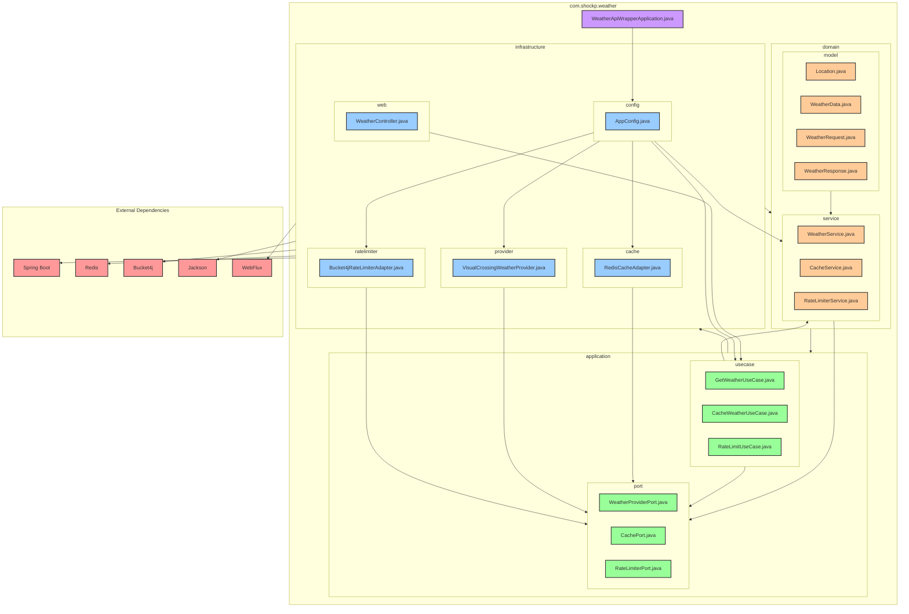

# Package Diagram - Weather API Wrapper Service

## Overview
This diagram shows the package structure and dependencies in the Weather API Wrapper Service, following hexagonal architecture principles.

## Package Diagram

## Package Structure

### Domain Layer (`com.shockp.weather.domain`)
The core business logic layer containing domain models and services.

#### Model Package (`com.shockp.weather.domain.model`)
- **Location.java**: Geographical location representation
- **WeatherData.java**: Weather information representation
- **WeatherRequest.java**: Weather request representation
- **WeatherResponse.java**: Weather response representation

#### Service Package (`com.shockp.weather.domain.service`)
- **WeatherService.java**: Core weather business logic
- **CacheService.java**: Cache business logic
- **RateLimiterService.java**: Rate limiting business logic

### Application Layer (`com.shockp.weather.application`)
The application layer containing ports and use cases.

#### Port Package (`com.shockp.weather.application.port`)
- **WeatherProviderPort.java**: Contract for weather data providers
- **CachePort.java**: Contract for cache operations
- **RateLimiterPort.java**: Contract for rate limiting operations

#### Use Case Package (`com.shockp.weather.application.usecase`)
- **GetWeatherUseCase.java**: Weather data retrieval use case
- **CacheWeatherUseCase.java**: Weather data caching use case
- **RateLimitUseCase.java**: Rate limiting use case

### Infrastructure Layer (`com.shockp.weather.infrastructure`)
The infrastructure layer containing adapters and external integrations.

#### Cache Package (`com.shockp.weather.infrastructure.cache`)
- **RedisCacheAdapter.java**: Redis cache implementation

#### Config Package (`com.shockp.weather.infrastructure.config`)
- **AppConfig.java**: Spring Boot configuration

#### Provider Package (`com.shockp.weather.infrastructure.provider`)
- **VisualCrossingWeatherProvider.java**: Visual Crossing API implementation

#### Rate Limiter Package (`com.shockp.weather.infrastructure.ratelimiter`)
- **Bucket4jRateLimiterAdapter.java**: Bucket4j rate limiter implementation

#### Web Package (`com.shockp.weather.infrastructure.web`)
- **WeatherController.java**: REST API controller

### Main Application
- **WeatherApiWrapperApplication.java**: Spring Boot main class

## Package Dependencies

### Dependency Rules
1. **Domain Layer**: No dependencies on other layers
2. **Application Layer**: Depends only on Domain Layer
3. **Infrastructure Layer**: Depends on Domain and Application Layers
4. **Main Application**: Depends on Infrastructure Layer

### Specific Dependencies

#### Domain Layer Dependencies
- Domain models have no external dependencies
- Domain services depend only on domain models and ports

#### Application Layer Dependencies
- Ports define contracts for infrastructure
- Use cases depend on domain services and ports

#### Infrastructure Layer Dependencies
- Adapters implement port interfaces
- Configuration creates and wires all components
- Web layer depends on use cases

## External Dependencies

### Spring Boot
- **spring-boot-starter-web**: Web application support
- **spring-boot-starter-data-redis**: Redis integration
- **spring-boot-starter-cache**: Caching support
- **spring-boot-starter-webflux**: Reactive web support

### Third-Party Libraries
- **bucket4j-core**: Rate limiting library
- **jackson-databind**: JSON processing
- **spring-boot-starter-test**: Testing support

## Package Design Principles

### Hexagonal Architecture
- **Domain**: Core business logic (innermost layer)
- **Application**: Use cases and ports (middle layer)
- **Infrastructure**: External integrations (outermost layer)

### Dependency Inversion
- High-level modules (domain) don't depend on low-level modules (infrastructure)
- Both depend on abstractions (ports)

### Package Cohesion
- Each package has a single responsibility
- Related classes are grouped together
- Clear separation of concerns

### Package Coupling
- Minimized dependencies between packages
- Clear dependency direction (domain → application → infrastructure)
- No circular dependencies

## Benefits of This Structure

1. **Maintainability**: Clear separation makes code easier to maintain
2. **Testability**: Dependencies can be easily mocked and tested
3. **Flexibility**: Easy to swap implementations (e.g., different cache providers)
4. **Scalability**: New features can be added without affecting existing code
5. **Understandability**: Clear structure makes the codebase easier to understand 