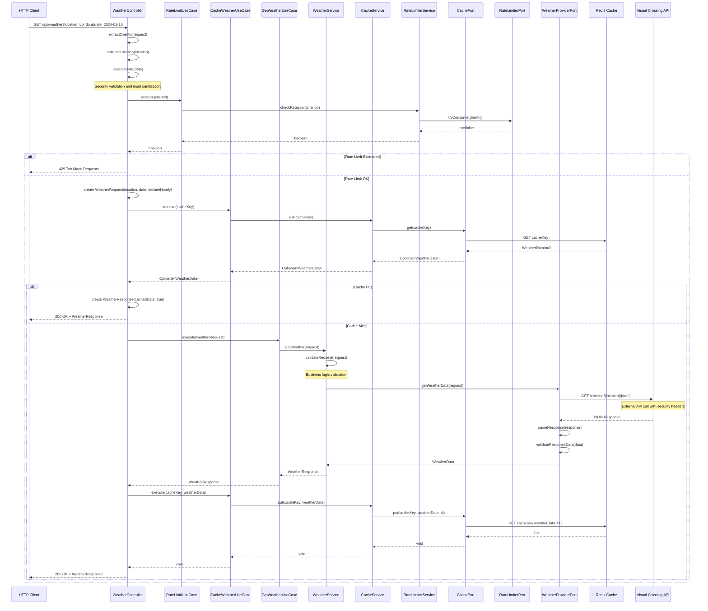
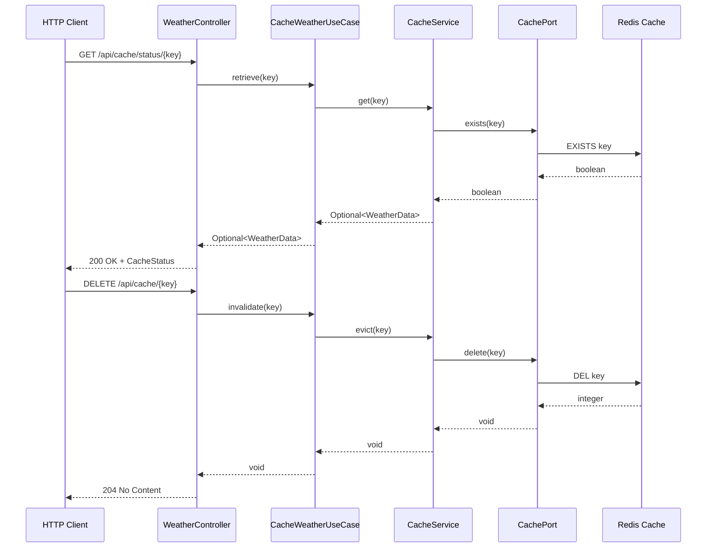
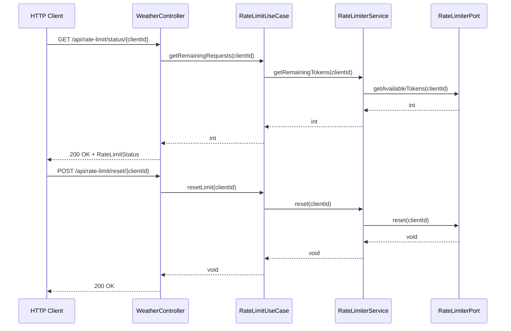
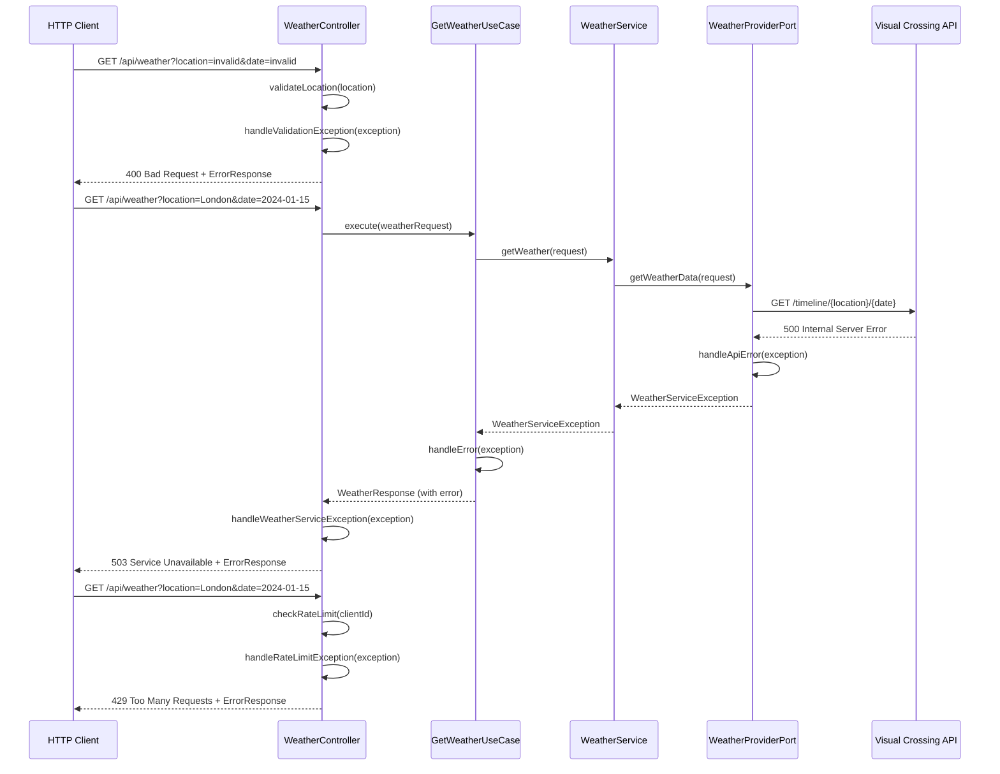
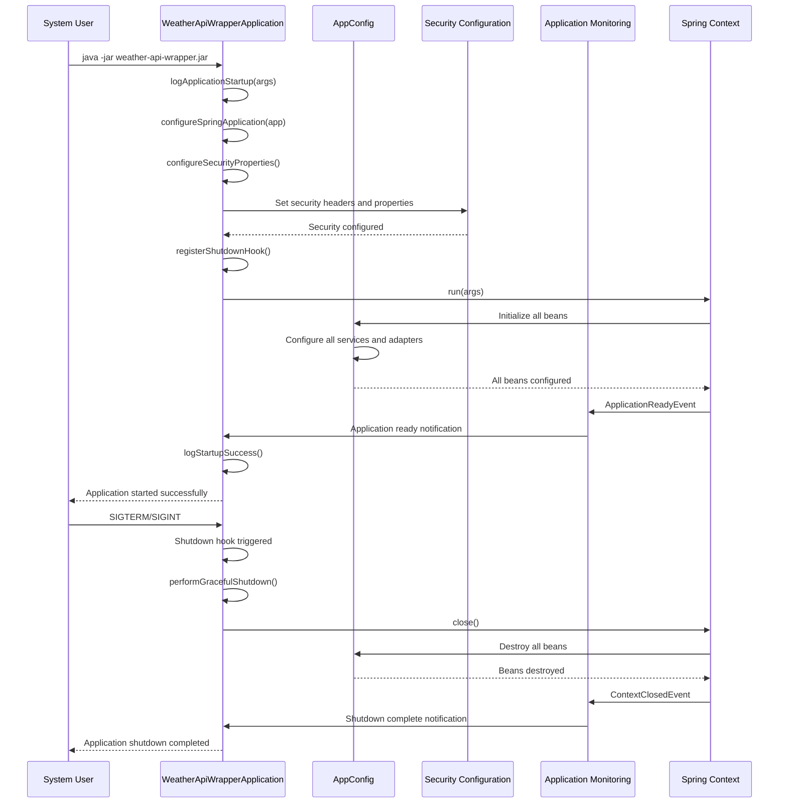

# Sequence Diagram - Weather API Wrapper Service

## Overview
This diagram shows the sequence of interactions when a client requests weather data, including caching, rate limiting, and external API calls.

## Main Weather Data Retrieval Sequence

## Cache Management Sequence

## Rate Limiting Management Sequence

## Error Handling Sequence

## Application Startup/Shutdown Sequence

## Key Interaction Patterns

### 1. **Request Flow**
1. **Client Request**: HTTP client sends request to controller
2. **Validation**: Input validation and client identification
3. **Rate Limiting**: Check if client has available tokens
4. **Cache Check**: Look for cached weather data
5. **External Call**: If cache miss, call external weather API
6. **Cache Storage**: Store new data in cache
7. **Response**: Return weather data to client

### 2. **Caching Strategy**
- **Cache-First**: Always check cache before external API calls
- **TTL Management**: Automatic expiration of cached data
- **Cache Invalidation**: Manual cache clearing capabilities
- **Cache Status**: Monitoring cache hit/miss statistics

### 3. **Rate Limiting Strategy**
- **Token Bucket**: Bucket4j-based rate limiting
- **Per-Client**: Individual rate limits per client ID
- **Graceful Degradation**: Clear error messages when limits exceeded
- **Reset Capability**: Manual rate limit reset functionality

### 4. **Error Handling**
- **Validation Errors**: Input validation with clear error messages
- **External API Errors**: Graceful handling of third-party service failures
- **Rate Limit Errors**: Clear indication when limits are exceeded
- **System Errors**: Proper error responses with appropriate HTTP status codes

### 5. **Security Measures**
- **Input Validation**: Comprehensive validation at all entry points
- **Security Headers**: Automatic security header configuration
- **Rate Limiting**: Protection against API abuse
- **Error Handling**: No sensitive information disclosure in error responses

### 6. **Application Lifecycle**
- **Startup Monitoring**: Comprehensive startup logging and validation
- **Graceful Shutdown**: Proper resource cleanup on application termination
- **Health Monitoring**: Application readiness and health checks
- **Performance Tracking**: System resource and performance monitoring

## Performance Considerations

### 1. **Caching Benefits**
- **Reduced Latency**: Cached responses are faster than API calls
- **Reduced Load**: Fewer external API calls reduce load on third-party services
- **Cost Savings**: Fewer API calls mean lower costs
- **Reliability**: Cached data available even when external API is down

### 2. **Rate Limiting Benefits**
- **API Protection**: Prevents abuse and ensures fair usage
- **Cost Control**: Limits external API costs
- **Service Stability**: Prevents overwhelming external services
- **Compliance**: Ensures adherence to API usage limits

### 3. **Error Resilience**
- **Graceful Degradation**: Service continues to work with cached data
- **Clear Error Messages**: Users understand what went wrong
- **Retry Logic**: Automatic retry mechanisms for transient failures
- **Monitoring**: Comprehensive error tracking and alerting 