# Use Case Diagram - Weather API Wrapper Service

## Overview
This diagram shows the main use cases and actors in the Weather API Wrapper Service, illustrating the system's functionality from a user perspective.

## Use Case Diagram

```mermaid
graph TB
    %% Actors
    subgraph "Actors"
        API_CLIENT[API Client]
        ADMIN[System Administrator]
        WEATHER_PROVIDER[Weather Provider API]
        CACHE_SYSTEM[Cache System]
    end

    %% Primary Use Cases
    subgraph "Primary Use Cases"
        GET_WEATHER[Get Weather Data]
        GET_WEATHER_COORDS[Get Weather by Coordinates]
        GET_CACHE_STATUS[Get Cache Status]
        CLEAR_CACHE[Clear Cache]
        GET_RATE_LIMIT_STATUS[Get Rate Limit Status]
        RESET_RATE_LIMIT[Reset Rate Limit]
    end

    %% Secondary Use Cases
    subgraph "Secondary Use Cases"
        VALIDATE_INPUT[Validate Input]
        CHECK_RATE_LIMIT[Check Rate Limit]
        CHECK_CACHE[Check Cache]
        FETCH_FROM_PROVIDER[Fetch from Provider]
        STORE_IN_CACHE[Store in Cache]
        HANDLE_ERROR[Handle Error]
        LOG_ACTIVITY[Log Activity]
    end

    %% System Use Cases
    subgraph "System Use Cases"
        MANAGE_CACHE[Manage Cache]
        MANAGE_RATE_LIMITS[Manage Rate Limits]
        MONITOR_PERFORMANCE[Monitor Performance]
        HANDLE_EXCEPTIONS[Handle Exceptions]
        CONFIGURE_SECURITY[Configure Security]
        MANAGE_LIFECYCLE[Manage Application Lifecycle]
    end

    %% Actor Relationships
    API_CLIENT --> GET_WEATHER
    API_CLIENT --> GET_WEATHER_COORDS
    API_CLIENT --> GET_CACHE_STATUS
    API_CLIENT --> CLEAR_CACHE
    API_CLIENT --> GET_RATE_LIMIT_STATUS
    API_CLIENT --> RESET_RATE_LIMIT

    ADMIN --> MANAGE_CACHE
    ADMIN --> MANAGE_RATE_LIMITS
    ADMIN --> MONITOR_PERFORMANCE
    ADMIN --> CONFIGURE_SECURITY
    ADMIN --> MANAGE_LIFECYCLE

    WEATHER_PROVIDER --> FETCH_FROM_PROVIDER
    CACHE_SYSTEM --> STORE_IN_CACHE
    CACHE_SYSTEM --> CHECK_CACHE

    %% Use Case Relationships
    GET_WEATHER --> VALIDATE_INPUT
    GET_WEATHER --> CHECK_RATE_LIMIT
    GET_WEATHER --> CHECK_CACHE
    GET_WEATHER --> FETCH_FROM_PROVIDER
    GET_WEATHER --> STORE_IN_CACHE
    GET_WEATHER --> HANDLE_ERROR
    GET_WEATHER --> LOG_ACTIVITY

    GET_WEATHER_COORDS --> VALIDATE_INPUT
    GET_WEATHER_COORDS --> CHECK_RATE_LIMIT
    GET_WEATHER_COORDS --> CHECK_CACHE
    GET_WEATHER_COORDS --> FETCH_FROM_PROVIDER
    GET_WEATHER_COORDS --> STORE_IN_CACHE
    GET_WEATHER_COORDS --> HANDLE_ERROR
    GET_WEATHER_COORDS --> LOG_ACTIVITY

    GET_CACHE_STATUS --> CHECK_CACHE
    GET_CACHE_STATUS --> LOG_ACTIVITY

    CLEAR_CACHE --> MANAGE_CACHE
    CLEAR_CACHE --> LOG_ACTIVITY

    GET_RATE_LIMIT_STATUS --> MANAGE_RATE_LIMITS
    GET_RATE_LIMIT_STATUS --> LOG_ACTIVITY

    RESET_RATE_LIMIT --> MANAGE_RATE_LIMITS
    RESET_RATE_LIMIT --> LOG_ACTIVITY

    %% Error Handling
    VALIDATE_INPUT --> HANDLE_EXCEPTIONS
    CHECK_RATE_LIMIT --> HANDLE_EXCEPTIONS
    CHECK_CACHE --> HANDLE_EXCEPTIONS
    FETCH_FROM_PROVIDER --> HANDLE_EXCEPTIONS
    STORE_IN_CACHE --> HANDLE_EXCEPTIONS

    %% Styling
    classDef actor fill:#ff9999,stroke:#333,stroke-width:2px
    classDef primary fill:#99ff99,stroke:#333,stroke-width:2px
    classDef secondary fill:#99ccff,stroke:#333,stroke-width:2px
    classDef system fill:#ffcc99,stroke:#333,stroke-width:2px

    class API_CLIENT,ADMIN,WEATHER_PROVIDER,CACHE_SYSTEM actor
    class GET_WEATHER,GET_WEATHER_COORDS,GET_CACHE_STATUS,CLEAR_CACHE,GET_RATE_LIMIT_STATUS,RESET_RATE_LIMIT primary
    class VALIDATE_INPUT,CHECK_RATE_LIMIT,CHECK_CACHE,FETCH_FROM_PROVIDER,STORE_IN_CACHE,HANDLE_ERROR,LOG_ACTIVITY secondary
    class MANAGE_CACHE,MANAGE_RATE_LIMITS,MONITOR_PERFORMANCE,HANDLE_EXCEPTIONS system
```

## Use Case Descriptions

### Primary Use Cases

#### 1. Get Weather Data
- **Actor**: API Client
- **Description**: Retrieve weather data for a specific location and date
- **Preconditions**: Valid location and date parameters
- **Main Flow**:
  1. Validate input parameters
  2. Check rate limit for client
  3. Check cache for existing data
  4. If cache miss, fetch from weather provider
  5. Store new data in cache
  6. Return weather data to client
- **Postconditions**: Weather data returned to client, potentially cached
- **Exceptions**: Invalid input, rate limit exceeded, provider unavailable

#### 2. Get Weather by Coordinates
- **Actor**: API Client
- **Description**: Retrieve weather data using latitude and longitude coordinates
- **Preconditions**: Valid coordinate parameters
- **Main Flow**: Similar to Get Weather Data but with coordinate validation
- **Postconditions**: Weather data returned to client
- **Exceptions**: Invalid coordinates, rate limit exceeded

#### 3. Get Cache Status
- **Actor**: API Client
- **Description**: Check if specific weather data exists in cache
- **Preconditions**: Valid cache key
- **Main Flow**:
  1. Validate cache key
  2. Check cache for data
  3. Return cache status
- **Postconditions**: Cache status information returned
- **Exceptions**: Invalid cache key

#### 4. Clear Cache
- **Actor**: API Client
- **Description**: Remove specific weather data from cache
- **Preconditions**: Valid cache key
- **Main Flow**:
  1. Validate cache key
  2. Remove data from cache
  3. Confirm deletion
- **Postconditions**: Data removed from cache
- **Exceptions**: Invalid cache key, cache unavailable

#### 5. Get Rate Limit Status
- **Actor**: API Client
- **Description**: Check current rate limit status for client
- **Preconditions**: Valid client ID
- **Main Flow**:
  1. Validate client ID
  2. Check rate limit status
  3. Return remaining requests
- **Postconditions**: Rate limit status returned
- **Exceptions**: Invalid client ID

#### 6. Reset Rate Limit
- **Actor**: API Client
- **Description**: Reset rate limit for specific client
- **Preconditions**: Valid client ID
- **Main Flow**:
  1. Validate client ID
  2. Reset rate limit counter
  3. Confirm reset
- **Postconditions**: Rate limit reset for client
- **Exceptions**: Invalid client ID

### Secondary Use Cases

#### 1. Validate Input
- **Description**: Validate all input parameters
- **Inputs**: Location, date, coordinates, client ID
- **Outputs**: Validation result
- **Exceptions**: Invalid parameters

#### 2. Check Rate Limit
- **Description**: Verify client has available rate limit tokens
- **Inputs**: Client ID
- **Outputs**: Rate limit status
- **Exceptions**: Rate limit exceeded

#### 3. Check Cache
- **Description**: Look for existing data in cache
- **Inputs**: Cache key
- **Outputs**: Cached data or null
- **Exceptions**: Cache unavailable

#### 4. Fetch from Provider
- **Description**: Retrieve weather data from external provider
- **Inputs**: Weather request
- **Outputs**: Weather data
- **Exceptions**: Provider unavailable, API errors

#### 5. Store in Cache
- **Description**: Store weather data in cache
- **Inputs**: Cache key, weather data, TTL
- **Outputs**: Success/failure
- **Exceptions**: Cache unavailable

#### 6. Handle Error
- **Description**: Process and respond to errors
- **Inputs**: Error information
- **Outputs**: Error response
- **Exceptions**: None

#### 7. Log Activity
- **Description**: Record system activities for monitoring
- **Inputs**: Activity information
- **Outputs**: Log entry
- **Exceptions**: Logging unavailable

### System Use Cases

#### 1. Manage Cache
- **Actor**: System Administrator
- **Description**: Monitor and manage cache operations
- **Includes**: Cache monitoring, cleanup, configuration

#### 2. Manage Rate Limits
- **Actor**: System Administrator
- **Description**: Configure and monitor rate limiting
- **Includes**: Rate limit configuration, monitoring, adjustment

#### 3. Monitor Performance
- **Actor**: System Administrator
- **Description**: Monitor system performance and health
- **Includes**: Performance metrics, health checks, alerts

#### 4. Handle Exceptions
- **Description**: System-wide exception handling
- **Includes**: Error logging, recovery, user notification

#### 5. Configure Security
- **Actor**: System Administrator
- **Description**: Configure and manage security settings
- **Includes**: Security headers, cookie settings, access controls

#### 6. Manage Application Lifecycle
- **Actor**: System Administrator
- **Description**: Manage application startup and shutdown
- **Includes**: Graceful shutdown, resource cleanup, health monitoring

## Actor Descriptions

### 1. API Client
- **Description**: External applications consuming the weather API
- **Responsibilities**: Send requests, handle responses
- **Examples**: Mobile apps, web applications, other services

### 2. System Administrator
- **Description**: Personnel managing the system
- **Responsibilities**: Monitor, configure, maintain system
- **Examples**: DevOps engineers, system operators

### 3. Weather Provider API
- **Description**: External weather data provider
- **Responsibilities**: Provide weather data
- **Examples**: Visual Crossing Weather API

### 4. Cache System
- **Description**: External caching infrastructure
- **Responsibilities**: Store and retrieve cached data
- **Examples**: Redis cache

## System Boundaries

### Included in System
- Weather data retrieval and processing
- Caching operations
- Rate limiting
- Input validation
- Error handling
- Logging and monitoring
- Security configuration and management
- Application lifecycle management
- Performance monitoring

### Excluded from System
- External weather provider implementation
- Cache system implementation
- Client application logic
- Network infrastructure

## Success Scenarios

### 1. Successful Weather Data Retrieval
1. Client sends valid request
2. System validates input
3. Rate limit check passes
4. Cache check finds data
5. System returns cached data
6. Client receives response

### 2. Successful Cache Miss Handling
1. Client sends valid request
2. System validates input
3. Rate limit check passes
4. Cache check misses
5. System fetches from provider
6. System stores in cache
7. System returns fresh data
8. Client receives response

### 3. Successful Rate Limit Management
1. Client requests rate limit status
2. System validates client ID
3. System checks current status
4. System returns status
5. Client receives information

## Failure Scenarios

### 1. Rate Limit Exceeded
1. Client sends request
2. System validates input
3. Rate limit check fails
4. System returns 429 error
5. Client receives error response

### 2. Provider Unavailable
1. Client sends request
2. System validates input
3. Rate limit check passes
4. Cache check misses
5. Provider call fails
6. System returns 503 error
7. Client receives error response

### 3. Invalid Input
1. Client sends invalid request
2. System validation fails
3. System returns 400 error
4. Client receives error response

### 4. Security Violation
1. Client sends request with invalid security parameters
2. System security validation fails
3. System logs security event
4. System returns 403 error
5. Client receives error response

### 5. Application Startup Failure
1. System administrator starts application
2. Configuration validation fails
3. System logs startup failure
4. System performs emergency shutdown
5. Administrator receives failure notification 